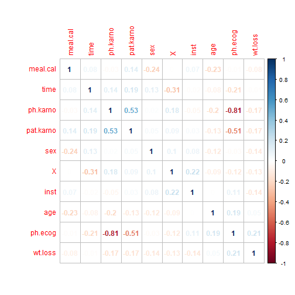
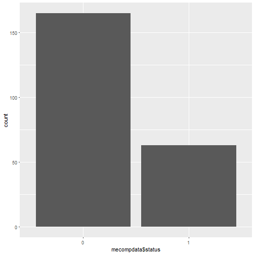
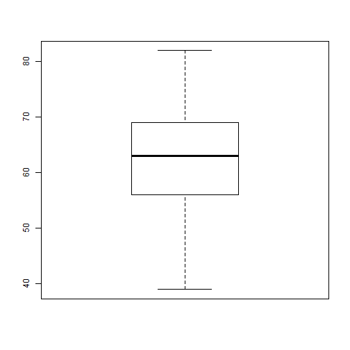
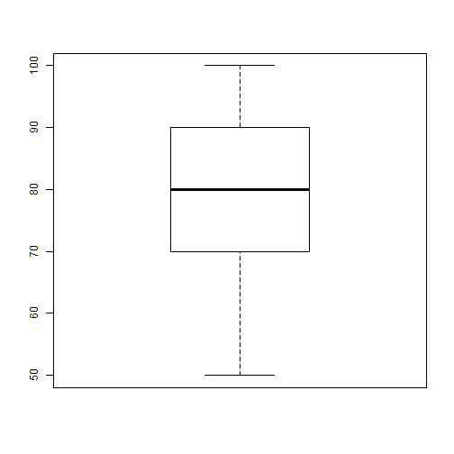
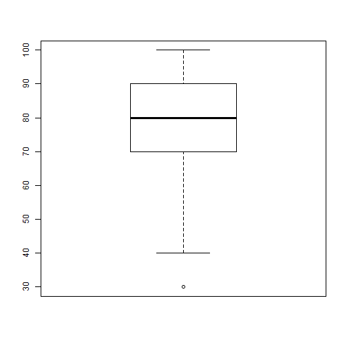
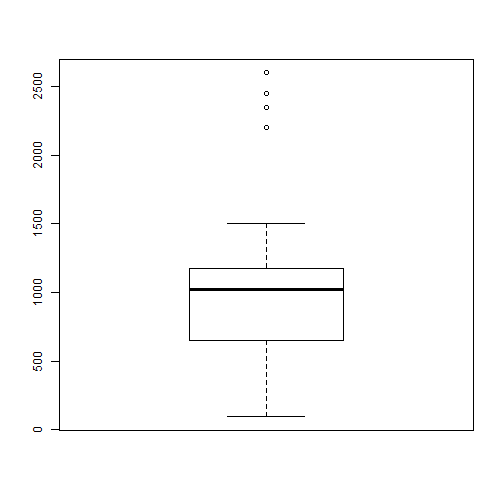
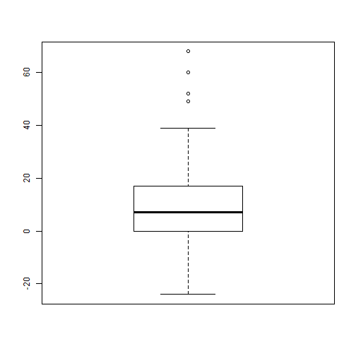
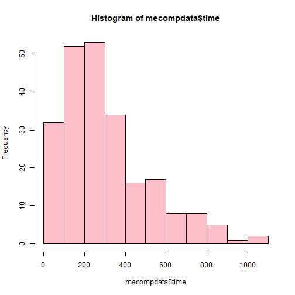
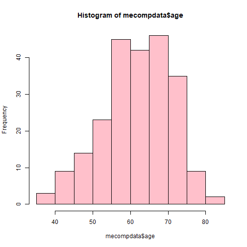

  
  
## PROJECT OVERVIEW
  
1. Advanced R project to predict lung cancer in both Female and    male participants
2. Binomial Regression 
3. Comes under classification with yes/no output

---
  
## DATA INFORMATION
  
1. Data contains 229 instances
2. Has 9 predictor attributes and 1 predicted attribute 
3. Explaining attributes

-inst-(Numeric)

-time-(Numeric)

-wt.loss-(Numeric)	
                                         
-age-(Numeric)	
                                         
-sex-(logical)	
                                         
-ph.ecog- (Numeric)	
                                         
-ph.karno-(Numeric)
                                         
-pat.karno-(numeric)

-meal.cal-(numeric)
                                        
-Outcome-status-logical(YES or NO)

---

##Required libraries

```r
library(ROCR)
```

```
## Loading required package: gplots
```

```
## 
## Attaching package: 'gplots'
```

```
## The following object is masked from 'package:stats':
## 
##     lowess
```

```r
library(caret)
```

```
## Loading required package: lattice
```

```
## Loading required package: ggplot2
```

---

## READ DATA

```r
data<- read.csv("C:/Users/Madan/Documents/gp2.csv",header=TRUE, stringsAsFactors = TRUE)

data$status <- replace(data$status, data$status==1,1)
data$status <- replace(data$status, data$status==2,0)
data$status <- as.factor(data$status)

str(data)
```

```
## 'data.frame':	228 obs. of  11 variables:
##  $ X        : int  1 2 3 4 5 6 7 8 9 10 ...
##  $ inst     : int  3 3 3 5 1 12 7 11 1 7 ...
##  $ time     : int  306 455 1010 210 883 1022 310 361 218 166 ...
##  $ status   : Factor w/ 2 levels "0","1": 1 1 2 1 1 2 1 1 1 1 ...
##  $ age      : int  74 68 56 57 60 74 68 71 53 61 ...
##  $ sex      : int  1 1 1 1 1 1 2 2 1 1 ...
##  $ ph.ecog  : int  1 0 0 1 0 1 2 2 1 2 ...
##  $ ph.karno : int  90 90 90 90 100 50 70 60 70 70 ...
##  $ pat.karno: int  100 90 90 60 90 80 60 80 80 70 ...
##  $ meal.cal : int  1175 1225 NA 1150 NA 513 384 538 825 271 ...
##  $ wt.loss  : int  NA 15 15 11 0 0 10 1 16 34 ...
```

---

##IMPUTE DATA using mean

```r
library(mice)
md.pattern(data)#finding missing data
```

```
##     X time status age sex inst ph.ecog ph.karno pat.karno wt.loss meal.cal
## 167 1    1      1   1   1    1       1        1         1       1        1
##   1 1    1      1   1   1    0       1        1         1       1        1
##   1 1    1      1   1   1    1       0        1         1       1        1
##   2 1    1      1   1   1    1       1        1         0       1        1
##  42 1    1      1   1   1    1       1        1         1       1        0
##  10 1    1      1   1   1    1       1        1         1       0        1
##   1 1    1      1   1   1    1       1        1         0       1        0
##   3 1    1      1   1   1    1       1        1         1       0        0
##   1 1    1      1   1   1    1       1        0         1       0        0
##     0    0      0   0   0    1       1        1         3      14       47
##       
## 167  0
##   1  1
##   1  1
##   2  1
##  42  1
##  10  1
##   1  2
##   3  2
##   1  3
##     67
```

```r
mecompdata <- mice(data,m=10,maxit=50,meth='pmm',seed=500)
```

```
## 
##  iter imp variable
##   1   1  inst  ph.ecog  ph.karno  pat.karno  meal.cal  wt.loss
##   1   2  inst  ph.ecog  ph.karno  pat.karno  meal.cal  wt.loss
##   1   3  inst  ph.ecog  ph.karno  pat.karno  meal.cal  wt.loss
##   1   4  inst  ph.ecog  ph.karno  pat.karno  meal.cal  wt.loss
##   1   5  inst  ph.ecog  ph.karno  pat.karno  meal.cal  wt.loss
##   1   6  inst  ph.ecog  ph.karno  pat.karno  meal.cal  wt.loss
##   1   7  inst  ph.ecog  ph.karno  pat.karno  meal.cal  wt.loss
##   1   8  inst  ph.ecog  ph.karno  pat.karno  meal.cal  wt.loss
##   1   9  inst  ph.ecog  ph.karno  pat.karno  meal.cal  wt.loss
##   1   10  inst  ph.ecog  ph.karno  pat.karno  meal.cal  wt.loss
##   2   1  inst  ph.ecog  ph.karno  pat.karno  meal.cal  wt.loss
##   2   2  inst  ph.ecog  ph.karno  pat.karno  meal.cal  wt.loss
##   2   3  inst  ph.ecog  ph.karno  pat.karno  meal.cal  wt.loss
##   2   4  inst  ph.ecog  ph.karno  pat.karno  meal.cal  wt.loss
##   2   5  inst  ph.ecog  ph.karno  pat.karno  meal.cal  wt.loss
##   2   6  inst  ph.ecog  ph.karno  pat.karno  meal.cal  wt.loss
##   2   7  inst  ph.ecog  ph.karno  pat.karno  meal.cal  wt.loss
##   2   8  inst  ph.ecog  ph.karno  pat.karno  meal.cal  wt.loss
##   2   9  inst  ph.ecog  ph.karno  pat.karno  meal.cal  wt.loss
##   2   10  inst  ph.ecog  ph.karno  pat.karno  meal.cal  wt.loss
##   3   1  inst  ph.ecog  ph.karno  pat.karno  meal.cal  wt.loss
##   3   2  inst  ph.ecog  ph.karno  pat.karno  meal.cal  wt.loss
##   3   3  inst  ph.ecog  ph.karno  pat.karno  meal.cal  wt.loss
##   3   4  inst  ph.ecog  ph.karno  pat.karno  meal.cal  wt.loss
##   3   5  inst  ph.ecog  ph.karno  pat.karno  meal.cal  wt.loss
##   3   6  inst  ph.ecog  ph.karno  pat.karno  meal.cal  wt.loss
##   3   7  inst  ph.ecog  ph.karno  pat.karno  meal.cal  wt.loss
##   3   8  inst  ph.ecog  ph.karno  pat.karno  meal.cal  wt.loss
##   3   9  inst  ph.ecog  ph.karno  pat.karno  meal.cal  wt.loss
##   3   10  inst  ph.ecog  ph.karno  pat.karno  meal.cal  wt.loss
##   4   1  inst  ph.ecog  ph.karno  pat.karno  meal.cal  wt.loss
##   4   2  inst  ph.ecog  ph.karno  pat.karno  meal.cal  wt.loss
##   4   3  inst  ph.ecog  ph.karno  pat.karno  meal.cal  wt.loss
##   4   4  inst  ph.ecog  ph.karno  pat.karno  meal.cal  wt.loss
##   4   5  inst  ph.ecog  ph.karno  pat.karno  meal.cal  wt.loss
##   4   6  inst  ph.ecog  ph.karno  pat.karno  meal.cal  wt.loss
##   4   7  inst  ph.ecog  ph.karno  pat.karno  meal.cal  wt.loss
##   4   8  inst  ph.ecog  ph.karno  pat.karno  meal.cal  wt.loss
##   4   9  inst  ph.ecog  ph.karno  pat.karno  meal.cal  wt.loss
##   4   10  inst  ph.ecog  ph.karno  pat.karno  meal.cal  wt.loss
##   5   1  inst  ph.ecog  ph.karno  pat.karno  meal.cal  wt.loss
##   5   2  inst  ph.ecog  ph.karno  pat.karno  meal.cal  wt.loss
##   5   3  inst  ph.ecog  ph.karno  pat.karno  meal.cal  wt.loss
##   5   4  inst  ph.ecog  ph.karno  pat.karno  meal.cal  wt.loss
##   5   5  inst  ph.ecog  ph.karno  pat.karno  meal.cal  wt.loss
##   5   6  inst  ph.ecog  ph.karno  pat.karno  meal.cal  wt.loss
##   5   7  inst  ph.ecog  ph.karno  pat.karno  meal.cal  wt.loss
##   5   8  inst  ph.ecog  ph.karno  pat.karno  meal.cal  wt.loss
##   5   9  inst  ph.ecog  ph.karno  pat.karno  meal.cal  wt.loss
##   5   10  inst  ph.ecog  ph.karno  pat.karno  meal.cal  wt.loss
##   6   1  inst  ph.ecog  ph.karno  pat.karno  meal.cal  wt.loss
##   6   2  inst  ph.ecog  ph.karno  pat.karno  meal.cal  wt.loss
##   6   3  inst  ph.ecog  ph.karno  pat.karno  meal.cal  wt.loss
##   6   4  inst  ph.ecog  ph.karno  pat.karno  meal.cal  wt.loss
##   6   5  inst  ph.ecog  ph.karno  pat.karno  meal.cal  wt.loss
##   6   6  inst  ph.ecog  ph.karno  pat.karno  meal.cal  wt.loss
##   6   7  inst  ph.ecog  ph.karno  pat.karno  meal.cal  wt.loss
##   6   8  inst  ph.ecog  ph.karno  pat.karno  meal.cal  wt.loss
##   6   9  inst  ph.ecog  ph.karno  pat.karno  meal.cal  wt.loss
##   6   10  inst  ph.ecog  ph.karno  pat.karno  meal.cal  wt.loss
##   7   1  inst  ph.ecog  ph.karno  pat.karno  meal.cal  wt.loss
##   7   2  inst  ph.ecog  ph.karno  pat.karno  meal.cal  wt.loss
##   7   3  inst  ph.ecog  ph.karno  pat.karno  meal.cal  wt.loss
##   7   4  inst  ph.ecog  ph.karno  pat.karno  meal.cal  wt.loss
##   7   5  inst  ph.ecog  ph.karno  pat.karno  meal.cal  wt.loss
##   7   6  inst  ph.ecog  ph.karno  pat.karno  meal.cal  wt.loss
##   7   7  inst  ph.ecog  ph.karno  pat.karno  meal.cal  wt.loss
##   7   8  inst  ph.ecog  ph.karno  pat.karno  meal.cal  wt.loss
##   7   9  inst  ph.ecog  ph.karno  pat.karno  meal.cal  wt.loss
##   7   10  inst  ph.ecog  ph.karno  pat.karno  meal.cal  wt.loss
##   8   1  inst  ph.ecog  ph.karno  pat.karno  meal.cal  wt.loss
##   8   2  inst  ph.ecog  ph.karno  pat.karno  meal.cal  wt.loss
##   8   3  inst  ph.ecog  ph.karno  pat.karno  meal.cal  wt.loss
##   8   4  inst  ph.ecog  ph.karno  pat.karno  meal.cal  wt.loss
##   8   5  inst  ph.ecog  ph.karno  pat.karno  meal.cal  wt.loss
##   8   6  inst  ph.ecog  ph.karno  pat.karno  meal.cal  wt.loss
##   8   7  inst  ph.ecog  ph.karno  pat.karno  meal.cal  wt.loss
##   8   8  inst  ph.ecog  ph.karno  pat.karno  meal.cal  wt.loss
##   8   9  inst  ph.ecog  ph.karno  pat.karno  meal.cal  wt.loss
##   8   10  inst  ph.ecog  ph.karno  pat.karno  meal.cal  wt.loss
##   9   1  inst  ph.ecog  ph.karno  pat.karno  meal.cal  wt.loss
##   9   2  inst  ph.ecog  ph.karno  pat.karno  meal.cal  wt.loss
##   9   3  inst  ph.ecog  ph.karno  pat.karno  meal.cal  wt.loss
##   9   4  inst  ph.ecog  ph.karno  pat.karno  meal.cal  wt.loss
##   9   5  inst  ph.ecog  ph.karno  pat.karno  meal.cal  wt.loss
##   9   6  inst  ph.ecog  ph.karno  pat.karno  meal.cal  wt.loss
##   9   7  inst  ph.ecog  ph.karno  pat.karno  meal.cal  wt.loss
##   9   8  inst  ph.ecog  ph.karno  pat.karno  meal.cal  wt.loss
##   9   9  inst  ph.ecog  ph.karno  pat.karno  meal.cal  wt.loss
##   9   10  inst  ph.ecog  ph.karno  pat.karno  meal.cal  wt.loss
##   10   1  inst  ph.ecog  ph.karno  pat.karno  meal.cal  wt.loss
##   10   2  inst  ph.ecog  ph.karno  pat.karno  meal.cal  wt.loss
##   10   3  inst  ph.ecog  ph.karno  pat.karno  meal.cal  wt.loss
##   10   4  inst  ph.ecog  ph.karno  pat.karno  meal.cal  wt.loss
##   10   5  inst  ph.ecog  ph.karno  pat.karno  meal.cal  wt.loss
##   10   6  inst  ph.ecog  ph.karno  pat.karno  meal.cal  wt.loss
##   10   7  inst  ph.ecog  ph.karno  pat.karno  meal.cal  wt.loss
##   10   8  inst  ph.ecog  ph.karno  pat.karno  meal.cal  wt.loss
##   10   9  inst  ph.ecog  ph.karno  pat.karno  meal.cal  wt.loss
##   10   10  inst  ph.ecog  ph.karno  pat.karno  meal.cal  wt.loss
##   11   1  inst  ph.ecog  ph.karno  pat.karno  meal.cal  wt.loss
##   11   2  inst  ph.ecog  ph.karno  pat.karno  meal.cal  wt.loss
##   11   3  inst  ph.ecog  ph.karno  pat.karno  meal.cal  wt.loss
##   11   4  inst  ph.ecog  ph.karno  pat.karno  meal.cal  wt.loss
##   11   5  inst  ph.ecog  ph.karno  pat.karno  meal.cal  wt.loss
##   11   6  inst  ph.ecog  ph.karno  pat.karno  meal.cal  wt.loss
##   11   7  inst  ph.ecog  ph.karno  pat.karno  meal.cal  wt.loss
##   11   8  inst  ph.ecog  ph.karno  pat.karno  meal.cal  wt.loss
##   11   9  inst  ph.ecog  ph.karno  pat.karno  meal.cal  wt.loss
##   11   10  inst  ph.ecog  ph.karno  pat.karno  meal.cal  wt.loss
##   12   1  inst  ph.ecog  ph.karno  pat.karno  meal.cal  wt.loss
##   12   2  inst  ph.ecog  ph.karno  pat.karno  meal.cal  wt.loss
##   12   3  inst  ph.ecog  ph.karno  pat.karno  meal.cal  wt.loss
##   12   4  inst  ph.ecog  ph.karno  pat.karno  meal.cal  wt.loss
##   12   5  inst  ph.ecog  ph.karno  pat.karno  meal.cal  wt.loss
##   12   6  inst  ph.ecog  ph.karno  pat.karno  meal.cal  wt.loss
##   12   7  inst  ph.ecog  ph.karno  pat.karno  meal.cal  wt.loss
##   12   8  inst  ph.ecog  ph.karno  pat.karno  meal.cal  wt.loss
##   12   9  inst  ph.ecog  ph.karno  pat.karno  meal.cal  wt.loss
##   12   10  inst  ph.ecog  ph.karno  pat.karno  meal.cal  wt.loss
##   13   1  inst  ph.ecog  ph.karno  pat.karno  meal.cal  wt.loss
##   13   2  inst  ph.ecog  ph.karno  pat.karno  meal.cal  wt.loss
##   13   3  inst  ph.ecog  ph.karno  pat.karno  meal.cal  wt.loss
##   13   4  inst  ph.ecog  ph.karno  pat.karno  meal.cal  wt.loss
##   13   5  inst  ph.ecog  ph.karno  pat.karno  meal.cal  wt.loss
##   13   6  inst  ph.ecog  ph.karno  pat.karno  meal.cal  wt.loss
##   13   7  inst  ph.ecog  ph.karno  pat.karno  meal.cal  wt.loss
##   13   8  inst  ph.ecog  ph.karno  pat.karno  meal.cal  wt.loss
##   13   9  inst  ph.ecog  ph.karno  pat.karno  meal.cal  wt.loss
##   13   10  inst  ph.ecog  ph.karno  pat.karno  meal.cal  wt.loss
##   14   1  inst  ph.ecog  ph.karno  pat.karno  meal.cal  wt.loss
##   14   2  inst  ph.ecog  ph.karno  pat.karno  meal.cal  wt.loss
##   14   3  inst  ph.ecog  ph.karno  pat.karno  meal.cal  wt.loss
##   14   4  inst  ph.ecog  ph.karno  pat.karno  meal.cal  wt.loss
##   14   5  inst  ph.ecog  ph.karno  pat.karno  meal.cal  wt.loss
##   14   6  inst  ph.ecog  ph.karno  pat.karno  meal.cal  wt.loss
##   14   7  inst  ph.ecog  ph.karno  pat.karno  meal.cal  wt.loss
##   14   8  inst  ph.ecog  ph.karno  pat.karno  meal.cal  wt.loss
##   14   9  inst  ph.ecog  ph.karno  pat.karno  meal.cal  wt.loss
##   14   10  inst  ph.ecog  ph.karno  pat.karno  meal.cal  wt.loss
##   15   1  inst  ph.ecog  ph.karno  pat.karno  meal.cal  wt.loss
##   15   2  inst  ph.ecog  ph.karno  pat.karno  meal.cal  wt.loss
##   15   3  inst  ph.ecog  ph.karno  pat.karno  meal.cal  wt.loss
##   15   4  inst  ph.ecog  ph.karno  pat.karno  meal.cal  wt.loss
##   15   5  inst  ph.ecog  ph.karno  pat.karno  meal.cal  wt.loss
##   15   6  inst  ph.ecog  ph.karno  pat.karno  meal.cal  wt.loss
##   15   7  inst  ph.ecog  ph.karno  pat.karno  meal.cal  wt.loss
##   15   8  inst  ph.ecog  ph.karno  pat.karno  meal.cal  wt.loss
##   15   9  inst  ph.ecog  ph.karno  pat.karno  meal.cal  wt.loss
##   15   10  inst  ph.ecog  ph.karno  pat.karno  meal.cal  wt.loss
##   16   1  inst  ph.ecog  ph.karno  pat.karno  meal.cal  wt.loss
##   16   2  inst  ph.ecog  ph.karno  pat.karno  meal.cal  wt.loss
##   16   3  inst  ph.ecog  ph.karno  pat.karno  meal.cal  wt.loss
##   16   4  inst  ph.ecog  ph.karno  pat.karno  meal.cal  wt.loss
##   16   5  inst  ph.ecog  ph.karno  pat.karno  meal.cal  wt.loss
##   16   6  inst  ph.ecog  ph.karno  pat.karno  meal.cal  wt.loss
##   16   7  inst  ph.ecog  ph.karno  pat.karno  meal.cal  wt.loss
##   16   8  inst  ph.ecog  ph.karno  pat.karno  meal.cal  wt.loss
##   16   9  inst  ph.ecog  ph.karno  pat.karno  meal.cal  wt.loss
##   16   10  inst  ph.ecog  ph.karno  pat.karno  meal.cal  wt.loss
##   17   1  inst  ph.ecog  ph.karno  pat.karno  meal.cal  wt.loss
##   17   2  inst  ph.ecog  ph.karno  pat.karno  meal.cal  wt.loss
##   17   3  inst  ph.ecog  ph.karno  pat.karno  meal.cal  wt.loss
##   17   4  inst  ph.ecog  ph.karno  pat.karno  meal.cal  wt.loss
##   17   5  inst  ph.ecog  ph.karno  pat.karno  meal.cal  wt.loss
##   17   6  inst  ph.ecog  ph.karno  pat.karno  meal.cal  wt.loss
##   17   7  inst  ph.ecog  ph.karno  pat.karno  meal.cal  wt.loss
##   17   8  inst  ph.ecog  ph.karno  pat.karno  meal.cal  wt.loss
##   17   9  inst  ph.ecog  ph.karno  pat.karno  meal.cal  wt.loss
##   17   10  inst  ph.ecog  ph.karno  pat.karno  meal.cal  wt.loss
##   18   1  inst  ph.ecog  ph.karno  pat.karno  meal.cal  wt.loss
##   18   2  inst  ph.ecog  ph.karno  pat.karno  meal.cal  wt.loss
##   18   3  inst  ph.ecog  ph.karno  pat.karno  meal.cal  wt.loss
##   18   4  inst  ph.ecog  ph.karno  pat.karno  meal.cal  wt.loss
##   18   5  inst  ph.ecog  ph.karno  pat.karno  meal.cal  wt.loss
##   18   6  inst  ph.ecog  ph.karno  pat.karno  meal.cal  wt.loss
##   18   7  inst  ph.ecog  ph.karno  pat.karno  meal.cal  wt.loss
##   18   8  inst  ph.ecog  ph.karno  pat.karno  meal.cal  wt.loss
##   18   9  inst  ph.ecog  ph.karno  pat.karno  meal.cal  wt.loss
##   18   10  inst  ph.ecog  ph.karno  pat.karno  meal.cal  wt.loss
##   19   1  inst  ph.ecog  ph.karno  pat.karno  meal.cal  wt.loss
##   19   2  inst  ph.ecog  ph.karno  pat.karno  meal.cal  wt.loss
##   19   3  inst  ph.ecog  ph.karno  pat.karno  meal.cal  wt.loss
##   19   4  inst  ph.ecog  ph.karno  pat.karno  meal.cal  wt.loss
##   19   5  inst  ph.ecog  ph.karno  pat.karno  meal.cal  wt.loss
##   19   6  inst  ph.ecog  ph.karno  pat.karno  meal.cal  wt.loss
##   19   7  inst  ph.ecog  ph.karno  pat.karno  meal.cal  wt.loss
##   19   8  inst  ph.ecog  ph.karno  pat.karno  meal.cal  wt.loss
##   19   9  inst  ph.ecog  ph.karno  pat.karno  meal.cal  wt.loss
##   19   10  inst  ph.ecog  ph.karno  pat.karno  meal.cal  wt.loss
##   20   1  inst  ph.ecog  ph.karno  pat.karno  meal.cal  wt.loss
##   20   2  inst  ph.ecog  ph.karno  pat.karno  meal.cal  wt.loss
##   20   3  inst  ph.ecog  ph.karno  pat.karno  meal.cal  wt.loss
##   20   4  inst  ph.ecog  ph.karno  pat.karno  meal.cal  wt.loss
##   20   5  inst  ph.ecog  ph.karno  pat.karno  meal.cal  wt.loss
##   20   6  inst  ph.ecog  ph.karno  pat.karno  meal.cal  wt.loss
##   20   7  inst  ph.ecog  ph.karno  pat.karno  meal.cal  wt.loss
##   20   8  inst  ph.ecog  ph.karno  pat.karno  meal.cal  wt.loss
##   20   9  inst  ph.ecog  ph.karno  pat.karno  meal.cal  wt.loss
##   20   10  inst  ph.ecog  ph.karno  pat.karno  meal.cal  wt.loss
##   21   1  inst  ph.ecog  ph.karno  pat.karno  meal.cal  wt.loss
##   21   2  inst  ph.ecog  ph.karno  pat.karno  meal.cal  wt.loss
##   21   3  inst  ph.ecog  ph.karno  pat.karno  meal.cal  wt.loss
##   21   4  inst  ph.ecog  ph.karno  pat.karno  meal.cal  wt.loss
##   21   5  inst  ph.ecog  ph.karno  pat.karno  meal.cal  wt.loss
##   21   6  inst  ph.ecog  ph.karno  pat.karno  meal.cal  wt.loss
##   21   7  inst  ph.ecog  ph.karno  pat.karno  meal.cal  wt.loss
##   21   8  inst  ph.ecog  ph.karno  pat.karno  meal.cal  wt.loss
##   21   9  inst  ph.ecog  ph.karno  pat.karno  meal.cal  wt.loss
##   21   10  inst  ph.ecog  ph.karno  pat.karno  meal.cal  wt.loss
##   22   1  inst  ph.ecog  ph.karno  pat.karno  meal.cal  wt.loss
##   22   2  inst  ph.ecog  ph.karno  pat.karno  meal.cal  wt.loss
##   22   3  inst  ph.ecog  ph.karno  pat.karno  meal.cal  wt.loss
##   22   4  inst  ph.ecog  ph.karno  pat.karno  meal.cal  wt.loss
##   22   5  inst  ph.ecog  ph.karno  pat.karno  meal.cal  wt.loss
##   22   6  inst  ph.ecog  ph.karno  pat.karno  meal.cal  wt.loss
##   22   7  inst  ph.ecog  ph.karno  pat.karno  meal.cal  wt.loss
##   22   8  inst  ph.ecog  ph.karno  pat.karno  meal.cal  wt.loss
##   22   9  inst  ph.ecog  ph.karno  pat.karno  meal.cal  wt.loss
##   22   10  inst  ph.ecog  ph.karno  pat.karno  meal.cal  wt.loss
##   23   1  inst  ph.ecog  ph.karno  pat.karno  meal.cal  wt.loss
##   23   2  inst  ph.ecog  ph.karno  pat.karno  meal.cal  wt.loss
##   23   3  inst  ph.ecog  ph.karno  pat.karno  meal.cal  wt.loss
##   23   4  inst  ph.ecog  ph.karno  pat.karno  meal.cal  wt.loss
##   23   5  inst  ph.ecog  ph.karno  pat.karno  meal.cal  wt.loss
##   23   6  inst  ph.ecog  ph.karno  pat.karno  meal.cal  wt.loss
##   23   7  inst  ph.ecog  ph.karno  pat.karno  meal.cal  wt.loss
##   23   8  inst  ph.ecog  ph.karno  pat.karno  meal.cal  wt.loss
##   23   9  inst  ph.ecog  ph.karno  pat.karno  meal.cal  wt.loss
##   23   10  inst  ph.ecog  ph.karno  pat.karno  meal.cal  wt.loss
##   24   1  inst  ph.ecog  ph.karno  pat.karno  meal.cal  wt.loss
##   24   2  inst  ph.ecog  ph.karno  pat.karno  meal.cal  wt.loss
##   24   3  inst  ph.ecog  ph.karno  pat.karno  meal.cal  wt.loss
##   24   4  inst  ph.ecog  ph.karno  pat.karno  meal.cal  wt.loss
##   24   5  inst  ph.ecog  ph.karno  pat.karno  meal.cal  wt.loss
##   24   6  inst  ph.ecog  ph.karno  pat.karno  meal.cal  wt.loss
##   24   7  inst  ph.ecog  ph.karno  pat.karno  meal.cal  wt.loss
##   24   8  inst  ph.ecog  ph.karno  pat.karno  meal.cal  wt.loss
##   24   9  inst  ph.ecog  ph.karno  pat.karno  meal.cal  wt.loss
##   24   10  inst  ph.ecog  ph.karno  pat.karno  meal.cal  wt.loss
##   25   1  inst  ph.ecog  ph.karno  pat.karno  meal.cal  wt.loss
##   25   2  inst  ph.ecog  ph.karno  pat.karno  meal.cal  wt.loss
##   25   3  inst  ph.ecog  ph.karno  pat.karno  meal.cal  wt.loss
##   25   4  inst  ph.ecog  ph.karno  pat.karno  meal.cal  wt.loss
##   25   5  inst  ph.ecog  ph.karno  pat.karno  meal.cal  wt.loss
##   25   6  inst  ph.ecog  ph.karno  pat.karno  meal.cal  wt.loss
##   25   7  inst  ph.ecog  ph.karno  pat.karno  meal.cal  wt.loss
##   25   8  inst  ph.ecog  ph.karno  pat.karno  meal.cal  wt.loss
##   25   9  inst  ph.ecog  ph.karno  pat.karno  meal.cal  wt.loss
##   25   10  inst  ph.ecog  ph.karno  pat.karno  meal.cal  wt.loss
##   26   1  inst  ph.ecog  ph.karno  pat.karno  meal.cal  wt.loss
##   26   2  inst  ph.ecog  ph.karno  pat.karno  meal.cal  wt.loss
##   26   3  inst  ph.ecog  ph.karno  pat.karno  meal.cal  wt.loss
##   26   4  inst  ph.ecog  ph.karno  pat.karno  meal.cal  wt.loss
##   26   5  inst  ph.ecog  ph.karno  pat.karno  meal.cal  wt.loss
##   26   6  inst  ph.ecog  ph.karno  pat.karno  meal.cal  wt.loss
##   26   7  inst  ph.ecog  ph.karno  pat.karno  meal.cal  wt.loss
##   26   8  inst  ph.ecog  ph.karno  pat.karno  meal.cal  wt.loss
##   26   9  inst  ph.ecog  ph.karno  pat.karno  meal.cal  wt.loss
##   26   10  inst  ph.ecog  ph.karno  pat.karno  meal.cal  wt.loss
##   27   1  inst  ph.ecog  ph.karno  pat.karno  meal.cal  wt.loss
##   27   2  inst  ph.ecog  ph.karno  pat.karno  meal.cal  wt.loss
##   27   3  inst  ph.ecog  ph.karno  pat.karno  meal.cal  wt.loss
##   27   4  inst  ph.ecog  ph.karno  pat.karno  meal.cal  wt.loss
##   27   5  inst  ph.ecog  ph.karno  pat.karno  meal.cal  wt.loss
##   27   6  inst  ph.ecog  ph.karno  pat.karno  meal.cal  wt.loss
##   27   7  inst  ph.ecog  ph.karno  pat.karno  meal.cal  wt.loss
##   27   8  inst  ph.ecog  ph.karno  pat.karno  meal.cal  wt.loss
##   27   9  inst  ph.ecog  ph.karno  pat.karno  meal.cal  wt.loss
##   27   10  inst  ph.ecog  ph.karno  pat.karno  meal.cal  wt.loss
##   28   1  inst  ph.ecog  ph.karno  pat.karno  meal.cal  wt.loss
##   28   2  inst  ph.ecog  ph.karno  pat.karno  meal.cal  wt.loss
##   28   3  inst  ph.ecog  ph.karno  pat.karno  meal.cal  wt.loss
##   28   4  inst  ph.ecog  ph.karno  pat.karno  meal.cal  wt.loss
##   28   5  inst  ph.ecog  ph.karno  pat.karno  meal.cal  wt.loss
##   28   6  inst  ph.ecog  ph.karno  pat.karno  meal.cal  wt.loss
##   28   7  inst  ph.ecog  ph.karno  pat.karno  meal.cal  wt.loss
##   28   8  inst  ph.ecog  ph.karno  pat.karno  meal.cal  wt.loss
##   28   9  inst  ph.ecog  ph.karno  pat.karno  meal.cal  wt.loss
##   28   10  inst  ph.ecog  ph.karno  pat.karno  meal.cal  wt.loss
##   29   1  inst  ph.ecog  ph.karno  pat.karno  meal.cal  wt.loss
##   29   2  inst  ph.ecog  ph.karno  pat.karno  meal.cal  wt.loss
##   29   3  inst  ph.ecog  ph.karno  pat.karno  meal.cal  wt.loss
##   29   4  inst  ph.ecog  ph.karno  pat.karno  meal.cal  wt.loss
##   29   5  inst  ph.ecog  ph.karno  pat.karno  meal.cal  wt.loss
##   29   6  inst  ph.ecog  ph.karno  pat.karno  meal.cal  wt.loss
##   29   7  inst  ph.ecog  ph.karno  pat.karno  meal.cal  wt.loss
##   29   8  inst  ph.ecog  ph.karno  pat.karno  meal.cal  wt.loss
##   29   9  inst  ph.ecog  ph.karno  pat.karno  meal.cal  wt.loss
##   29   10  inst  ph.ecog  ph.karno  pat.karno  meal.cal  wt.loss
##   30   1  inst  ph.ecog  ph.karno  pat.karno  meal.cal  wt.loss
##   30   2  inst  ph.ecog  ph.karno  pat.karno  meal.cal  wt.loss
##   30   3  inst  ph.ecog  ph.karno  pat.karno  meal.cal  wt.loss
##   30   4  inst  ph.ecog  ph.karno  pat.karno  meal.cal  wt.loss
##   30   5  inst  ph.ecog  ph.karno  pat.karno  meal.cal  wt.loss
##   30   6  inst  ph.ecog  ph.karno  pat.karno  meal.cal  wt.loss
##   30   7  inst  ph.ecog  ph.karno  pat.karno  meal.cal  wt.loss
##   30   8  inst  ph.ecog  ph.karno  pat.karno  meal.cal  wt.loss
##   30   9  inst  ph.ecog  ph.karno  pat.karno  meal.cal  wt.loss
##   30   10  inst  ph.ecog  ph.karno  pat.karno  meal.cal  wt.loss
##   31   1  inst  ph.ecog  ph.karno  pat.karno  meal.cal  wt.loss
##   31   2  inst  ph.ecog  ph.karno  pat.karno  meal.cal  wt.loss
##   31   3  inst  ph.ecog  ph.karno  pat.karno  meal.cal  wt.loss
##   31   4  inst  ph.ecog  ph.karno  pat.karno  meal.cal  wt.loss
##   31   5  inst  ph.ecog  ph.karno  pat.karno  meal.cal  wt.loss
##   31   6  inst  ph.ecog  ph.karno  pat.karno  meal.cal  wt.loss
##   31   7  inst  ph.ecog  ph.karno  pat.karno  meal.cal  wt.loss
##   31   8  inst  ph.ecog  ph.karno  pat.karno  meal.cal  wt.loss
##   31   9  inst  ph.ecog  ph.karno  pat.karno  meal.cal  wt.loss
##   31   10  inst  ph.ecog  ph.karno  pat.karno  meal.cal  wt.loss
##   32   1  inst  ph.ecog  ph.karno  pat.karno  meal.cal  wt.loss
##   32   2  inst  ph.ecog  ph.karno  pat.karno  meal.cal  wt.loss
##   32   3  inst  ph.ecog  ph.karno  pat.karno  meal.cal  wt.loss
##   32   4  inst  ph.ecog  ph.karno  pat.karno  meal.cal  wt.loss
##   32   5  inst  ph.ecog  ph.karno  pat.karno  meal.cal  wt.loss
##   32   6  inst  ph.ecog  ph.karno  pat.karno  meal.cal  wt.loss
##   32   7  inst  ph.ecog  ph.karno  pat.karno  meal.cal  wt.loss
##   32   8  inst  ph.ecog  ph.karno  pat.karno  meal.cal  wt.loss
##   32   9  inst  ph.ecog  ph.karno  pat.karno  meal.cal  wt.loss
##   32   10  inst  ph.ecog  ph.karno  pat.karno  meal.cal  wt.loss
##   33   1  inst  ph.ecog  ph.karno  pat.karno  meal.cal  wt.loss
##   33   2  inst  ph.ecog  ph.karno  pat.karno  meal.cal  wt.loss
##   33   3  inst  ph.ecog  ph.karno  pat.karno  meal.cal  wt.loss
##   33   4  inst  ph.ecog  ph.karno  pat.karno  meal.cal  wt.loss
##   33   5  inst  ph.ecog  ph.karno  pat.karno  meal.cal  wt.loss
##   33   6  inst  ph.ecog  ph.karno  pat.karno  meal.cal  wt.loss
##   33   7  inst  ph.ecog  ph.karno  pat.karno  meal.cal  wt.loss
##   33   8  inst  ph.ecog  ph.karno  pat.karno  meal.cal  wt.loss
##   33   9  inst  ph.ecog  ph.karno  pat.karno  meal.cal  wt.loss
##   33   10  inst  ph.ecog  ph.karno  pat.karno  meal.cal  wt.loss
##   34   1  inst  ph.ecog  ph.karno  pat.karno  meal.cal  wt.loss
##   34   2  inst  ph.ecog  ph.karno  pat.karno  meal.cal  wt.loss
##   34   3  inst  ph.ecog  ph.karno  pat.karno  meal.cal  wt.loss
##   34   4  inst  ph.ecog  ph.karno  pat.karno  meal.cal  wt.loss
##   34   5  inst  ph.ecog  ph.karno  pat.karno  meal.cal  wt.loss
##   34   6  inst  ph.ecog  ph.karno  pat.karno  meal.cal  wt.loss
##   34   7  inst  ph.ecog  ph.karno  pat.karno  meal.cal  wt.loss
##   34   8  inst  ph.ecog  ph.karno  pat.karno  meal.cal  wt.loss
##   34   9  inst  ph.ecog  ph.karno  pat.karno  meal.cal  wt.loss
##   34   10  inst  ph.ecog  ph.karno  pat.karno  meal.cal  wt.loss
##   35   1  inst  ph.ecog  ph.karno  pat.karno  meal.cal  wt.loss
##   35   2  inst  ph.ecog  ph.karno  pat.karno  meal.cal  wt.loss
##   35   3  inst  ph.ecog  ph.karno  pat.karno  meal.cal  wt.loss
##   35   4  inst  ph.ecog  ph.karno  pat.karno  meal.cal  wt.loss
##   35   5  inst  ph.ecog  ph.karno  pat.karno  meal.cal  wt.loss
##   35   6  inst  ph.ecog  ph.karno  pat.karno  meal.cal  wt.loss
##   35   7  inst  ph.ecog  ph.karno  pat.karno  meal.cal  wt.loss
##   35   8  inst  ph.ecog  ph.karno  pat.karno  meal.cal  wt.loss
##   35   9  inst  ph.ecog  ph.karno  pat.karno  meal.cal  wt.loss
##   35   10  inst  ph.ecog  ph.karno  pat.karno  meal.cal  wt.loss
##   36   1  inst  ph.ecog  ph.karno  pat.karno  meal.cal  wt.loss
##   36   2  inst  ph.ecog  ph.karno  pat.karno  meal.cal  wt.loss
##   36   3  inst  ph.ecog  ph.karno  pat.karno  meal.cal  wt.loss
##   36   4  inst  ph.ecog  ph.karno  pat.karno  meal.cal  wt.loss
##   36   5  inst  ph.ecog  ph.karno  pat.karno  meal.cal  wt.loss
##   36   6  inst  ph.ecog  ph.karno  pat.karno  meal.cal  wt.loss
##   36   7  inst  ph.ecog  ph.karno  pat.karno  meal.cal  wt.loss
##   36   8  inst  ph.ecog  ph.karno  pat.karno  meal.cal  wt.loss
##   36   9  inst  ph.ecog  ph.karno  pat.karno  meal.cal  wt.loss
##   36   10  inst  ph.ecog  ph.karno  pat.karno  meal.cal  wt.loss
##   37   1  inst  ph.ecog  ph.karno  pat.karno  meal.cal  wt.loss
##   37   2  inst  ph.ecog  ph.karno  pat.karno  meal.cal  wt.loss
##   37   3  inst  ph.ecog  ph.karno  pat.karno  meal.cal  wt.loss
##   37   4  inst  ph.ecog  ph.karno  pat.karno  meal.cal  wt.loss
##   37   5  inst  ph.ecog  ph.karno  pat.karno  meal.cal  wt.loss
##   37   6  inst  ph.ecog  ph.karno  pat.karno  meal.cal  wt.loss
##   37   7  inst  ph.ecog  ph.karno  pat.karno  meal.cal  wt.loss
##   37   8  inst  ph.ecog  ph.karno  pat.karno  meal.cal  wt.loss
##   37   9  inst  ph.ecog  ph.karno  pat.karno  meal.cal  wt.loss
##   37   10  inst  ph.ecog  ph.karno  pat.karno  meal.cal  wt.loss
##   38   1  inst  ph.ecog  ph.karno  pat.karno  meal.cal  wt.loss
##   38   2  inst  ph.ecog  ph.karno  pat.karno  meal.cal  wt.loss
##   38   3  inst  ph.ecog  ph.karno  pat.karno  meal.cal  wt.loss
##   38   4  inst  ph.ecog  ph.karno  pat.karno  meal.cal  wt.loss
##   38   5  inst  ph.ecog  ph.karno  pat.karno  meal.cal  wt.loss
##   38   6  inst  ph.ecog  ph.karno  pat.karno  meal.cal  wt.loss
##   38   7  inst  ph.ecog  ph.karno  pat.karno  meal.cal  wt.loss
##   38   8  inst  ph.ecog  ph.karno  pat.karno  meal.cal  wt.loss
##   38   9  inst  ph.ecog  ph.karno  pat.karno  meal.cal  wt.loss
##   38   10  inst  ph.ecog  ph.karno  pat.karno  meal.cal  wt.loss
##   39   1  inst  ph.ecog  ph.karno  pat.karno  meal.cal  wt.loss
##   39   2  inst  ph.ecog  ph.karno  pat.karno  meal.cal  wt.loss
##   39   3  inst  ph.ecog  ph.karno  pat.karno  meal.cal  wt.loss
##   39   4  inst  ph.ecog  ph.karno  pat.karno  meal.cal  wt.loss
##   39   5  inst  ph.ecog  ph.karno  pat.karno  meal.cal  wt.loss
##   39   6  inst  ph.ecog  ph.karno  pat.karno  meal.cal  wt.loss
##   39   7  inst  ph.ecog  ph.karno  pat.karno  meal.cal  wt.loss
##   39   8  inst  ph.ecog  ph.karno  pat.karno  meal.cal  wt.loss
##   39   9  inst  ph.ecog  ph.karno  pat.karno  meal.cal  wt.loss
##   39   10  inst  ph.ecog  ph.karno  pat.karno  meal.cal  wt.loss
##   40   1  inst  ph.ecog  ph.karno  pat.karno  meal.cal  wt.loss
##   40   2  inst  ph.ecog  ph.karno  pat.karno  meal.cal  wt.loss
##   40   3  inst  ph.ecog  ph.karno  pat.karno  meal.cal  wt.loss
##   40   4  inst  ph.ecog  ph.karno  pat.karno  meal.cal  wt.loss
##   40   5  inst  ph.ecog  ph.karno  pat.karno  meal.cal  wt.loss
##   40   6  inst  ph.ecog  ph.karno  pat.karno  meal.cal  wt.loss
##   40   7  inst  ph.ecog  ph.karno  pat.karno  meal.cal  wt.loss
##   40   8  inst  ph.ecog  ph.karno  pat.karno  meal.cal  wt.loss
##   40   9  inst  ph.ecog  ph.karno  pat.karno  meal.cal  wt.loss
##   40   10  inst  ph.ecog  ph.karno  pat.karno  meal.cal  wt.loss
##   41   1  inst  ph.ecog  ph.karno  pat.karno  meal.cal  wt.loss
##   41   2  inst  ph.ecog  ph.karno  pat.karno  meal.cal  wt.loss
##   41   3  inst  ph.ecog  ph.karno  pat.karno  meal.cal  wt.loss
##   41   4  inst  ph.ecog  ph.karno  pat.karno  meal.cal  wt.loss
##   41   5  inst  ph.ecog  ph.karno  pat.karno  meal.cal  wt.loss
##   41   6  inst  ph.ecog  ph.karno  pat.karno  meal.cal  wt.loss
##   41   7  inst  ph.ecog  ph.karno  pat.karno  meal.cal  wt.loss
##   41   8  inst  ph.ecog  ph.karno  pat.karno  meal.cal  wt.loss
##   41   9  inst  ph.ecog  ph.karno  pat.karno  meal.cal  wt.loss
##   41   10  inst  ph.ecog  ph.karno  pat.karno  meal.cal  wt.loss
##   42   1  inst  ph.ecog  ph.karno  pat.karno  meal.cal  wt.loss
##   42   2  inst  ph.ecog  ph.karno  pat.karno  meal.cal  wt.loss
##   42   3  inst  ph.ecog  ph.karno  pat.karno  meal.cal  wt.loss
##   42   4  inst  ph.ecog  ph.karno  pat.karno  meal.cal  wt.loss
##   42   5  inst  ph.ecog  ph.karno  pat.karno  meal.cal  wt.loss
##   42   6  inst  ph.ecog  ph.karno  pat.karno  meal.cal  wt.loss
##   42   7  inst  ph.ecog  ph.karno  pat.karno  meal.cal  wt.loss
##   42   8  inst  ph.ecog  ph.karno  pat.karno  meal.cal  wt.loss
##   42   9  inst  ph.ecog  ph.karno  pat.karno  meal.cal  wt.loss
##   42   10  inst  ph.ecog  ph.karno  pat.karno  meal.cal  wt.loss
##   43   1  inst  ph.ecog  ph.karno  pat.karno  meal.cal  wt.loss
##   43   2  inst  ph.ecog  ph.karno  pat.karno  meal.cal  wt.loss
##   43   3  inst  ph.ecog  ph.karno  pat.karno  meal.cal  wt.loss
##   43   4  inst  ph.ecog  ph.karno  pat.karno  meal.cal  wt.loss
##   43   5  inst  ph.ecog  ph.karno  pat.karno  meal.cal  wt.loss
##   43   6  inst  ph.ecog  ph.karno  pat.karno  meal.cal  wt.loss
##   43   7  inst  ph.ecog  ph.karno  pat.karno  meal.cal  wt.loss
##   43   8  inst  ph.ecog  ph.karno  pat.karno  meal.cal  wt.loss
##   43   9  inst  ph.ecog  ph.karno  pat.karno  meal.cal  wt.loss
##   43   10  inst  ph.ecog  ph.karno  pat.karno  meal.cal  wt.loss
##   44   1  inst  ph.ecog  ph.karno  pat.karno  meal.cal  wt.loss
##   44   2  inst  ph.ecog  ph.karno  pat.karno  meal.cal  wt.loss
##   44   3  inst  ph.ecog  ph.karno  pat.karno  meal.cal  wt.loss
##   44   4  inst  ph.ecog  ph.karno  pat.karno  meal.cal  wt.loss
##   44   5  inst  ph.ecog  ph.karno  pat.karno  meal.cal  wt.loss
##   44   6  inst  ph.ecog  ph.karno  pat.karno  meal.cal  wt.loss
##   44   7  inst  ph.ecog  ph.karno  pat.karno  meal.cal  wt.loss
##   44   8  inst  ph.ecog  ph.karno  pat.karno  meal.cal  wt.loss
##   44   9  inst  ph.ecog  ph.karno  pat.karno  meal.cal  wt.loss
##   44   10  inst  ph.ecog  ph.karno  pat.karno  meal.cal  wt.loss
##   45   1  inst  ph.ecog  ph.karno  pat.karno  meal.cal  wt.loss
##   45   2  inst  ph.ecog  ph.karno  pat.karno  meal.cal  wt.loss
##   45   3  inst  ph.ecog  ph.karno  pat.karno  meal.cal  wt.loss
##   45   4  inst  ph.ecog  ph.karno  pat.karno  meal.cal  wt.loss
##   45   5  inst  ph.ecog  ph.karno  pat.karno  meal.cal  wt.loss
##   45   6  inst  ph.ecog  ph.karno  pat.karno  meal.cal  wt.loss
##   45   7  inst  ph.ecog  ph.karno  pat.karno  meal.cal  wt.loss
##   45   8  inst  ph.ecog  ph.karno  pat.karno  meal.cal  wt.loss
##   45   9  inst  ph.ecog  ph.karno  pat.karno  meal.cal  wt.loss
##   45   10  inst  ph.ecog  ph.karno  pat.karno  meal.cal  wt.loss
##   46   1  inst  ph.ecog  ph.karno  pat.karno  meal.cal  wt.loss
##   46   2  inst  ph.ecog  ph.karno  pat.karno  meal.cal  wt.loss
##   46   3  inst  ph.ecog  ph.karno  pat.karno  meal.cal  wt.loss
##   46   4  inst  ph.ecog  ph.karno  pat.karno  meal.cal  wt.loss
##   46   5  inst  ph.ecog  ph.karno  pat.karno  meal.cal  wt.loss
##   46   6  inst  ph.ecog  ph.karno  pat.karno  meal.cal  wt.loss
##   46   7  inst  ph.ecog  ph.karno  pat.karno  meal.cal  wt.loss
##   46   8  inst  ph.ecog  ph.karno  pat.karno  meal.cal  wt.loss
##   46   9  inst  ph.ecog  ph.karno  pat.karno  meal.cal  wt.loss
##   46   10  inst  ph.ecog  ph.karno  pat.karno  meal.cal  wt.loss
##   47   1  inst  ph.ecog  ph.karno  pat.karno  meal.cal  wt.loss
##   47   2  inst  ph.ecog  ph.karno  pat.karno  meal.cal  wt.loss
##   47   3  inst  ph.ecog  ph.karno  pat.karno  meal.cal  wt.loss
##   47   4  inst  ph.ecog  ph.karno  pat.karno  meal.cal  wt.loss
##   47   5  inst  ph.ecog  ph.karno  pat.karno  meal.cal  wt.loss
##   47   6  inst  ph.ecog  ph.karno  pat.karno  meal.cal  wt.loss
##   47   7  inst  ph.ecog  ph.karno  pat.karno  meal.cal  wt.loss
##   47   8  inst  ph.ecog  ph.karno  pat.karno  meal.cal  wt.loss
##   47   9  inst  ph.ecog  ph.karno  pat.karno  meal.cal  wt.loss
##   47   10  inst  ph.ecog  ph.karno  pat.karno  meal.cal  wt.loss
##   48   1  inst  ph.ecog  ph.karno  pat.karno  meal.cal  wt.loss
##   48   2  inst  ph.ecog  ph.karno  pat.karno  meal.cal  wt.loss
##   48   3  inst  ph.ecog  ph.karno  pat.karno  meal.cal  wt.loss
##   48   4  inst  ph.ecog  ph.karno  pat.karno  meal.cal  wt.loss
##   48   5  inst  ph.ecog  ph.karno  pat.karno  meal.cal  wt.loss
##   48   6  inst  ph.ecog  ph.karno  pat.karno  meal.cal  wt.loss
##   48   7  inst  ph.ecog  ph.karno  pat.karno  meal.cal  wt.loss
##   48   8  inst  ph.ecog  ph.karno  pat.karno  meal.cal  wt.loss
##   48   9  inst  ph.ecog  ph.karno  pat.karno  meal.cal  wt.loss
##   48   10  inst  ph.ecog  ph.karno  pat.karno  meal.cal  wt.loss
##   49   1  inst  ph.ecog  ph.karno  pat.karno  meal.cal  wt.loss
##   49   2  inst  ph.ecog  ph.karno  pat.karno  meal.cal  wt.loss
##   49   3  inst  ph.ecog  ph.karno  pat.karno  meal.cal  wt.loss
##   49   4  inst  ph.ecog  ph.karno  pat.karno  meal.cal  wt.loss
##   49   5  inst  ph.ecog  ph.karno  pat.karno  meal.cal  wt.loss
##   49   6  inst  ph.ecog  ph.karno  pat.karno  meal.cal  wt.loss
##   49   7  inst  ph.ecog  ph.karno  pat.karno  meal.cal  wt.loss
##   49   8  inst  ph.ecog  ph.karno  pat.karno  meal.cal  wt.loss
##   49   9  inst  ph.ecog  ph.karno  pat.karno  meal.cal  wt.loss
##   49   10  inst  ph.ecog  ph.karno  pat.karno  meal.cal  wt.loss
##   50   1  inst  ph.ecog  ph.karno  pat.karno  meal.cal  wt.loss
##   50   2  inst  ph.ecog  ph.karno  pat.karno  meal.cal  wt.loss
##   50   3  inst  ph.ecog  ph.karno  pat.karno  meal.cal  wt.loss
##   50   4  inst  ph.ecog  ph.karno  pat.karno  meal.cal  wt.loss
##   50   5  inst  ph.ecog  ph.karno  pat.karno  meal.cal  wt.loss
##   50   6  inst  ph.ecog  ph.karno  pat.karno  meal.cal  wt.loss
##   50   7  inst  ph.ecog  ph.karno  pat.karno  meal.cal  wt.loss
##   50   8  inst  ph.ecog  ph.karno  pat.karno  meal.cal  wt.loss
##   50   9  inst  ph.ecog  ph.karno  pat.karno  meal.cal  wt.loss
##   50   10  inst  ph.ecog  ph.karno  pat.karno  meal.cal  wt.loss
```

```r
mecompdata <- complete(mecompdata)
md.pattern(mecompdata)
```

```
##      X inst time status age sex ph.ecog ph.karno pat.karno meal.cal
## [1,] 1    1    1      1   1   1       1        1         1        1
## [2,] 0    0    0      0   0   0       0        0         0        0
##      wt.loss  
## [1,]       1 0
## [2,]       0 0
```

```r
sum(is.na(mecompdata))
```

```
## [1] 0
```

```r
str(mecompdata)
```

```
## 'data.frame':	228 obs. of  11 variables:
##  $ X        : int  1 2 3 4 5 6 7 8 9 10 ...
##  $ inst     : int  3 3 3 5 1 12 7 11 1 7 ...
##  $ time     : int  306 455 1010 210 883 1022 310 361 218 166 ...
##  $ status   : Factor w/ 2 levels "0","1": 1 1 2 1 1 2 1 1 1 1 ...
##   ..- attr(*, "contrasts")= num [1:2, 1] 0 1
##   .. ..- attr(*, "dimnames")=List of 2
##   .. .. ..$ : chr  "0" "1"
##   .. .. ..$ : chr "2"
##  $ age      : int  74 68 56 57 60 74 68 71 53 61 ...
##  $ sex      : int  1 1 1 1 1 1 2 2 1 1 ...
##  $ ph.ecog  : int  1 0 0 1 0 1 2 2 1 2 ...
##  $ ph.karno : int  90 90 90 90 100 50 70 60 70 70 ...
##  $ pat.karno: int  100 90 90 60 90 80 60 80 80 70 ...
##  $ meal.cal : int  1175 1225 1025 1150 1025 513 384 538 825 271 ...
##  $ wt.loss  : int  30 15 15 11 0 0 10 1 16 34 ...
```

---
##EDA

```r
##Corr-plot
library(corrplot)
```

```
## corrplot 0.84 loaded
```

```r
data1=mecompdata[-4]
corplot=cor(data1)
corplot1=corrplot(corplot,order="hclust",method="number")
```



```r
##ph.ecog&ph.karno-high negative correlation
```

---
## EDA

```r
## Bar plot
library(ggplot2)
plot1=ggplot(mecompdata, aes(x =mecompdata$status)) + geom_bar()
plot1
```



---
## EDA

```r
##BOX-PLOTS
boxplot(mecompdata$inst, data=mecompdata)
```


```r
boxplot(mecompdata$time, data=mecompdata)##has outliers
```


```r
boxplot(mecompdata$age, data=mecompdata)
```



```r
boxplot(mecompdata$ph.ecog, data=mecompdata)
```


```r
boxplot(mecompdata$ph.karno, data=mecompdata)
```



```r
boxplot(mecompdata$pat.karno, data=mecompdata)
```



```r
boxplot(mecompdata$meal.cal, data=mecompdata)##has outliers
```



```r
boxplot(mecompdata$wt.loss, data=mecompdata)##has outliers
```



---
## EDA

```r
hist(mecompdata$inst,col = "pink", freq = TRUE)
```


```r
hist(mecompdata$time,col = "pink", freq = TRUE)##not linear
```



```r
hist(mecompdata$age,col = "pink", freq = TRUE)
```



```r
hist(mecompdata$ph.ecog,col = "pink", freq = TRUE)##not linear
```


```r
hist(mecompdata$ph.karno,col = "pink", freq = TRUE)## not linear
```


```r
hist(mecompdata$pat.karno,col = "pink", freq = TRUE)## notlinear
```


```r
hist(mecompdata$meal.cal,col = "pink", freq = TRUE)
```


```r
hist(mecompdata$wt.loss,col = "pink", freq = TRUE)
```


---

## EDA

```r
##scatter plots
pairs(~inst+time+age+ph.ecog,data=mecompdata, 
      main="Simple Scatterplot Matrix")
```


```r
pairs(~ph.karno+pat.karno+meal.cal+wt.loss,data=mecompdata, 
      main="Simple Scatterplot Matrix")
```


```r
pairs(~inst+ph.karno+meal.cal+ph.ecog,data=mecompdata, 
      main="Simple Scatterplot Matrix")
```


```r
pairs(~ph.karno+time+meal.cal+ph.ecog,data=mecompdata, 
      main="Simple Scatterplot Matrix")
```


---
## DATA MANUPULATION

```r
##Manupulating outliers:limiting
mecompdata$time = pmin(mecompdata$time, 750)
mecompdata$meal.cal = pmin(mecompdata$meal.cal,1500)
mecompdata$meal.cal = pmax(mecompdata$meal.cal,350)
mecompdata$wt.loss = pmin(mecompdata$wt.loss,39)
mecompdata$X<-NULL
set.seed(17)
Train<- createDataPartition(mecompdata$status, p=0.7, list=FALSE)
nrow(mecompdata)
```

```
## [1] 228
```

```r
training <- mecompdata[ Train, ]
nrow(training)
```

```
## [1] 161
```

```r
testing <- mecompdata[ -Train, ]
nrow(testing)
```

```
## [1] 67
```

---
## MODELING

```r
###plain glm model####
model_glm<-glm(status~.,data=training,family=binomial(link='logit'))
pred_glm<-predict(model_glm, newdata=testing)
cmatrix=table(predict(model_glm, newdata=testing,type='response')>0.5, testing$status)
dimnames(cmatrix)[[1]] = c("A","B")
colnames(cmatrix)[[1]] = c("A")
colnames(cmatrix)[[2]] = c("B")
Precision<-precision(cmatrix)
Recall<-recall(cmatrix)
F1 <- 2*Precision*Recall/(Precision+Recall)
Accuracy <- (cmatrix[1,1]+cmatrix[2,2])/sum(cmatrix)
Precision #0.9482759
```

```
## [1] 0.7833333
```

```r
Recall #0.9591837
```

```
## [1] 0.9591837
```

```r
F1 #0.8623853
```

```
## [1] 0.8623853
```

```r
Accuracy #0.7761194
```

```
## [1] 0.7761194
```

```r
perf_log <- prediction(pred_glm, testing$status)
roc <- performance(perf_log, "tpr", "fpr")
plot(roc, colorize = TRUE)
```


```r
performance(perf_log, "auc")@y.values
```

```
## [[1]]
## [1] 0.670068
```

---
##log transforming data

```r
Formula1=status~inst+log(time)+age+ph.ecog+log(ph.karno)+log(pat.karno)+meal.cal+wt.loss

model_glm1<-glm(Formula1,data=training,family=binomial(link='logit'))
pred_glm1<-predict(model_glm1, newdata=testing)
cmatrix=table(predict(model_glm1, newdata=testing,type='response')>0.5, testing$status)
dimnames(cmatrix)[[1]] = c("A","B")
colnames(cmatrix)[[1]] = c("A")
colnames(cmatrix)[[2]] = c("B")
Precision<-precision(cmatrix)
Recall<-recall(cmatrix)
F1 <- 2*Precision*Recall/(Precision+Recall)
Accuracy <- (cmatrix[1,1]+cmatrix[2,2])/sum(cmatrix)
Precision #0.7580645
```

```
## [1] 0.7580645
```

```r
Recall #0.9591837
```

```
## [1] 0.9591837
```

```r
F1 #0.8468468
```

```
## [1] 0.8468468
```

```r
Accuracy #0.7462687
```

```
## [1] 0.7462687
```

```r
perf_log1 <- prediction(pred_glm1, testing$status)
roc1 <- performance(perf_log1, "tpr", "fpr")
plot(roc1, colorize = TRUE)
```


```r
performance(perf_log1, "auc")@y.values
```

```
## [[1]]
## [1] 0.6723356
```

---
##Feature Engineering

```r
fecompdata=mecompdata
fecompdata$att1 <- mecompdata$ph.ecog^2
fecompdata$att2 <- mecompdata$ph.ecog^3
fecompdata$att3 <- mecompdata$ph.karno^2
fecompdata$att4 <- mecompdata$ph.karno^3
fecompdata$att5 <- mecompdata$pat.karno^2
fecompdata$att6 <- mecompdata$pat.karno^3
fecompdata$att7 <- mecompdata$ph.ecog*mecompdata$ph.karno
fecompdata$att8 <- mecompdata$ph.karno*mecompdata$pat.karno
fecompdata$att9 <- mecompdata$ph.ecog*mecompdata$pat.karno
fecompdata$att10 <- mecompdata$ph.ecog*(mecompdata$ph.karno^2)
fecompdata$att11 <- (mecompdata$ph.ecog^2)*mecompdata$ph.karno
fecompdata$att12 <- mecompdata$ph.karno*(mecompdata$pat.karno^2)
fecompdata$att13 <- (mecompdata$ph.karno^2)*mecompdata$pat.karno
fecompdata$att14 <- mecompdata$ph.ecog*(mecompdata$pat.karno^2)
fecompdata$att15 <- (mecompdata$ph.ecog^2)*mecompdata$pat.karno
fecompdata$att16 <- mecompdata$meal.cal^2
fecompdata$att17 <- mecompdata$meal.cal^3
fecompdata$att18 <- mecompdata$wt.loss^2
fecompdata$att19 <- mecompdata$wt.loss^3
fecompdata$att20 <- mecompdata$age^2
fecompdata$att21 <- mecompdata$age^3
fecompdata$att22 <- mecompdata$meal.cal*mecompdata$wt.loss
fecompdata$att23 <- mecompdata$wt.loss*mecompdata$age
fecompdata$att24 <- mecompdata$meal.cal*mecompdata$age
fecompdata$att25 <- mecompdata$meal.cal*(mecompdata$wt.loss^2)
fecompdata$att26 <- (mecompdata$meal.cal^2)*mecompdata$wt.loss
fecompdata$att27 <- mecompdata$wt.loss*(mecompdata$age^2)
fecompdata$att28 <- (mecompdata$wt.loss^2)*mecompdata$age
fecompdata$att29 <- mecompdata$meal.cal*(mecompdata$age^2)
fecompdata$att30 <- (mecompdata$meal.cal^2)*mecompdata$age

set.seed(17)
Train<- createDataPartition(fecompdata$status, p=0.7, list=FALSE)
nrow(fecompdata)
```

```
## [1] 228
```

```r
training <- fecompdata[ Train, ]
nrow(training)
```

```
## [1] 161
```

```r
testing <- fecompdata[ -Train, ]
nrow(testing)
```

```
## [1] 67
```

```r
Formula2=status~inst+log(time)+age+ph.ecog+log(ph.karno)+log(pat.karno)+meal.cal+wt.loss+att1+att2+att3+att4+att5+att6+att7+att8+att9+att10+att11+att12+att13+att14+att15+att16+att17+att18+att19+att20+att21+att22+att23+att24+att25+att26+att27+att28+att29+att30

model_glm2<-glm(Formula2,data=training,family=binomial(link='logit'))
pred_glm2<-predict(model_glm2, newdata=testing)
cmatrix=table(predict(model_glm2, newdata=testing,type='response')>0.5, testing$status)
dimnames(cmatrix)[[1]] = c("A","B")
colnames(cmatrix)[[1]] = c("A")
colnames(cmatrix)[[2]] = c("B")
Precision<-precision(cmatrix)
Recall<-recall(cmatrix)
F1 <- 2*Precision*Recall/(Precision+Recall)
Accuracy <- (cmatrix[1,1]+cmatrix[2,2])/sum(cmatrix)
Precision #0.7169811
```

```
## [1] 0.7272727
```

```r
Recall #0.7755102
```

```
## [1] 0.8163265
```

```r
F1 #0.745098
```

```
## [1] 0.7692308
```

```r
Accuracy #0.6119403###heavy dip in accuracy
```

```
## [1] 0.641791
```

```r
perf_log2 <- prediction(pred_glm2, testing$status)
roc2 <- performance(perf_log2, "tpr", "fpr")
plot(roc2, colorize = TRUE)
```


```r
performance(perf_log2, "auc")@y.values
```

```
## [[1]]
## [1] 0.4546485
```

---
##Principal component analysis

```r
str(fecompdata)
```

```
## 'data.frame':	228 obs. of  40 variables:
##  $ inst     : int  3 3 3 5 1 12 7 11 1 7 ...
##  $ time     : num  306 455 750 210 750 750 310 361 218 166 ...
##  $ status   : Factor w/ 2 levels "0","1": 1 1 2 1 1 2 1 1 1 1 ...
##   ..- attr(*, "contrasts")= num [1:2, 1] 0 1
##   .. ..- attr(*, "dimnames")=List of 2
##   .. .. ..$ : chr  "0" "1"
##   .. .. ..$ : chr "2"
##  $ age      : int  74 68 56 57 60 74 68 71 53 61 ...
##  $ sex      : int  1 1 1 1 1 1 2 2 1 1 ...
##  $ ph.ecog  : int  1 0 0 1 0 1 2 2 1 2 ...
##  $ ph.karno : int  90 90 90 90 100 50 70 60 70 70 ...
##  $ pat.karno: int  100 90 90 60 90 80 60 80 80 70 ...
##  $ meal.cal : num  1175 1225 1025 1150 1025 ...
##  $ wt.loss  : num  30 15 15 11 0 0 10 1 16 34 ...
##  $ att1     : num  1 0 0 1 0 1 4 4 1 4 ...
##  $ att2     : num  1 0 0 1 0 1 8 8 1 8 ...
##  $ att3     : num  8100 8100 8100 8100 10000 2500 4900 3600 4900 4900 ...
##  $ att4     : num  729000 729000 729000 729000 1000000 125000 343000 216000 343000 343000 ...
##  $ att5     : num  10000 8100 8100 3600 8100 6400 3600 6400 6400 4900 ...
##  $ att6     : num  1000000 729000 729000 216000 729000 512000 216000 512000 512000 343000 ...
##  $ att7     : int  90 0 0 90 0 50 140 120 70 140 ...
##  $ att8     : int  9000 8100 8100 5400 9000 4000 4200 4800 5600 4900 ...
##  $ att9     : int  100 0 0 60 0 80 120 160 80 140 ...
##  $ att10    : num  8100 0 0 8100 0 2500 9800 7200 4900 9800 ...
##  $ att11    : num  90 0 0 90 0 50 280 240 70 280 ...
##  $ att12    : num  900000 729000 729000 324000 810000 320000 252000 384000 448000 343000 ...
##  $ att13    : num  810000 729000 729000 486000 900000 200000 294000 288000 392000 343000 ...
##  $ att14    : num  10000 0 0 3600 0 6400 7200 12800 6400 9800 ...
##  $ att15    : num  100 0 0 60 0 80 240 320 80 280 ...
##  $ att16    : num  1380625 1500625 1050625 1322500 1050625 ...
##  $ att17    : num  1.62e+09 1.84e+09 1.08e+09 1.52e+09 1.08e+09 ...
##  $ att18    : num  900 225 225 121 0 ...
##  $ att19    : num  27000 3375 3375 1331 0 ...
##  $ att20    : num  5476 4624 3136 3249 3600 ...
##  $ att21    : num  405224 314432 175616 185193 216000 ...
##  $ att22    : num  35250 18375 15375 12650 0 ...
##  $ att23    : num  2220 1020 840 627 0 ...
##  $ att24    : num  86950 83300 57400 65550 61500 ...
##  $ att25    : num  1057500 275625 230625 139150 0 ...
##  $ att26    : num  41418750 22509375 15759375 14547500 0 ...
##  $ att27    : num  164280 69360 47040 35739 0 ...
##  $ att28    : num  66600 15300 12600 6897 0 ...
##  $ att29    : num  6434300 5664400 3214400 3736350 3690000 ...
##  $ att30    : num  1.02e+08 1.02e+08 5.88e+07 7.54e+07 6.30e+07 ...
```

```r
##removing dependent variable
pca.test <-testing[,-3]
pca.train <- training[,-3]

##applying PCA
prin_comp <- prcomp(pca.train, scale. = T)

##Printing rotation and std-dev
prin_comp$scale
```

```
##         inst         time          age          sex      ph.ecog 
## 8.031281e+00 1.850602e+02 9.288166e+00 4.881356e-01 7.451708e-01 
##     ph.karno    pat.karno     meal.cal      wt.loss         att1 
## 1.215550e+01 1.458270e+01 3.259974e+02 1.201924e+01 1.624492e+00 
##         att2         att3         att4         att5         att6 
## 3.737837e+00 1.905259e+03 2.302853e+05 2.226051e+03 2.667769e+05 
##         att7         att8         att9        att10        att11 
## 5.091805e+01 1.812519e+03 5.353316e+01 3.779741e+03 1.050398e+02 
##        att12        att13        att14        att15        att16 
## 2.255760e+05 2.121514e+05 4.465498e+03 1.109800e+02 5.738778e+05 
##        att17        att18        att19        att20        att21 
## 8.543603e+08 3.529228e+02 1.230293e+04 1.131868e+03 1.060983e+05 
##        att22        att23        att24        att25        att26 
## 1.188852e+04 7.767655e+02 2.074198e+04 3.570271e+05 1.506597e+07 
##        att27        att28        att29        att30 
## 5.218205e+04 2.262686e+04 1.555067e+06 3.530296e+07
```

```r
prin_comp$rotation
```

```
##                    PC1          PC2          PC3         PC4          PC5
## inst       0.003182353  0.091067704  0.089920480 -0.02493397 -0.044081310
## time       0.075338654 -0.027373913  0.031472526  0.01505471 -0.001546637
## age       -0.082745457  0.002345542  0.003875108 -0.36527701  0.373808727
## sex        0.029686446  0.103496495 -0.102655026 -0.01018734 -0.092770069
## ph.ecog   -0.244944759  0.101504639  0.046605719 -0.05872978 -0.120451807
## ph.karno   0.226758993 -0.094024488 -0.032861121 -0.03430632  0.026173659
## pat.karno  0.170121992 -0.070273764  0.099413433 -0.27787271 -0.239339633
## meal.cal   0.020100676 -0.046633851  0.382121810  0.14919137 -0.011222693
## wt.loss   -0.124251443 -0.310505591 -0.105949689 -0.02199891 -0.028939147
## att1      -0.240106571  0.106482393  0.023876867 -0.02729498 -0.081170426
## att2      -0.223015880  0.100611840  0.016404456 -0.01686104 -0.063264435
## att3       0.229028008 -0.091835683 -0.034019949 -0.02567980  0.029140372
## att4       0.229042786 -0.088581940 -0.035068352 -0.01761745  0.031074874
## att5       0.169440336 -0.062085635  0.098753781 -0.28366563 -0.245534300
## att6       0.165835407 -0.055026984  0.097396281 -0.28658347 -0.248316282
## att7      -0.227653328  0.089756079  0.050922413 -0.09454175 -0.143609756
## att8       0.228059500 -0.091245232  0.045012312 -0.19196616 -0.139711776
## att9      -0.215216998  0.079574978  0.088676113 -0.16279678 -0.213100742
## att10     -0.195488452  0.071523675  0.054395530 -0.12338476 -0.159351781
## att11     -0.238711046  0.104681898  0.022400548 -0.05274222 -0.095188300
## att12      0.211246316 -0.077598660  0.065622136 -0.23206643 -0.186277804
## att13      0.237980816 -0.091905771  0.017589105 -0.13641935 -0.085900704
## att14     -0.167315573  0.057789019  0.114733322 -0.23844924 -0.273260031
## att15     -0.227676274  0.091478533  0.056382225 -0.10588023 -0.155238475
## att16      0.014747390 -0.062692108  0.377160168  0.16394034 -0.008865409
## att17      0.008736000 -0.076356664  0.361909762  0.17101335 -0.008609024
## att18     -0.134981952 -0.295235278 -0.087863207  0.01235820 -0.048520690
## att19     -0.110822109 -0.313947376 -0.073324346  0.01342640 -0.063815047
## att20     -0.081436876  0.005528959  0.004989489 -0.36648921  0.375362237
## att21     -0.079862788  0.008469851  0.005702725 -0.36463356  0.374432222
## att22     -0.116039706 -0.321285961  0.042783952  0.02873851 -0.021938295
## att23     -0.126365746 -0.304935862 -0.105933905 -0.05446493  0.001760838
## att24     -0.014040041 -0.047025710  0.386309717 -0.01699240  0.146198975
## att25     -0.126574651 -0.298781704  0.045734893  0.06355002 -0.048181496
## att26     -0.100336566 -0.298582777  0.111051592  0.05842528 -0.010265052
## att27     -0.124999589 -0.293304223 -0.104096042 -0.08365047  0.030411202
## att28     -0.137496368 -0.289461908 -0.090945308 -0.01739912 -0.017142935
## att29     -0.036460109 -0.038354609  0.339125421 -0.13941779  0.244377181
## att30     -0.006478438 -0.065273700  0.391688414  0.06012459  0.090352355
##                    PC6          PC7          PC8           PC9
## inst      -0.131637032  0.647569466 -0.665242986  0.2102712543
## time      -0.452069572  0.365764572  0.623818189  0.4983891026
## age       -0.038370964  0.026651258  0.001714947 -0.0248502756
## sex       -0.460397751  0.294673731  0.129125483 -0.7003687418
## ph.ecog    0.072752250  0.072377198  0.049668456  0.0005405219
## ph.karno   0.334035460  0.230968108  0.129346582 -0.0769991449
## pat.karno -0.136130292 -0.143815772 -0.051023123  0.0333005792
## meal.cal   0.020951244 -0.016143353  0.021779855 -0.0382562433
## wt.loss    0.017186241 -0.016264268 -0.029363073  0.1055399444
## att1       0.049998752  0.008132188  0.067565512 -0.0526573038
## att2       0.047944968 -0.021569246  0.077142410 -0.0723550901
## att3       0.321925555  0.220224929  0.140559749 -0.0915312350
## att4       0.310063227  0.208594743  0.151560215 -0.1048801872
## att5      -0.135995524 -0.131486596 -0.071623914  0.0302346793
## att6      -0.134000543 -0.121875292 -0.087844669  0.0251145189
## att7       0.185702072  0.175286328  0.076074704  0.0214478621
## att8       0.080877229  0.033240458  0.031491439 -0.0329126575
## att9       0.048038535  0.011013335  0.062309175  0.0140989338
## att10      0.285689269  0.269772286  0.098903959  0.0353794358
## att11      0.131983926  0.082089056  0.090835206 -0.0307864990
## att12     -0.003894784 -0.021216557 -0.017454075 -0.0177506754
## att13      0.160330135  0.099218656  0.073048704 -0.0664465297
## att14      0.025569448 -0.035890660  0.059066010  0.0231780717
## att15      0.032129305 -0.056024791  0.082964800 -0.0501563147
## att16      0.006253296 -0.016889361  0.044308265 -0.0492517467
## att17     -0.009941713 -0.017859563  0.062459939 -0.0573303956
## att18     -0.052267088  0.050780483 -0.001471270 -0.1697326284
## att19     -0.041177684  0.102332410 -0.012239558 -0.1285490700
## att20     -0.034844618  0.021917408  0.011400171 -0.0274816193
## att21     -0.032242937  0.017387776  0.019582601 -0.0286115636
## att22     -0.009659470  0.017678135 -0.062606421  0.1009652350
## att23      0.025350308 -0.028129075 -0.002999874  0.1074655203
## att24      0.005784253  0.009952111  0.008124756 -0.0641848074
## att25     -0.073109044  0.087910708 -0.019729540 -0.1428123641
## att26     -0.037818803  0.042505023 -0.070817359  0.0700328989
## att27      0.032119034 -0.036798465  0.021176857  0.1093783109
## att28     -0.050164224  0.039021214  0.019326601 -0.1705027007
## att29     -0.002739445  0.024150658  0.004718198 -0.0805349277
## att30     -0.002164970  0.005092798  0.030304290 -0.0682725371
##                   PC10         PC11         PC12         PC13
## inst      -0.121104958  0.111104969 -0.122607446  0.080538030
## time      -0.033301617  0.110183117  0.013858052 -0.042650096
## age        0.014780447  0.006584369  0.058038639  0.071291074
## sex       -0.039065113 -0.384208992 -0.111662464  0.017018232
## ph.ecog    0.040063835 -0.019526781  0.043221497 -0.091290627
## ph.karno  -0.035308342 -0.029333320 -0.027991059  0.068772618
## pat.karno -0.007112447  0.037072427 -0.004273087  0.068915686
## meal.cal   0.004806413  0.008626143 -0.102712474 -0.132515356
## wt.loss   -0.078638104 -0.214007363 -0.240382019 -0.098023551
## att1      -0.343127849  0.105727169  0.014510563 -0.059748014
## att2      -0.542764105  0.162447092 -0.002458735 -0.049153355
## att3      -0.082565928  0.004085008  0.003770273  0.077294168
## att4      -0.130646258  0.035629678  0.033020357  0.088590805
## att5      -0.033989232  0.024409400  0.003006195 -0.038528675
## att6      -0.056753674  0.018954534  0.007468184 -0.127648749
## att7       0.193694373 -0.099661707  0.022590690 -0.113505129
## att8      -0.064672740  0.021884796  0.008654437 -0.010333864
## att9       0.160550285 -0.031049762  0.009126693  0.140645091
## att10      0.344685354 -0.169979052  0.012515624 -0.140417330
## att11     -0.264568982  0.053836806 -0.008341451 -0.066526359
## att12     -0.091215316  0.029504891  0.024794132 -0.114170657
## att13     -0.119458013  0.038364483  0.035847102 -0.032691220
## att14      0.247726975 -0.056471237 -0.017969040  0.277830513
## att15     -0.284649259  0.118992796 -0.021475432  0.172945464
## att16      0.007441348  0.029748529 -0.139684406  0.217638661
## att17      0.010178662  0.051824820 -0.158639056  0.531458105
## att18      0.132078765  0.344359609 -0.025221454 -0.115614689
## att19      0.145238954  0.300558482 -0.072323059 -0.013210226
## att20      0.010553775  0.028071296  0.042714652  0.145389244
## att21      0.006496257  0.046485029  0.029241965  0.212844672
## att22     -0.143152612 -0.333711569  0.248978675 -0.043662056
## att23     -0.090625113 -0.203254008 -0.337927617  0.004439507
## att24      0.002714726 -0.025837156 -0.050651878 -0.338557794
## att25      0.040227043  0.188225031  0.471368513  0.095413311
## att26     -0.133021273 -0.325822524  0.496999309  0.124237882
## att27     -0.099530606 -0.193186134 -0.415373258  0.099085476
## att28      0.121333865  0.357753569 -0.097965345 -0.085688895
## att29     -0.001486537 -0.030562972 -0.023178083 -0.396636519
## att30      0.002384369 -0.009300911 -0.095546263 -0.016492731
##                    PC14          PC15         PC16         PC17
## inst      -0.0739940465  0.0557474910 -0.005174217  0.011825980
## time      -0.0234918059  0.0107690643 -0.012147314 -0.008640193
## age        0.0199589045 -0.0669917973 -0.094198759 -0.066610980
## sex       -0.0008495177  0.0067373677  0.015712864 -0.023544336
## ph.ecog    0.1384693484 -0.0001010071  0.098760530  0.327589808
## ph.karno  -0.0595371041  0.0110414142 -0.096123143 -0.281097347
## pat.karno -0.1006408882  0.0347346573 -0.133414272 -0.007625266
## meal.cal  -0.0787764563  0.1222957904  0.441446366 -0.414657017
## wt.loss   -0.0055643940 -0.1041987179 -0.370557495 -0.245415283
## att1       0.0929889780 -0.0194748184  0.045538409  0.099534743
## att2       0.0190126330 -0.0318149883 -0.010531247 -0.091534788
## att3      -0.1145149910  0.0115517157 -0.002475350 -0.047789859
## att4      -0.1654811303  0.0102571960  0.077151875  0.171241961
## att5       0.1045356104 -0.0203114733  0.005425253 -0.074859813
## att6       0.2558704047 -0.0516060634  0.112074360 -0.124674338
## att7       0.2261403313 -0.0046206711  0.011488957  0.054148841
## att8       0.0176753076  0.0287836648 -0.061949890  0.055675321
## att9      -0.2489801626  0.0420366256 -0.004214529  0.159330928
## att10      0.2804853357  0.0014302492 -0.028053843 -0.144649520
## att11      0.2000860299 -0.0373511700 -0.044332235 -0.184918893
## att12      0.1997609053 -0.0094959195  0.054825874  0.112625829
## att13      0.0330111855  0.0172445127  0.029241834  0.237494019
## att14     -0.4537382127  0.0297013884  0.009390330 -0.108711415
## att15     -0.3138437611 -0.0043831758 -0.097550670 -0.068309504
## att16      0.1401371339  0.0247813567  0.089332563 -0.150460039
## att17      0.3431840284 -0.0429855328 -0.220078183  0.102223314
## att18      0.0219472939  0.1972819736 -0.273570920 -0.141309281
## att19     -0.0607751277 -0.8043947936  0.169969943  0.010870545
## att20      0.0811953820 -0.0100137254  0.035129115 -0.087105925
## att21      0.1354750741  0.0436476695  0.150378541 -0.114986514
## att22     -0.0426458612  0.0212479679 -0.064822311 -0.158248223
## att23     -0.0033339385  0.0366387170  0.049288623  0.043291064
## att24     -0.1954255402  0.0122012314  0.068746559 -0.041575221
## att25      0.0080746122  0.1233519554  0.287662228  0.016033745
## att26      0.0162324152 -0.0243493586 -0.067806708  0.113865869
## att27      0.0006284951  0.1442230767  0.435265736  0.280741921
## att28      0.0401948089  0.4666720917 -0.095595565  0.090861308
## att29     -0.2059863517 -0.0440100810 -0.139941118  0.234214473
## att30      0.0116491085 -0.0798889264 -0.282683898  0.274420163
##                    PC18          PC19          PC20          PC21
## inst      -0.0071984426 -0.0022199768 -0.0143691178  0.0005244414
## time      -0.0068748227  0.0147582499 -0.0064711885  0.0032837082
## age       -0.1100102697  0.0209902061  0.0445688511 -0.6232100147
## sex        0.0003033824 -0.0179291797  0.0053922496  0.0015645412
## ph.ecog   -0.2498196725 -0.1912821955 -0.1688735310 -0.0097720521
## ph.karno   0.2054483345  0.2400426019  0.1038851618  0.0407229583
## pat.karno  0.3050492690 -0.4038541349  0.2937303386  0.0140715570
## meal.cal  -0.2014188419 -0.2328393901  0.0799083835 -0.0163014815
## wt.loss   -0.0517233363 -0.2144952514 -0.3698382266 -0.0185556024
## att1      -0.1002240119 -0.0341067628 -0.1063994713  0.0289711691
## att2       0.0433374599  0.0385588920  0.2140555614 -0.2976958522
## att3      -0.0322184016  0.0834193324 -0.0420348899  0.0060567294
## att4      -0.2535329217 -0.0523247622 -0.1830927808 -0.0006748356
## att5       0.0359755179  0.0833381226  0.0054426540  0.0031579051
## att6      -0.1676997391  0.4425502717 -0.2174812408  0.0219320930
## att7       0.0103856899 -0.0625647044  0.0199977399  0.0023259522
## att8       0.1113266640 -0.2239659572  0.1270191296 -0.0178393481
## att9      -0.0858959996 -0.1734917886 -0.0193701269 -0.0086778374
## att10      0.1984030448 -0.0201701945  0.1950343649 -0.0984110903
## att11      0.1441957286  0.1317803913 -0.0161033016  0.2473113322
## att12     -0.1180937248  0.0016493776 -0.0778101687 -0.0317811348
## att13     -0.1336016233 -0.2336195899 -0.0472355117 -0.0317208320
## att14     -0.1505397526  0.3180297359 -0.1333634859 -0.0373431359
## att15      0.0984320084 -0.0310787055  0.0159143058  0.1403125066
## att16     -0.1050366983 -0.0941023174 -0.0015386862 -0.0436582281
## att17      0.0173070485  0.0167156151 -0.0677296218 -0.0282224268
## att18     -0.1292756612 -0.0964668026 -0.0844635709  0.0400387645
## att19     -0.0629044795 -0.0079405758  0.1851547969  0.0643454157
## att20     -0.0606293788 -0.0614838068 -0.0008038445 -0.0300599643
## att21     -0.0199552450 -0.1371473822 -0.0449599496  0.5409098853
## att22     -0.1576271599 -0.0897709338 -0.0213353827  0.0557096394
## att23      0.0833585775 -0.0161314763 -0.0978388763 -0.0665120004
## att24     -0.0031934162 -0.0007766431  0.0201623851 -0.1092328444
## att25      0.5037530288 -0.0205537241 -0.4195107260 -0.1764420365
## att26     -0.1990322580  0.1413849855  0.3881019124  0.1094662031
## att27      0.2048357424  0.1486330142  0.1429676749 -0.0322777611
## att28     -0.2019543258  0.1790734323  0.3093337474  0.0465440637
## att29      0.1970027841  0.1209779316 -0.0768998984  0.2374271933
## att30      0.1149999525  0.1705456800 -0.0240344635 -0.0247345859
##                   PC22         PC23          PC24          PC25
## inst       0.002902334  0.003224352  2.045741e-03 -0.0030923290
## time       0.003121185  0.009754982 -4.239474e-05  0.0046784322
## age       -0.305555515 -0.004376114  3.490979e-04 -0.0316845372
## sex       -0.002386959 -0.004474649 -1.910512e-03  0.0029624461
## ph.ecog   -0.044189719  0.066437053 -2.694882e-01 -0.0520190850
## ph.karno  -0.018809940  0.346277672 -2.364121e-01 -0.1452899580
## pat.karno -0.081502631 -0.316998847 -1.937323e-01 -0.0788912797
## meal.cal  -0.068016778  0.068146998 -7.358224e-02  0.0263217113
## wt.loss    0.068593579  0.090037327 -7.908880e-02  0.0458833731
## att1      -0.125138390  0.068709309 -3.748962e-02 -0.1834923053
## att2       0.632017015 -0.076934436 -5.600182e-02 -0.0009181961
## att3      -0.006681686 -0.118162159 -9.414762e-02  0.0494818441
## att4      -0.021791149 -0.524691205 -5.159201e-02  0.1568140406
## att5      -0.018627384 -0.229720678 -1.460084e-01 -0.0063938059
## att6      -0.005678303 -0.075498313 -3.646560e-02  0.2657781496
## att7      -0.012399463  0.022530512 -1.482325e-01 -0.0095810897
## att8       0.002985644  0.292493555  5.834289e-02 -0.1681900976
## att9       0.036433887  0.075744549 -1.266188e-01 -0.0004875542
## att10      0.139108814 -0.154349132  2.932824e-01  0.2899751229
## att11     -0.439606347 -0.175777589 -6.552535e-02 -0.3537919125
## att12      0.044154928  0.335467324  2.046388e-01 -0.0275794225
## att13      0.021525192  0.185383341  2.561856e-01 -0.0434625359
## att14      0.190749092  0.033246118  4.353732e-02 -0.3127024154
## att15     -0.321170049  0.169149961  2.977831e-01  0.5634861001
## att16     -0.005160298  0.043423608 -2.412631e-02  0.0446468796
## att17      0.038428272 -0.096461708  1.542938e-01 -0.1104747189
## att18      0.076149423  0.003602137 -2.739648e-01  0.1573566150
## att19     -0.015117857 -0.005505441  6.325617e-02 -0.0549007256
## att20     -0.008920559  0.014002005 -3.712727e-03  0.0094707567
## att21      0.269421337  0.033174181 -2.658006e-02  0.0514983380
## att22      0.022388215 -0.203031706  4.276694e-01 -0.2558246239
## att23     -0.010704014  0.025467598 -5.517964e-02  0.0451732774
## att24     -0.081361072 -0.015599427 -2.169956e-02 -0.0131572931
## att25      0.015990432  0.028539932  1.665596e-03 -0.0003086543
## att26     -0.043162548  0.127104934 -2.900250e-01  0.1755660288
## att27     -0.037462624 -0.019554466 -5.332754e-02  0.0298184383
## att28     -0.082659854 -0.038491790  2.209481e-01 -0.1246613985
## att29      0.135895610 -0.068451089  1.043220e-01 -0.0765590714
## att30     -0.005301812  0.051132904 -1.285261e-01  0.1168669174
##                    PC26          PC27          PC28          PC29
## inst      -0.0053462534 -0.0007639237 -0.0006260342 -0.0001942041
## time       0.0041220810 -0.0064655472  0.0017512460  0.0018540177
## age       -0.0001060638 -0.0665955931  0.0073850687 -0.0356377357
## sex        0.0003511743  0.0044376458 -0.0007678143 -0.0017775787
## ph.ecog    0.3443813593 -0.0280946279  0.0725131370  0.1544019651
## ph.karno   0.3582679556 -0.0679650490  0.0805997530  0.0361913498
## pat.karno  0.0590206905  0.0518928494 -0.0137200407  0.0331049541
## meal.cal  -0.0487993201  0.0189100872 -0.0600334594  0.0108704182
## wt.loss   -0.0110260137  0.2815159618 -0.3167121310  0.0651507584
## att1      -0.0832168870 -0.0305163578  0.0885655522  0.5683892381
## att2       0.0468557303  0.0419098368 -0.0389706091 -0.1538713867
## att3       0.0866314482  0.0010807605  0.0221827686  0.0854165800
## att4      -0.0798503560  0.0700875581 -0.0732948411 -0.0189240245
## att5       0.1084708540  0.0080473828  0.0719570873  0.3060901484
## att6       0.1513360343 -0.0185382677 -0.0486275234 -0.2011160083
## att7       0.2161335754 -0.0014468037 -0.0072216863 -0.1487883377
## att8      -0.0743089140 -0.0291665125  0.0250454905  0.0431822142
## att9       0.1425056236  0.0219605156 -0.0729580780 -0.4507745886
## att10     -0.2090287400  0.0100609440  0.0004442184  0.2103390606
## att11     -0.3113668539  0.0475899210 -0.0750084347 -0.3441339816
## att12     -0.1317843751 -0.0197418898  0.0050173096 -0.0841272393
## att13     -0.2532808087  0.0061647302 -0.0434893659 -0.1358821625
## att14     -0.2701598785  0.0113005513  0.0093325989  0.1669172472
## att15      0.1661603951 -0.0735994358  0.0338430580  0.0509166161
## att16     -0.0068722944  0.1165263675  0.0917341292 -0.0297504595
## att17      0.1186239673 -0.3320259790 -0.2419424298  0.0292058021
## att18     -0.2668286510 -0.4856940665  0.3343127759 -0.0753900390
## att19      0.0530313743  0.0360156784 -0.0033762233  0.0030471533
## att20     -0.0003065533  0.0197418888  0.0114687400  0.0031862527
## att21     -0.0168353823  0.1480532357  0.0576885344  0.0242607368
## att22      0.2897866432 -0.0817139220  0.4563072768 -0.1028914109
## att23     -0.0364684458 -0.0200469253 -0.0980676619  0.0363308583
## att24      0.0032884572 -0.0474551972 -0.1036588424  0.0290605434
## att25      0.0144560092  0.1233875105 -0.0879190265  0.0068446200
## att26     -0.2062228846 -0.0385550158 -0.2501205739  0.0652631053
## att27     -0.0743734607 -0.1583247665  0.1624685510 -0.0499537243
## att28      0.2126181241  0.3403845710 -0.2238883758  0.0573844509
## att29      0.0831691527 -0.3053049144 -0.2357846717  0.0154283180
## att30     -0.1411472042  0.4965916542  0.4830824751 -0.0509848785
##                   PC30          PC31          PC32          PC33
## inst      -0.001722099 -0.0004500086 -0.0001711338 -0.0001200100
## time       0.001399199 -0.0011465701  0.0002160611  0.0002660194
## age        0.020088269 -0.0209966798 -0.0053110444 -0.0638536298
## sex       -0.001886071  0.0015487665  0.0010955473 -0.0001869323
## ph.ecog   -0.169511447  0.0110664040 -0.0462945903  0.1428132423
## ph.karno   0.043016017  0.0095706035  0.0013333944 -0.0870878368
## pat.karno  0.084547905 -0.0439104515  0.0051379339  0.0573923013
## meal.cal  -0.025770629  0.1444309271  0.4164368403 -0.1927542628
## wt.loss    0.058889825  0.1065476963 -0.2111618802 -0.1863521948
## att1       0.438748750 -0.0895057110  0.0625564435 -0.0463723943
## att2      -0.090783468  0.0264885933 -0.0038043439  0.0172670170
## att3       0.122034995 -0.0366556849  0.0154519997  0.0052732699
## att4      -0.040918901  0.0068894996  0.0057877509 -0.0368397108
## att5      -0.290711606  0.0694428204 -0.0425660981 -0.3121456528
## att6       0.267798780 -0.0571711277  0.0497999452  0.2933823437
## att7      -0.377300357  0.0834461762 -0.0209757307  0.0019047454
## att8       0.064775506 -0.0356977020  0.0241038086  0.3906639736
## att9       0.482963223 -0.0582769723  0.0813886046 -0.2015305292
## att10      0.187789915 -0.0385079392  0.0123112348 -0.0089139729
## att11     -0.082537533 -0.0048635251 -0.0230270732  0.0066487290
## att12     -0.030887626  0.0415746361 -0.0180595267 -0.3826551306
## att13     -0.179735893  0.0358017822 -0.0349350412  0.0631533063
## att14     -0.184578593  0.0173595729 -0.0298986446  0.0947432334
## att15     -0.192713765  0.0493816599 -0.0316218587  0.0066645935
## att16     -0.070843711 -0.6686186047 -0.4364821236  0.0349865848
## att17      0.047052730  0.2925340417  0.1106920782  0.0067690960
## att18     -0.005576201  0.0160729208 -0.0223430082  0.0004935334
## att19      0.010288340 -0.0006332260  0.0073901842  0.0082807363
## att20     -0.075839263 -0.1154625530  0.1356490827 -0.0467130545
## att21      0.051025075  0.1629296319 -0.0847312589  0.1041013040
## att22      0.039220172  0.0098064118  0.0136113600  0.0182606159
## att23     -0.157378973 -0.2265938340  0.4790181263  0.3668232334
## att24      0.083957965  0.3971931511 -0.4062319573  0.3551177918
## att25     -0.011353445  0.0018914628  0.0028152976 -0.0025335094
## att26     -0.018831479 -0.0183389476 -0.0128957605 -0.0116193752
## att27      0.076873011  0.1257950440 -0.2737907468 -0.1938964204
## att28      0.004962043 -0.0164854121  0.0096453397 -0.0061922441
## att29     -0.048037795 -0.3339446191  0.1011747478 -0.1958484783
## att30      0.005463508  0.1348822693  0.2247100062 -0.0337663667
##                    PC34          PC35          PC36          PC37
## inst      -9.946659e-04 -2.225640e-04 -2.705006e-04 -0.0001442184
## time       1.983257e-05 -8.530414e-05 -2.148849e-04  0.0002145689
## age       -8.791347e-02 -2.560409e-01  3.285106e-01  0.0016924578
## sex        1.528513e-04 -4.114968e-05 -4.753961e-05 -0.0006352659
## ph.ecog   -1.648876e-01  2.903810e-01  2.498553e-01 -0.1575881001
## ph.karno   9.707011e-02 -1.627688e-01 -1.161219e-01 -0.0699152379
## pat.karno -4.626633e-02 -1.509789e-01 -8.326826e-02 -0.2173743486
## meal.cal  -2.260386e-01 -3.094157e-02  4.687094e-02 -0.0211012128
## wt.loss   -2.192600e-01  2.408584e-02 -3.814711e-02 -0.0055349870
## att1       7.575408e-02 -2.511264e-01 -2.154559e-01 -0.0058827833
## att2      -1.859191e-02  3.931940e-02  3.565751e-02 -0.0004867606
## att3      -1.771869e-02  3.554422e-01  2.649496e-01 -0.2634088751
## att4       1.098251e-02 -1.660821e-01 -1.149516e-01  0.3759666133
## att5       2.315617e-01  1.574040e-01  1.068606e-01  0.0635164887
## att6      -2.180581e-01 -9.909860e-02 -1.022848e-01 -0.1063175857
## att7      -2.206428e-02 -3.778906e-01 -2.775760e-01  0.1581457797
## att8      -3.438272e-01  1.674576e-01  8.085659e-02  0.5361339604
## att9       2.395359e-01  8.247377e-02  1.684953e-02  0.0520964591
## att10      1.340031e-02  9.928255e-02  7.224769e-02 -0.0437049588
## att11      9.120677e-04  1.570681e-01  1.207856e-01 -0.0126841650
## att12      3.127348e-01  6.656012e-02  1.086464e-01  0.2111815942
## att13     -2.259063e-02 -1.682872e-01 -1.411471e-01 -0.5753071209
## att14     -9.904914e-02 -3.961159e-02 -1.293077e-02 -0.0392975688
## att15     -3.728620e-02  7.561865e-03  1.795307e-02  0.0313527901
## att16      8.669704e-02 -3.945351e-02  1.701923e-02  0.0217524069
## att17     -1.011877e-02  2.250493e-02 -6.876815e-03 -0.0043275371
## att18      9.658551e-03 -4.235260e-03 -1.337133e-02 -0.0025536132
## att19      4.059131e-03  4.712907e-04  8.057083e-04  0.0016598827
## att20     -1.096343e-02  4.793168e-01 -6.277583e-01 -0.0094859348
## att21      8.444351e-02 -2.267218e-01  3.001692e-01  0.0060596489
## att22      7.332114e-03 -2.705915e-03 -1.148171e-02  0.0058774894
## att23      4.507073e-01 -3.830557e-02  9.896403e-02  0.0043440121
## att24      3.812527e-01  1.043991e-01 -1.140876e-01  0.0166604534
## att25     -2.946933e-03  3.732841e-04  4.583536e-03  0.0001595962
## att26     -3.800169e-03  8.704820e-04  5.375465e-03 -0.0038207587
## att27     -2.405949e-01  1.614925e-02 -5.564864e-02 -0.0024209126
## att28     -1.128538e-02  3.223490e-03  8.387389e-03  0.0015916560
## att29     -1.859918e-01 -6.112505e-02  7.595177e-02 -0.0036179706
## att30     -6.878994e-02 -2.451274e-03 -8.710215e-03 -0.0103095881
##                    PC38          PC39
## inst      -1.350138e-04 -7.157256e-05
## time      -9.584099e-06  1.665436e-05
## age       -3.216165e-02  9.616582e-04
## sex        3.129496e-04  3.970212e-05
## ph.ecog    2.257009e-01 -2.987263e-01
## ph.karno   6.440072e-02 -3.624678e-01
## pat.karno  3.864901e-01  3.950276e-02
## meal.cal  -4.790389e-04 -1.152258e-02
## wt.loss   -7.202009e-03  1.131817e-03
## att1      -6.247802e-02  1.271691e-01
## att2       9.861975e-03 -1.988635e-02
## att3       2.900891e-03  6.282166e-01
## att4       9.969206e-02 -2.400352e-01
## att5      -5.216680e-01 -8.280688e-02
## att6       2.510081e-02 -7.338778e-03
## att7      -6.398340e-02  4.755773e-01
## att8      -2.313963e-01  3.239576e-02
## att9      -2.873419e-01 -3.642753e-02
## att10      2.261449e-02 -1.903737e-01
## att11      1.085904e-02 -8.924144e-02
## att12      5.035837e-01  1.105389e-01
## att13     -2.988021e-01 -1.273085e-01
## att14      1.359368e-01  1.549747e-02
## att15      2.767294e-02  5.344068e-03
## att16     -1.731620e-02  9.405200e-03
## att17      7.508201e-03 -1.045600e-03
## att18      3.025713e-03  7.166044e-04
## att19      3.686849e-04  1.364120e-04
## att20      5.593153e-02 -6.685961e-03
## att21     -2.289606e-02  4.469006e-03
## att22      3.326306e-03  1.807912e-03
## att23      1.241546e-02 -6.407213e-03
## att24      1.793883e-02  1.405475e-02
## att25     -1.111128e-03 -8.297636e-04
## att26     -1.961144e-03 -4.008712e-04
## att27     -6.529850e-03  4.020077e-03
## att28     -2.859270e-03 -1.229372e-04
## att29     -1.402910e-02 -4.387475e-03
## att30      4.549357e-03 -6.972719e-03
```

```r
##first 5 rows of 4 pc's
prin_comp$rotation[1:5,1:4]
```

```
##                  PC1          PC2          PC3         PC4
## inst     0.003182353  0.091067704  0.089920480 -0.02493397
## time     0.075338654 -0.027373913  0.031472526  0.01505471
## age     -0.082745457  0.002345542  0.003875108 -0.36527701
## sex      0.029686446  0.103496495 -0.102655026 -0.01018734
## ph.ecog -0.244944759  0.101504639  0.046605719 -0.05872978
```

```r
##plot
biplot(prin_comp, scale = 0)
```


```r
##std_dev
std_dev <- prin_comp$sdev
pr_var <- std_dev^2

#check variance of first 10 components
pr_var[1:10]
```

```
##  [1] 13.9737351  6.6276458  5.9898240  3.6029308  2.9475026  1.1436357
##  [7]  1.0399217  0.8439400  0.8051072  0.6447934
```

```r
prop_varex <- pr_var/sum(pr_var)
prop_varex[1:20]
```

```
##  [1] 0.3583009011 0.1699396366 0.1535852311 0.0923828405 0.0755769892
##  [6] 0.0293239914 0.0266646601 0.0216394865 0.0206437746 0.0165331636
## [11] 0.0139553771 0.0097298180 0.0034117778 0.0027066043 0.0014636646
## [16] 0.0009888621 0.0007015382 0.0006104569 0.0005173244 0.0004792411
```

```r
##screeplot- first 11 PC'S EXPLAIN 95% OF VARIATION
plot(prop_varex, xlab = "Principal Component",
     ylab = "Proportion of Variance Explained",
     type = "b")
```


```r
##This confirms the above infrence
plot(cumsum(prop_varex), xlab = "Principal Component",
     ylab = "Cumulative Proportion of Variance Explained",
     type = "b")
```


```r
##prediction
train.data <- data.frame(status= training$status, prin_comp$x)

#select first 10 PCAs
train.data <- train.data[,1:11]

##run a model
model_glm4 <- glm(status ~ .,data = train.data,family=binomial(link='logit'))
model_glm4
```

```
## 
## Call:  glm(formula = status ~ ., family = binomial(link = "logit"), 
##     data = train.data)
## 
## Coefficients:
## (Intercept)          PC1          PC2          PC3          PC4  
##   -1.194997     0.198172    -0.007207    -0.111235     0.037502  
##         PC5          PC6          PC7          PC8          PC9  
##   -0.121166    -0.641229     0.377516    -0.197274    -0.168739  
##        PC10  
##   -0.004775  
## 
## Degrees of Freedom: 160 Total (i.e. Null);  150 Residual
## Null Deviance:	    190.8 
## Residual Deviance: 158 	AIC: 180
```

```r
#transform test into PCA
test.data <- predict(prin_comp, newdata = pca.test)
test.data <- as.data.frame(test.data)


#select the first 11 components
test.data <- test.data[,1:11]
test.data$status <-testing$status
test.data <- as.data.frame(test.data)

#make prediction on test data
pred_glm4 <- predict(model_glm4, test.data)

cmatrix=table(pred_glm4>0.5, test.data$status)
dimnames(cmatrix)[[1]] = c("A","B")
colnames(cmatrix)[[1]] = c("A")
colnames(cmatrix)[[2]] = c("B")
Precision<-precision(cmatrix)
Recall<-recall(cmatrix)

F1 <- 2*Precision*Recall/(Precision+Recall)
Accuracy <- (cmatrix[1,1]+cmatrix[2,2])/sum(cmatrix)
Precision #0.7741935
```

```
## [1] 0.7741935
```

```r
Recall #0.9795918
```

```
## [1] 0.9795918
```

```r
F1 #0.8648649
```

```
## [1] 0.8648649
```

```r
Accuracy #0.7761194##improved accuracy
```

```
## [1] 0.7761194
```

```r
perf_log4 <- prediction(pred_glm4, test.data$status)
roc4 <- performance(perf_log4, "tpr", "fpr")
plot(roc4, colorize = TRUE)
```


```r
performance(perf_log4, "auc")@y.values
```

```
## [[1]]
## [1] 0.685941
```

---
##stewpise selection

```r
fecompdata=mecompdata
fecompdata$att1 <- mecompdata$ph.ecog^2
fecompdata$att2 <- mecompdata$ph.ecog^3
fecompdata$att3 <- mecompdata$ph.karno^2
fecompdata$att4 <- mecompdata$ph.karno^3
fecompdata$att5 <- mecompdata$pat.karno^2
fecompdata$att6 <- mecompdata$pat.karno^3
fecompdata$att7 <- mecompdata$ph.ecog*mecompdata$ph.karno
fecompdata$att8 <- mecompdata$ph.karno*mecompdata$pat.karno
fecompdata$att9 <- mecompdata$ph.ecog*mecompdata$pat.karno
fecompdata$att10 <- mecompdata$ph.ecog*(mecompdata$ph.karno^2)
fecompdata$att11 <- (mecompdata$ph.ecog^2)*mecompdata$ph.karno
fecompdata$att12 <- mecompdata$ph.karno*(mecompdata$pat.karno^2)
fecompdata$att13 <- (mecompdata$ph.karno^2)*mecompdata$pat.karno
fecompdata$att14 <- mecompdata$ph.ecog*(mecompdata$pat.karno^2)
fecompdata$att15 <- (mecompdata$ph.ecog^2)*mecompdata$pat.karno
fecompdata$att16 <- mecompdata$meal.cal^2
fecompdata$att17 <- mecompdata$meal.cal^3
fecompdata$att18 <- mecompdata$wt.loss^2
fecompdata$att19 <- mecompdata$wt.loss^3
fecompdata$att20 <- mecompdata$age^2
fecompdata$att21 <- mecompdata$age^3
fecompdata$att22 <- mecompdata$meal.cal*mecompdata$wt.loss
fecompdata$att23 <- mecompdata$wt.loss*mecompdata$age
fecompdata$att24 <- mecompdata$meal.cal*mecompdata$age
fecompdata$att25 <- mecompdata$meal.cal*(mecompdata$wt.loss^2)
fecompdata$att26 <- (mecompdata$meal.cal^2)*mecompdata$wt.loss
fecompdata$att27 <- mecompdata$wt.loss*(mecompdata$age^2)
fecompdata$att28 <- (mecompdata$wt.loss^2)*mecompdata$age
fecompdata$att29 <- mecompdata$meal.cal*(mecompdata$age^2)
fecompdata$att30 <- (mecompdata$meal.cal^2)*mecompdata$age

set.seed(17)
Train<- createDataPartition(fecompdata$status, p=0.7, list=FALSE)
nrow(fecompdata)
```

```
## [1] 228
```

```r
training <- fecompdata[ Train, ]
nrow(training)
```

```
## [1] 161
```

```r
testing <- fecompdata[ -Train, ]
nrow(testing)
```

```
## [1] 67
```

```r
null<-glm(status~1,data=training,family=binomial(link='logit'))
full<-glm(status~.,data=training,family=binomial(link='logit'))
step(null, scope=list(lower=null, upper=full), direction="forward")
```

```
## Start:  AIC=192.78
## status ~ 1
## 
##             Df Deviance    AIC
## + sex        1   178.79 182.79
## + ph.ecog    1   180.02 184.02
## + att11      1   180.56 184.56
## + att7       1   180.56 184.56
## + att1       1   180.73 184.73
## + att15      1   180.86 184.86
## + att9       1   181.36 185.36
## + att2       1   181.98 185.98
## + att10      1   182.03 186.03
## + att12      1   182.74 186.74
## + att8       1   183.19 187.19
## + att13      1   183.53 187.53
## + att6       1   183.74 187.74
## + att5       1   183.96 187.96
## + att14      1   184.40 188.40
## + pat.karno  1   184.60 188.60
## + time       1   185.90 189.90
## + att3       1   185.98 189.98
## + att4       1   186.02 190.02
## + ph.karno   1   186.06 190.06
## + att29      1   186.36 190.36
## + inst       1   187.06 191.06
## + age        1   187.33 191.33
## + att24      1   187.55 191.55
## + att20      1   187.57 191.57
## + att21      1   187.75 191.75
## + wt.loss    1   187.84 191.84
## + att22      1   188.09 192.09
## + att30      1   188.19 192.19
## + att23      1   188.46 192.46
## + att26      1   188.63 192.63
## <none>           190.78 192.78
## + att18      1   188.97 192.97
## + att27      1   188.99 192.99
## + att25      1   189.35 193.35
## + att28      1   189.42 193.42
## + att17      1   189.61 193.61
## + att16      1   189.62 193.62
## + meal.cal   1   189.76 193.76
## + att19      1   190.50 194.50
## 
## Step:  AIC=182.79
## status ~ sex
## 
##             Df Deviance    AIC
## + ph.ecog    1   168.13 174.13
## + att1       1   168.34 174.34
## + att11      1   168.46 174.46
## + att15      1   168.69 174.69
## + att7       1   169.02 175.02
## + att2       1   169.36 175.36
## + att9       1   169.65 175.65
## + att10      1   170.75 176.75
## + att12      1   171.37 177.37
## + att8       1   171.62 177.62
## + att13      1   171.91 177.91
## + att6       1   172.35 178.35
## + att5       1   172.49 178.49
## + att14      1   172.71 178.71
## + pat.karno  1   172.99 178.99
## + ph.karno   1   173.90 179.90
## + att3       1   173.92 179.92
## + att4       1   174.05 180.05
## + time       1   175.02 181.02
## + inst       1   175.91 181.91
## + age        1   176.13 182.13
## + att20      1   176.38 182.38
## + att21      1   176.57 182.57
## <none>           178.79 182.79
## + att29      1   177.11 183.11
## + wt.loss    1   177.75 183.75
## + att18      1   177.92 183.92
## + att24      1   177.97 183.97
## + att23      1   178.17 184.17
## + att28      1   178.25 184.25
## + att30      1   178.26 184.26
## + att22      1   178.31 184.31
## + att27      1   178.45 184.45
## + att25      1   178.51 184.51
## + att26      1   178.55 184.55
## + att17      1   178.73 184.73
## + att16      1   178.74 184.74
## + meal.cal   1   178.77 184.77
## + att19      1   178.79 184.79
## 
## Step:  AIC=174.13
## status ~ sex + ph.ecog
## 
##             Df Deviance    AIC
## + inst       1   163.33 171.33
## <none>           168.13 174.13
## + att6       1   166.38 174.38
## + time       1   166.53 174.53
## + att5       1   166.63 174.63
## + pat.karno  1   167.03 175.03
## + att12      1   167.28 175.28
## + att4       1   167.49 175.49
## + age        1   167.49 175.49
## + att3       1   167.53 175.53
## + att29      1   167.53 175.53
## + ph.karno   1   167.60 175.60
## + att20      1   167.62 175.62
## + att21      1   167.71 175.71
## + att24      1   167.74 175.74
## + att30      1   167.77 175.77
## + wt.loss    1   167.84 175.84
## + att8       1   167.86 175.86
## + att2       1   167.88 175.88
## + att1       1   167.89 175.89
## + att19      1   167.89 175.89
## + att17      1   168.00 176.00
## + att14      1   168.00 176.00
## + att25      1   168.00 176.00
## + att15      1   168.01 176.01
## + att16      1   168.03 176.03
## + att11      1   168.04 176.04
## + att23      1   168.06 176.06
## + att7       1   168.08 176.08
## + meal.cal   1   168.08 176.08
## + att10      1   168.09 176.09
## + att9       1   168.10 176.10
## + att13      1   168.10 176.10
## + att18      1   168.11 176.11
## + att22      1   168.11 176.11
## + att28      1   168.12 176.12
## + att27      1   168.13 176.13
## + att26      1   168.13 176.13
## 
## Step:  AIC=171.33
## status ~ sex + ph.ecog + inst
## 
##             Df Deviance    AIC
## <none>           163.33 171.33
## + att29      1   162.10 172.10
## + time       1   162.17 172.17
## + att24      1   162.32 172.32
## + att30      1   162.45 172.45
## + att6       1   162.50 172.50
## + att19      1   162.51 172.51
## + att3       1   162.59 172.59
## + ph.karno   1   162.59 172.59
## + att4       1   162.61 172.61
## + att5       1   162.65 172.65
## + age        1   162.72 172.72
## + att25      1   162.79 172.79
## + att28      1   162.83 172.83
## + att20      1   162.87 172.87
## + pat.karno  1   162.88 172.88
## + att21      1   162.96 172.96
## + att16      1   162.96 172.96
## + att27      1   162.97 172.97
## + att17      1   162.99 172.99
## + meal.cal   1   163.02 173.02
## + att12      1   163.07 173.07
## + att18      1   163.15 173.15
## + att23      1   163.21 173.21
## + att26      1   163.24 173.24
## + att22      1   163.25 173.25
## + att2       1   163.26 173.26
## + att1       1   163.27 173.27
## + att14      1   163.28 173.28
## + att11      1   163.31 173.31
## + att13      1   163.31 173.31
## + att8       1   163.31 173.31
## + att15      1   163.31 173.31
## + att9       1   163.33 173.33
## + att10      1   163.33 173.33
## + att7       1   163.33 173.33
## + wt.loss    1   163.33 173.33
```

```
## 
## Call:  glm(formula = status ~ sex + ph.ecog + inst, family = binomial(link = "logit"), 
##     data = training)
## 
## Coefficients:
## (Intercept)          sex      ph.ecog         inst  
##    -2.56024      1.25934     -0.94722      0.05188  
## 
## Degrees of Freedom: 160 Total (i.e. Null);  157 Residual
## Null Deviance:	    190.8 
## Residual Deviance: 163.3 	AIC: 171.3
```

```r
model_glm5<-glm(status~ inst+sex+ph.ecog+age,data=training,family=binomial(link='logit'))
pred_glm5<-predict(model_glm5, newdata=testing)

cmatrix=table(predict(model_glm5, newdata=testing,type='response')>0.5, testing$status)
dimnames(cmatrix)[[1]] = c("A","B")
colnames(cmatrix)[[1]] = c("A")
colnames(cmatrix)[[2]] = c("B")
Precision<-precision(cmatrix)
Recall<-recall(cmatrix)
F1 <- 2*Precision*Recall/(Precision+Recall)
Accuracy <- (cmatrix[1,1]+cmatrix[2,2])/sum(cmatrix)
Precision #0.7931034
```

```
## [1] 0.7931034
```

```r
Recall #0.9387755
```

```
## [1] 0.9387755
```

```r
F1 #0.8598131
```

```
## [1] 0.8598131
```

```r
Accuracy #0.7761194###same accuracy as PCA
```

```
## [1] 0.7761194
```

```r
perf_log5 <- prediction(pred_glm5, testing$status)
roc5 <- performance(perf_log5, "tpr", "fpr")
plot(roc5, colorize = TRUE)
```


```r
performance(perf_log5, "auc")@y.values
```

```
## [[1]]
## [1] 0.6689342
```
---

## ROC CURVE

```r
plot(roc, colorize=TRUE)
plot(roc1, add = TRUE, colorize = TRUE)
plot(roc2, add = TRUE, colorize = TRUE)
plot(roc4, add = TRUE, colorize = TRUE)##BETTER ROCR
plot(roc5, add = TRUE, colorize = TRUE)
```


------


