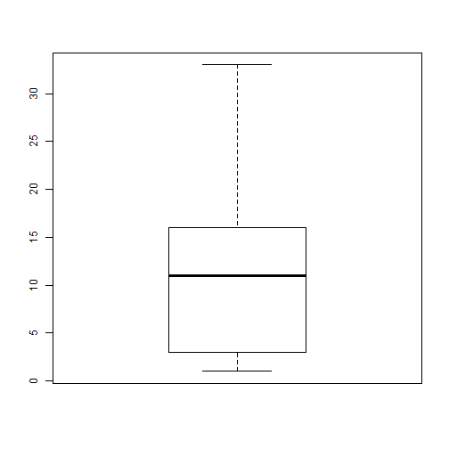
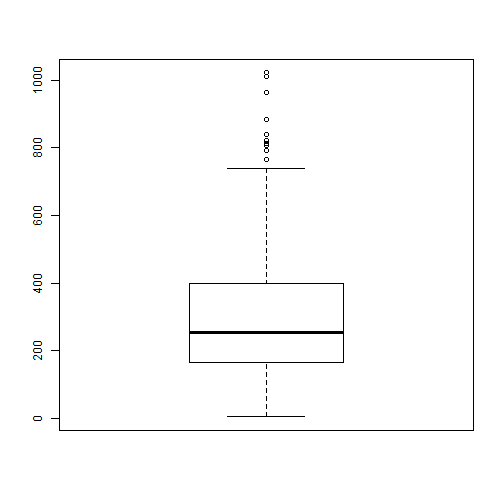
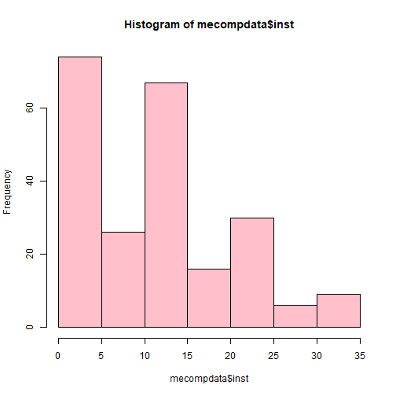
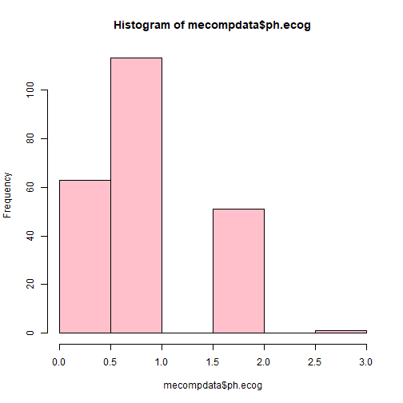

  
  
## PROJECT OVERVIEW
  
1. Advanced R project to predict lung cancer in both Female and    male participants
2. Binomial Regression 
3. Comes under classification with yes/no output

---
  
## DATA INFORMATION
  
1. Data contains 229 instances
2. Has 9 predictor attributes and 1 predicted attribute 
3. Explaining attributes

-inst-(Numeric)

-time-(Numeric)

-wt.loss-(Numeric)	
                                         
-age-(Numeric)	
                                         
-sex-(logical)	
                                         
-ph.ecog- (Numeric)	
                                         
-ph.karno-(Numeric)
                                         
-pat.karno-(numeric)

-meal.cal-(numeric)
                                        
-Outcome-status-logical(YES or NO)

---
  
## READ DATA

```r
data<- read.csv("C:/Users/Madan/Documents/gp2.csv",header=TRUE, stringsAsFactors = TRUE)

data$status <- replace(data$status, data$status==1,1)
data$status <- replace(data$status, data$status==2,0)
data$status <- as.factor(data$status)

str(data)
```

```
## 'data.frame':	228 obs. of  11 variables:
##  $ X        : int  1 2 3 4 5 6 7 8 9 10 ...
##  $ inst     : int  3 3 3 5 1 12 7 11 1 7 ...
##  $ time     : int  306 455 1010 210 883 1022 310 361 218 166 ...
##  $ status   : Factor w/ 2 levels "0","1": 1 1 2 1 1 2 1 1 1 1 ...
##  $ age      : int  74 68 56 57 60 74 68 71 53 61 ...
##  $ sex      : int  1 1 1 1 1 1 2 2 1 1 ...
##  $ ph.ecog  : int  1 0 0 1 0 1 2 2 1 2 ...
##  $ ph.karno : int  90 90 90 90 100 50 70 60 70 70 ...
##  $ pat.karno: int  100 90 90 60 90 80 60 80 80 70 ...
##  $ meal.cal : int  1175 1225 NA 1150 NA 513 384 538 825 271 ...
##  $ wt.loss  : int  NA 15 15 11 0 0 10 1 16 34 ...
```

---

##IMPUTE DATA using mean

```r
library(mice)
md.pattern(data)#finding missing data
```

```
##     X time status age sex inst ph.ecog ph.karno pat.karno wt.loss meal.cal
## 167 1    1      1   1   1    1       1        1         1       1        1
##   1 1    1      1   1   1    0       1        1         1       1        1
##   1 1    1      1   1   1    1       0        1         1       1        1
##   2 1    1      1   1   1    1       1        1         0       1        1
##  42 1    1      1   1   1    1       1        1         1       1        0
##  10 1    1      1   1   1    1       1        1         1       0        1
##   1 1    1      1   1   1    1       1        1         0       1        0
##   3 1    1      1   1   1    1       1        1         1       0        0
##   1 1    1      1   1   1    1       1        0         1       0        0
##     0    0      0   0   0    1       1        1         3      14       47
##       
## 167  0
##   1  1
##   1  1
##   2  1
##  42  1
##  10  1
##   1  2
##   3  2
##   1  3
##     67
```

```r
mecompdata <- mice(data,m=10,maxit=50,meth='pmm',seed=500)
```

```
## 
##  iter imp variable
##   1   1  inst  ph.ecog  ph.karno  pat.karno  meal.cal  wt.loss
##   1   2  inst  ph.ecog  ph.karno  pat.karno  meal.cal  wt.loss
##   1   3  inst  ph.ecog  ph.karno  pat.karno  meal.cal  wt.loss
##   1   4  inst  ph.ecog  ph.karno  pat.karno  meal.cal  wt.loss
##   1   5  inst  ph.ecog  ph.karno  pat.karno  meal.cal  wt.loss
##   1   6  inst  ph.ecog  ph.karno  pat.karno  meal.cal  wt.loss
##   1   7  inst  ph.ecog  ph.karno  pat.karno  meal.cal  wt.loss
##   1   8  inst  ph.ecog  ph.karno  pat.karno  meal.cal  wt.loss
##   1   9  inst  ph.ecog  ph.karno  pat.karno  meal.cal  wt.loss
##   1   10  inst  ph.ecog  ph.karno  pat.karno  meal.cal  wt.loss
##   2   1  inst  ph.ecog  ph.karno  pat.karno  meal.cal  wt.loss
##   2   2  inst  ph.ecog  ph.karno  pat.karno  meal.cal  wt.loss
##   2   3  inst  ph.ecog  ph.karno  pat.karno  meal.cal  wt.loss
##   2   4  inst  ph.ecog  ph.karno  pat.karno  meal.cal  wt.loss
##   2   5  inst  ph.ecog  ph.karno  pat.karno  meal.cal  wt.loss
##   2   6  inst  ph.ecog  ph.karno  pat.karno  meal.cal  wt.loss
##   2   7  inst  ph.ecog  ph.karno  pat.karno  meal.cal  wt.loss
##   2   8  inst  ph.ecog  ph.karno  pat.karno  meal.cal  wt.loss
##   2   9  inst  ph.ecog  ph.karno  pat.karno  meal.cal  wt.loss
##   2   10  inst  ph.ecog  ph.karno  pat.karno  meal.cal  wt.loss
##   3   1  inst  ph.ecog  ph.karno  pat.karno  meal.cal  wt.loss
##   3   2  inst  ph.ecog  ph.karno  pat.karno  meal.cal  wt.loss
##   3   3  inst  ph.ecog  ph.karno  pat.karno  meal.cal  wt.loss
##   3   4  inst  ph.ecog  ph.karno  pat.karno  meal.cal  wt.loss
##   3   5  inst  ph.ecog  ph.karno  pat.karno  meal.cal  wt.loss
##   3   6  inst  ph.ecog  ph.karno  pat.karno  meal.cal  wt.loss
##   3   7  inst  ph.ecog  ph.karno  pat.karno  meal.cal  wt.loss
##   3   8  inst  ph.ecog  ph.karno  pat.karno  meal.cal  wt.loss
##   3   9  inst  ph.ecog  ph.karno  pat.karno  meal.cal  wt.loss
##   3   10  inst  ph.ecog  ph.karno  pat.karno  meal.cal  wt.loss
##   4   1  inst  ph.ecog  ph.karno  pat.karno  meal.cal  wt.loss
##   4   2  inst  ph.ecog  ph.karno  pat.karno  meal.cal  wt.loss
##   4   3  inst  ph.ecog  ph.karno  pat.karno  meal.cal  wt.loss
##   4   4  inst  ph.ecog  ph.karno  pat.karno  meal.cal  wt.loss
##   4   5  inst  ph.ecog  ph.karno  pat.karno  meal.cal  wt.loss
##   4   6  inst  ph.ecog  ph.karno  pat.karno  meal.cal  wt.loss
##   4   7  inst  ph.ecog  ph.karno  pat.karno  meal.cal  wt.loss
##   4   8  inst  ph.ecog  ph.karno  pat.karno  meal.cal  wt.loss
##   4   9  inst  ph.ecog  ph.karno  pat.karno  meal.cal  wt.loss
##   4   10  inst  ph.ecog  ph.karno  pat.karno  meal.cal  wt.loss
##   5   1  inst  ph.ecog  ph.karno  pat.karno  meal.cal  wt.loss
##   5   2  inst  ph.ecog  ph.karno  pat.karno  meal.cal  wt.loss
##   5   3  inst  ph.ecog  ph.karno  pat.karno  meal.cal  wt.loss
##   5   4  inst  ph.ecog  ph.karno  pat.karno  meal.cal  wt.loss
##   5   5  inst  ph.ecog  ph.karno  pat.karno  meal.cal  wt.loss
##   5   6  inst  ph.ecog  ph.karno  pat.karno  meal.cal  wt.loss
##   5   7  inst  ph.ecog  ph.karno  pat.karno  meal.cal  wt.loss
##   5   8  inst  ph.ecog  ph.karno  pat.karno  meal.cal  wt.loss
##   5   9  inst  ph.ecog  ph.karno  pat.karno  meal.cal  wt.loss
##   5   10  inst  ph.ecog  ph.karno  pat.karno  meal.cal  wt.loss
##   6   1  inst  ph.ecog  ph.karno  pat.karno  meal.cal  wt.loss
##   6   2  inst  ph.ecog  ph.karno  pat.karno  meal.cal  wt.loss
##   6   3  inst  ph.ecog  ph.karno  pat.karno  meal.cal  wt.loss
##   6   4  inst  ph.ecog  ph.karno  pat.karno  meal.cal  wt.loss
##   6   5  inst  ph.ecog  ph.karno  pat.karno  meal.cal  wt.loss
##   6   6  inst  ph.ecog  ph.karno  pat.karno  meal.cal  wt.loss
##   6   7  inst  ph.ecog  ph.karno  pat.karno  meal.cal  wt.loss
##   6   8  inst  ph.ecog  ph.karno  pat.karno  meal.cal  wt.loss
##   6   9  inst  ph.ecog  ph.karno  pat.karno  meal.cal  wt.loss
##   6   10  inst  ph.ecog  ph.karno  pat.karno  meal.cal  wt.loss
##   7   1  inst  ph.ecog  ph.karno  pat.karno  meal.cal  wt.loss
##   7   2  inst  ph.ecog  ph.karno  pat.karno  meal.cal  wt.loss
##   7   3  inst  ph.ecog  ph.karno  pat.karno  meal.cal  wt.loss
##   7   4  inst  ph.ecog  ph.karno  pat.karno  meal.cal  wt.loss
##   7   5  inst  ph.ecog  ph.karno  pat.karno  meal.cal  wt.loss
##   7   6  inst  ph.ecog  ph.karno  pat.karno  meal.cal  wt.loss
##   7   7  inst  ph.ecog  ph.karno  pat.karno  meal.cal  wt.loss
##   7   8  inst  ph.ecog  ph.karno  pat.karno  meal.cal  wt.loss
##   7   9  inst  ph.ecog  ph.karno  pat.karno  meal.cal  wt.loss
##   7   10  inst  ph.ecog  ph.karno  pat.karno  meal.cal  wt.loss
##   8   1  inst  ph.ecog  ph.karno  pat.karno  meal.cal  wt.loss
##   8   2  inst  ph.ecog  ph.karno  pat.karno  meal.cal  wt.loss
##   8   3  inst  ph.ecog  ph.karno  pat.karno  meal.cal  wt.loss
##   8   4  inst  ph.ecog  ph.karno  pat.karno  meal.cal  wt.loss
##   8   5  inst  ph.ecog  ph.karno  pat.karno  meal.cal  wt.loss
##   8   6  inst  ph.ecog  ph.karno  pat.karno  meal.cal  wt.loss
##   8   7  inst  ph.ecog  ph.karno  pat.karno  meal.cal  wt.loss
##   8   8  inst  ph.ecog  ph.karno  pat.karno  meal.cal  wt.loss
##   8   9  inst  ph.ecog  ph.karno  pat.karno  meal.cal  wt.loss
##   8   10  inst  ph.ecog  ph.karno  pat.karno  meal.cal  wt.loss
##   9   1  inst  ph.ecog  ph.karno  pat.karno  meal.cal  wt.loss
##   9   2  inst  ph.ecog  ph.karno  pat.karno  meal.cal  wt.loss
##   9   3  inst  ph.ecog  ph.karno  pat.karno  meal.cal  wt.loss
##   9   4  inst  ph.ecog  ph.karno  pat.karno  meal.cal  wt.loss
##   9   5  inst  ph.ecog  ph.karno  pat.karno  meal.cal  wt.loss
##   9   6  inst  ph.ecog  ph.karno  pat.karno  meal.cal  wt.loss
##   9   7  inst  ph.ecog  ph.karno  pat.karno  meal.cal  wt.loss
##   9   8  inst  ph.ecog  ph.karno  pat.karno  meal.cal  wt.loss
##   9   9  inst  ph.ecog  ph.karno  pat.karno  meal.cal  wt.loss
##   9   10  inst  ph.ecog  ph.karno  pat.karno  meal.cal  wt.loss
##   10   1  inst  ph.ecog  ph.karno  pat.karno  meal.cal  wt.loss
##   10   2  inst  ph.ecog  ph.karno  pat.karno  meal.cal  wt.loss
##   10   3  inst  ph.ecog  ph.karno  pat.karno  meal.cal  wt.loss
##   10   4  inst  ph.ecog  ph.karno  pat.karno  meal.cal  wt.loss
##   10   5  inst  ph.ecog  ph.karno  pat.karno  meal.cal  wt.loss
##   10   6  inst  ph.ecog  ph.karno  pat.karno  meal.cal  wt.loss
##   10   7  inst  ph.ecog  ph.karno  pat.karno  meal.cal  wt.loss
##   10   8  inst  ph.ecog  ph.karno  pat.karno  meal.cal  wt.loss
##   10   9  inst  ph.ecog  ph.karno  pat.karno  meal.cal  wt.loss
##   10   10  inst  ph.ecog  ph.karno  pat.karno  meal.cal  wt.loss
##   11   1  inst  ph.ecog  ph.karno  pat.karno  meal.cal  wt.loss
##   11   2  inst  ph.ecog  ph.karno  pat.karno  meal.cal  wt.loss
##   11   3  inst  ph.ecog  ph.karno  pat.karno  meal.cal  wt.loss
##   11   4  inst  ph.ecog  ph.karno  pat.karno  meal.cal  wt.loss
##   11   5  inst  ph.ecog  ph.karno  pat.karno  meal.cal  wt.loss
##   11   6  inst  ph.ecog  ph.karno  pat.karno  meal.cal  wt.loss
##   11   7  inst  ph.ecog  ph.karno  pat.karno  meal.cal  wt.loss
##   11   8  inst  ph.ecog  ph.karno  pat.karno  meal.cal  wt.loss
##   11   9  inst  ph.ecog  ph.karno  pat.karno  meal.cal  wt.loss
##   11   10  inst  ph.ecog  ph.karno  pat.karno  meal.cal  wt.loss
##   12   1  inst  ph.ecog  ph.karno  pat.karno  meal.cal  wt.loss
##   12   2  inst  ph.ecog  ph.karno  pat.karno  meal.cal  wt.loss
##   12   3  inst  ph.ecog  ph.karno  pat.karno  meal.cal  wt.loss
##   12   4  inst  ph.ecog  ph.karno  pat.karno  meal.cal  wt.loss
##   12   5  inst  ph.ecog  ph.karno  pat.karno  meal.cal  wt.loss
##   12   6  inst  ph.ecog  ph.karno  pat.karno  meal.cal  wt.loss
##   12   7  inst  ph.ecog  ph.karno  pat.karno  meal.cal  wt.loss
##   12   8  inst  ph.ecog  ph.karno  pat.karno  meal.cal  wt.loss
##   12   9  inst  ph.ecog  ph.karno  pat.karno  meal.cal  wt.loss
##   12   10  inst  ph.ecog  ph.karno  pat.karno  meal.cal  wt.loss
##   13   1  inst  ph.ecog  ph.karno  pat.karno  meal.cal  wt.loss
##   13   2  inst  ph.ecog  ph.karno  pat.karno  meal.cal  wt.loss
##   13   3  inst  ph.ecog  ph.karno  pat.karno  meal.cal  wt.loss
##   13   4  inst  ph.ecog  ph.karno  pat.karno  meal.cal  wt.loss
##   13   5  inst  ph.ecog  ph.karno  pat.karno  meal.cal  wt.loss
##   13   6  inst  ph.ecog  ph.karno  pat.karno  meal.cal  wt.loss
##   13   7  inst  ph.ecog  ph.karno  pat.karno  meal.cal  wt.loss
##   13   8  inst  ph.ecog  ph.karno  pat.karno  meal.cal  wt.loss
##   13   9  inst  ph.ecog  ph.karno  pat.karno  meal.cal  wt.loss
##   13   10  inst  ph.ecog  ph.karno  pat.karno  meal.cal  wt.loss
##   14   1  inst  ph.ecog  ph.karno  pat.karno  meal.cal  wt.loss
##   14   2  inst  ph.ecog  ph.karno  pat.karno  meal.cal  wt.loss
##   14   3  inst  ph.ecog  ph.karno  pat.karno  meal.cal  wt.loss
##   14   4  inst  ph.ecog  ph.karno  pat.karno  meal.cal  wt.loss
##   14   5  inst  ph.ecog  ph.karno  pat.karno  meal.cal  wt.loss
##   14   6  inst  ph.ecog  ph.karno  pat.karno  meal.cal  wt.loss
##   14   7  inst  ph.ecog  ph.karno  pat.karno  meal.cal  wt.loss
##   14   8  inst  ph.ecog  ph.karno  pat.karno  meal.cal  wt.loss
##   14   9  inst  ph.ecog  ph.karno  pat.karno  meal.cal  wt.loss
##   14   10  inst  ph.ecog  ph.karno  pat.karno  meal.cal  wt.loss
##   15   1  inst  ph.ecog  ph.karno  pat.karno  meal.cal  wt.loss
##   15   2  inst  ph.ecog  ph.karno  pat.karno  meal.cal  wt.loss
##   15   3  inst  ph.ecog  ph.karno  pat.karno  meal.cal  wt.loss
##   15   4  inst  ph.ecog  ph.karno  pat.karno  meal.cal  wt.loss
##   15   5  inst  ph.ecog  ph.karno  pat.karno  meal.cal  wt.loss
##   15   6  inst  ph.ecog  ph.karno  pat.karno  meal.cal  wt.loss
##   15   7  inst  ph.ecog  ph.karno  pat.karno  meal.cal  wt.loss
##   15   8  inst  ph.ecog  ph.karno  pat.karno  meal.cal  wt.loss
##   15   9  inst  ph.ecog  ph.karno  pat.karno  meal.cal  wt.loss
##   15   10  inst  ph.ecog  ph.karno  pat.karno  meal.cal  wt.loss
##   16   1  inst  ph.ecog  ph.karno  pat.karno  meal.cal  wt.loss
##   16   2  inst  ph.ecog  ph.karno  pat.karno  meal.cal  wt.loss
##   16   3  inst  ph.ecog  ph.karno  pat.karno  meal.cal  wt.loss
##   16   4  inst  ph.ecog  ph.karno  pat.karno  meal.cal  wt.loss
##   16   5  inst  ph.ecog  ph.karno  pat.karno  meal.cal  wt.loss
##   16   6  inst  ph.ecog  ph.karno  pat.karno  meal.cal  wt.loss
##   16   7  inst  ph.ecog  ph.karno  pat.karno  meal.cal  wt.loss
##   16   8  inst  ph.ecog  ph.karno  pat.karno  meal.cal  wt.loss
##   16   9  inst  ph.ecog  ph.karno  pat.karno  meal.cal  wt.loss
##   16   10  inst  ph.ecog  ph.karno  pat.karno  meal.cal  wt.loss
##   17   1  inst  ph.ecog  ph.karno  pat.karno  meal.cal  wt.loss
##   17   2  inst  ph.ecog  ph.karno  pat.karno  meal.cal  wt.loss
##   17   3  inst  ph.ecog  ph.karno  pat.karno  meal.cal  wt.loss
##   17   4  inst  ph.ecog  ph.karno  pat.karno  meal.cal  wt.loss
##   17   5  inst  ph.ecog  ph.karno  pat.karno  meal.cal  wt.loss
##   17   6  inst  ph.ecog  ph.karno  pat.karno  meal.cal  wt.loss
##   17   7  inst  ph.ecog  ph.karno  pat.karno  meal.cal  wt.loss
##   17   8  inst  ph.ecog  ph.karno  pat.karno  meal.cal  wt.loss
##   17   9  inst  ph.ecog  ph.karno  pat.karno  meal.cal  wt.loss
##   17   10  inst  ph.ecog  ph.karno  pat.karno  meal.cal  wt.loss
##   18   1  inst  ph.ecog  ph.karno  pat.karno  meal.cal  wt.loss
##   18   2  inst  ph.ecog  ph.karno  pat.karno  meal.cal  wt.loss
##   18   3  inst  ph.ecog  ph.karno  pat.karno  meal.cal  wt.loss
##   18   4  inst  ph.ecog  ph.karno  pat.karno  meal.cal  wt.loss
##   18   5  inst  ph.ecog  ph.karno  pat.karno  meal.cal  wt.loss
##   18   6  inst  ph.ecog  ph.karno  pat.karno  meal.cal  wt.loss
##   18   7  inst  ph.ecog  ph.karno  pat.karno  meal.cal  wt.loss
##   18   8  inst  ph.ecog  ph.karno  pat.karno  meal.cal  wt.loss
##   18   9  inst  ph.ecog  ph.karno  pat.karno  meal.cal  wt.loss
##   18   10  inst  ph.ecog  ph.karno  pat.karno  meal.cal  wt.loss
##   19   1  inst  ph.ecog  ph.karno  pat.karno  meal.cal  wt.loss
##   19   2  inst  ph.ecog  ph.karno  pat.karno  meal.cal  wt.loss
##   19   3  inst  ph.ecog  ph.karno  pat.karno  meal.cal  wt.loss
##   19   4  inst  ph.ecog  ph.karno  pat.karno  meal.cal  wt.loss
##   19   5  inst  ph.ecog  ph.karno  pat.karno  meal.cal  wt.loss
##   19   6  inst  ph.ecog  ph.karno  pat.karno  meal.cal  wt.loss
##   19   7  inst  ph.ecog  ph.karno  pat.karno  meal.cal  wt.loss
##   19   8  inst  ph.ecog  ph.karno  pat.karno  meal.cal  wt.loss
##   19   9  inst  ph.ecog  ph.karno  pat.karno  meal.cal  wt.loss
##   19   10  inst  ph.ecog  ph.karno  pat.karno  meal.cal  wt.loss
##   20   1  inst  ph.ecog  ph.karno  pat.karno  meal.cal  wt.loss
##   20   2  inst  ph.ecog  ph.karno  pat.karno  meal.cal  wt.loss
##   20   3  inst  ph.ecog  ph.karno  pat.karno  meal.cal  wt.loss
##   20   4  inst  ph.ecog  ph.karno  pat.karno  meal.cal  wt.loss
##   20   5  inst  ph.ecog  ph.karno  pat.karno  meal.cal  wt.loss
##   20   6  inst  ph.ecog  ph.karno  pat.karno  meal.cal  wt.loss
##   20   7  inst  ph.ecog  ph.karno  pat.karno  meal.cal  wt.loss
##   20   8  inst  ph.ecog  ph.karno  pat.karno  meal.cal  wt.loss
##   20   9  inst  ph.ecog  ph.karno  pat.karno  meal.cal  wt.loss
##   20   10  inst  ph.ecog  ph.karno  pat.karno  meal.cal  wt.loss
##   21   1  inst  ph.ecog  ph.karno  pat.karno  meal.cal  wt.loss
##   21   2  inst  ph.ecog  ph.karno  pat.karno  meal.cal  wt.loss
##   21   3  inst  ph.ecog  ph.karno  pat.karno  meal.cal  wt.loss
##   21   4  inst  ph.ecog  ph.karno  pat.karno  meal.cal  wt.loss
##   21   5  inst  ph.ecog  ph.karno  pat.karno  meal.cal  wt.loss
##   21   6  inst  ph.ecog  ph.karno  pat.karno  meal.cal  wt.loss
##   21   7  inst  ph.ecog  ph.karno  pat.karno  meal.cal  wt.loss
##   21   8  inst  ph.ecog  ph.karno  pat.karno  meal.cal  wt.loss
##   21   9  inst  ph.ecog  ph.karno  pat.karno  meal.cal  wt.loss
##   21   10  inst  ph.ecog  ph.karno  pat.karno  meal.cal  wt.loss
##   22   1  inst  ph.ecog  ph.karno  pat.karno  meal.cal  wt.loss
##   22   2  inst  ph.ecog  ph.karno  pat.karno  meal.cal  wt.loss
##   22   3  inst  ph.ecog  ph.karno  pat.karno  meal.cal  wt.loss
##   22   4  inst  ph.ecog  ph.karno  pat.karno  meal.cal  wt.loss
##   22   5  inst  ph.ecog  ph.karno  pat.karno  meal.cal  wt.loss
##   22   6  inst  ph.ecog  ph.karno  pat.karno  meal.cal  wt.loss
##   22   7  inst  ph.ecog  ph.karno  pat.karno  meal.cal  wt.loss
##   22   8  inst  ph.ecog  ph.karno  pat.karno  meal.cal  wt.loss
##   22   9  inst  ph.ecog  ph.karno  pat.karno  meal.cal  wt.loss
##   22   10  inst  ph.ecog  ph.karno  pat.karno  meal.cal  wt.loss
##   23   1  inst  ph.ecog  ph.karno  pat.karno  meal.cal  wt.loss
##   23   2  inst  ph.ecog  ph.karno  pat.karno  meal.cal  wt.loss
##   23   3  inst  ph.ecog  ph.karno  pat.karno  meal.cal  wt.loss
##   23   4  inst  ph.ecog  ph.karno  pat.karno  meal.cal  wt.loss
##   23   5  inst  ph.ecog  ph.karno  pat.karno  meal.cal  wt.loss
##   23   6  inst  ph.ecog  ph.karno  pat.karno  meal.cal  wt.loss
##   23   7  inst  ph.ecog  ph.karno  pat.karno  meal.cal  wt.loss
##   23   8  inst  ph.ecog  ph.karno  pat.karno  meal.cal  wt.loss
##   23   9  inst  ph.ecog  ph.karno  pat.karno  meal.cal  wt.loss
##   23   10  inst  ph.ecog  ph.karno  pat.karno  meal.cal  wt.loss
##   24   1  inst  ph.ecog  ph.karno  pat.karno  meal.cal  wt.loss
##   24   2  inst  ph.ecog  ph.karno  pat.karno  meal.cal  wt.loss
##   24   3  inst  ph.ecog  ph.karno  pat.karno  meal.cal  wt.loss
##   24   4  inst  ph.ecog  ph.karno  pat.karno  meal.cal  wt.loss
##   24   5  inst  ph.ecog  ph.karno  pat.karno  meal.cal  wt.loss
##   24   6  inst  ph.ecog  ph.karno  pat.karno  meal.cal  wt.loss
##   24   7  inst  ph.ecog  ph.karno  pat.karno  meal.cal  wt.loss
##   24   8  inst  ph.ecog  ph.karno  pat.karno  meal.cal  wt.loss
##   24   9  inst  ph.ecog  ph.karno  pat.karno  meal.cal  wt.loss
##   24   10  inst  ph.ecog  ph.karno  pat.karno  meal.cal  wt.loss
##   25   1  inst  ph.ecog  ph.karno  pat.karno  meal.cal  wt.loss
##   25   2  inst  ph.ecog  ph.karno  pat.karno  meal.cal  wt.loss
##   25   3  inst  ph.ecog  ph.karno  pat.karno  meal.cal  wt.loss
##   25   4  inst  ph.ecog  ph.karno  pat.karno  meal.cal  wt.loss
##   25   5  inst  ph.ecog  ph.karno  pat.karno  meal.cal  wt.loss
##   25   6  inst  ph.ecog  ph.karno  pat.karno  meal.cal  wt.loss
##   25   7  inst  ph.ecog  ph.karno  pat.karno  meal.cal  wt.loss
##   25   8  inst  ph.ecog  ph.karno  pat.karno  meal.cal  wt.loss
##   25   9  inst  ph.ecog  ph.karno  pat.karno  meal.cal  wt.loss
##   25   10  inst  ph.ecog  ph.karno  pat.karno  meal.cal  wt.loss
##   26   1  inst  ph.ecog  ph.karno  pat.karno  meal.cal  wt.loss
##   26   2  inst  ph.ecog  ph.karno  pat.karno  meal.cal  wt.loss
##   26   3  inst  ph.ecog  ph.karno  pat.karno  meal.cal  wt.loss
##   26   4  inst  ph.ecog  ph.karno  pat.karno  meal.cal  wt.loss
##   26   5  inst  ph.ecog  ph.karno  pat.karno  meal.cal  wt.loss
##   26   6  inst  ph.ecog  ph.karno  pat.karno  meal.cal  wt.loss
##   26   7  inst  ph.ecog  ph.karno  pat.karno  meal.cal  wt.loss
##   26   8  inst  ph.ecog  ph.karno  pat.karno  meal.cal  wt.loss
##   26   9  inst  ph.ecog  ph.karno  pat.karno  meal.cal  wt.loss
##   26   10  inst  ph.ecog  ph.karno  pat.karno  meal.cal  wt.loss
##   27   1  inst  ph.ecog  ph.karno  pat.karno  meal.cal  wt.loss
##   27   2  inst  ph.ecog  ph.karno  pat.karno  meal.cal  wt.loss
##   27   3  inst  ph.ecog  ph.karno  pat.karno  meal.cal  wt.loss
##   27   4  inst  ph.ecog  ph.karno  pat.karno  meal.cal  wt.loss
##   27   5  inst  ph.ecog  ph.karno  pat.karno  meal.cal  wt.loss
##   27   6  inst  ph.ecog  ph.karno  pat.karno  meal.cal  wt.loss
##   27   7  inst  ph.ecog  ph.karno  pat.karno  meal.cal  wt.loss
##   27   8  inst  ph.ecog  ph.karno  pat.karno  meal.cal  wt.loss
##   27   9  inst  ph.ecog  ph.karno  pat.karno  meal.cal  wt.loss
##   27   10  inst  ph.ecog  ph.karno  pat.karno  meal.cal  wt.loss
##   28   1  inst  ph.ecog  ph.karno  pat.karno  meal.cal  wt.loss
##   28   2  inst  ph.ecog  ph.karno  pat.karno  meal.cal  wt.loss
##   28   3  inst  ph.ecog  ph.karno  pat.karno  meal.cal  wt.loss
##   28   4  inst  ph.ecog  ph.karno  pat.karno  meal.cal  wt.loss
##   28   5  inst  ph.ecog  ph.karno  pat.karno  meal.cal  wt.loss
##   28   6  inst  ph.ecog  ph.karno  pat.karno  meal.cal  wt.loss
##   28   7  inst  ph.ecog  ph.karno  pat.karno  meal.cal  wt.loss
##   28   8  inst  ph.ecog  ph.karno  pat.karno  meal.cal  wt.loss
##   28   9  inst  ph.ecog  ph.karno  pat.karno  meal.cal  wt.loss
##   28   10  inst  ph.ecog  ph.karno  pat.karno  meal.cal  wt.loss
##   29   1  inst  ph.ecog  ph.karno  pat.karno  meal.cal  wt.loss
##   29   2  inst  ph.ecog  ph.karno  pat.karno  meal.cal  wt.loss
##   29   3  inst  ph.ecog  ph.karno  pat.karno  meal.cal  wt.loss
##   29   4  inst  ph.ecog  ph.karno  pat.karno  meal.cal  wt.loss
##   29   5  inst  ph.ecog  ph.karno  pat.karno  meal.cal  wt.loss
##   29   6  inst  ph.ecog  ph.karno  pat.karno  meal.cal  wt.loss
##   29   7  inst  ph.ecog  ph.karno  pat.karno  meal.cal  wt.loss
##   29   8  inst  ph.ecog  ph.karno  pat.karno  meal.cal  wt.loss
##   29   9  inst  ph.ecog  ph.karno  pat.karno  meal.cal  wt.loss
##   29   10  inst  ph.ecog  ph.karno  pat.karno  meal.cal  wt.loss
##   30   1  inst  ph.ecog  ph.karno  pat.karno  meal.cal  wt.loss
##   30   2  inst  ph.ecog  ph.karno  pat.karno  meal.cal  wt.loss
##   30   3  inst  ph.ecog  ph.karno  pat.karno  meal.cal  wt.loss
##   30   4  inst  ph.ecog  ph.karno  pat.karno  meal.cal  wt.loss
##   30   5  inst  ph.ecog  ph.karno  pat.karno  meal.cal  wt.loss
##   30   6  inst  ph.ecog  ph.karno  pat.karno  meal.cal  wt.loss
##   30   7  inst  ph.ecog  ph.karno  pat.karno  meal.cal  wt.loss
##   30   8  inst  ph.ecog  ph.karno  pat.karno  meal.cal  wt.loss
##   30   9  inst  ph.ecog  ph.karno  pat.karno  meal.cal  wt.loss
##   30   10  inst  ph.ecog  ph.karno  pat.karno  meal.cal  wt.loss
##   31   1  inst  ph.ecog  ph.karno  pat.karno  meal.cal  wt.loss
##   31   2  inst  ph.ecog  ph.karno  pat.karno  meal.cal  wt.loss
##   31   3  inst  ph.ecog  ph.karno  pat.karno  meal.cal  wt.loss
##   31   4  inst  ph.ecog  ph.karno  pat.karno  meal.cal  wt.loss
##   31   5  inst  ph.ecog  ph.karno  pat.karno  meal.cal  wt.loss
##   31   6  inst  ph.ecog  ph.karno  pat.karno  meal.cal  wt.loss
##   31   7  inst  ph.ecog  ph.karno  pat.karno  meal.cal  wt.loss
##   31   8  inst  ph.ecog  ph.karno  pat.karno  meal.cal  wt.loss
##   31   9  inst  ph.ecog  ph.karno  pat.karno  meal.cal  wt.loss
##   31   10  inst  ph.ecog  ph.karno  pat.karno  meal.cal  wt.loss
##   32   1  inst  ph.ecog  ph.karno  pat.karno  meal.cal  wt.loss
##   32   2  inst  ph.ecog  ph.karno  pat.karno  meal.cal  wt.loss
##   32   3  inst  ph.ecog  ph.karno  pat.karno  meal.cal  wt.loss
##   32   4  inst  ph.ecog  ph.karno  pat.karno  meal.cal  wt.loss
##   32   5  inst  ph.ecog  ph.karno  pat.karno  meal.cal  wt.loss
##   32   6  inst  ph.ecog  ph.karno  pat.karno  meal.cal  wt.loss
##   32   7  inst  ph.ecog  ph.karno  pat.karno  meal.cal  wt.loss
##   32   8  inst  ph.ecog  ph.karno  pat.karno  meal.cal  wt.loss
##   32   9  inst  ph.ecog  ph.karno  pat.karno  meal.cal  wt.loss
##   32   10  inst  ph.ecog  ph.karno  pat.karno  meal.cal  wt.loss
##   33   1  inst  ph.ecog  ph.karno  pat.karno  meal.cal  wt.loss
##   33   2  inst  ph.ecog  ph.karno  pat.karno  meal.cal  wt.loss
##   33   3  inst  ph.ecog  ph.karno  pat.karno  meal.cal  wt.loss
##   33   4  inst  ph.ecog  ph.karno  pat.karno  meal.cal  wt.loss
##   33   5  inst  ph.ecog  ph.karno  pat.karno  meal.cal  wt.loss
##   33   6  inst  ph.ecog  ph.karno  pat.karno  meal.cal  wt.loss
##   33   7  inst  ph.ecog  ph.karno  pat.karno  meal.cal  wt.loss
##   33   8  inst  ph.ecog  ph.karno  pat.karno  meal.cal  wt.loss
##   33   9  inst  ph.ecog  ph.karno  pat.karno  meal.cal  wt.loss
##   33   10  inst  ph.ecog  ph.karno  pat.karno  meal.cal  wt.loss
##   34   1  inst  ph.ecog  ph.karno  pat.karno  meal.cal  wt.loss
##   34   2  inst  ph.ecog  ph.karno  pat.karno  meal.cal  wt.loss
##   34   3  inst  ph.ecog  ph.karno  pat.karno  meal.cal  wt.loss
##   34   4  inst  ph.ecog  ph.karno  pat.karno  meal.cal  wt.loss
##   34   5  inst  ph.ecog  ph.karno  pat.karno  meal.cal  wt.loss
##   34   6  inst  ph.ecog  ph.karno  pat.karno  meal.cal  wt.loss
##   34   7  inst  ph.ecog  ph.karno  pat.karno  meal.cal  wt.loss
##   34   8  inst  ph.ecog  ph.karno  pat.karno  meal.cal  wt.loss
##   34   9  inst  ph.ecog  ph.karno  pat.karno  meal.cal  wt.loss
##   34   10  inst  ph.ecog  ph.karno  pat.karno  meal.cal  wt.loss
##   35   1  inst  ph.ecog  ph.karno  pat.karno  meal.cal  wt.loss
##   35   2  inst  ph.ecog  ph.karno  pat.karno  meal.cal  wt.loss
##   35   3  inst  ph.ecog  ph.karno  pat.karno  meal.cal  wt.loss
##   35   4  inst  ph.ecog  ph.karno  pat.karno  meal.cal  wt.loss
##   35   5  inst  ph.ecog  ph.karno  pat.karno  meal.cal  wt.loss
##   35   6  inst  ph.ecog  ph.karno  pat.karno  meal.cal  wt.loss
##   35   7  inst  ph.ecog  ph.karno  pat.karno  meal.cal  wt.loss
##   35   8  inst  ph.ecog  ph.karno  pat.karno  meal.cal  wt.loss
##   35   9  inst  ph.ecog  ph.karno  pat.karno  meal.cal  wt.loss
##   35   10  inst  ph.ecog  ph.karno  pat.karno  meal.cal  wt.loss
##   36   1  inst  ph.ecog  ph.karno  pat.karno  meal.cal  wt.loss
##   36   2  inst  ph.ecog  ph.karno  pat.karno  meal.cal  wt.loss
##   36   3  inst  ph.ecog  ph.karno  pat.karno  meal.cal  wt.loss
##   36   4  inst  ph.ecog  ph.karno  pat.karno  meal.cal  wt.loss
##   36   5  inst  ph.ecog  ph.karno  pat.karno  meal.cal  wt.loss
##   36   6  inst  ph.ecog  ph.karno  pat.karno  meal.cal  wt.loss
##   36   7  inst  ph.ecog  ph.karno  pat.karno  meal.cal  wt.loss
##   36   8  inst  ph.ecog  ph.karno  pat.karno  meal.cal  wt.loss
##   36   9  inst  ph.ecog  ph.karno  pat.karno  meal.cal  wt.loss
##   36   10  inst  ph.ecog  ph.karno  pat.karno  meal.cal  wt.loss
##   37   1  inst  ph.ecog  ph.karno  pat.karno  meal.cal  wt.loss
##   37   2  inst  ph.ecog  ph.karno  pat.karno  meal.cal  wt.loss
##   37   3  inst  ph.ecog  ph.karno  pat.karno  meal.cal  wt.loss
##   37   4  inst  ph.ecog  ph.karno  pat.karno  meal.cal  wt.loss
##   37   5  inst  ph.ecog  ph.karno  pat.karno  meal.cal  wt.loss
##   37   6  inst  ph.ecog  ph.karno  pat.karno  meal.cal  wt.loss
##   37   7  inst  ph.ecog  ph.karno  pat.karno  meal.cal  wt.loss
##   37   8  inst  ph.ecog  ph.karno  pat.karno  meal.cal  wt.loss
##   37   9  inst  ph.ecog  ph.karno  pat.karno  meal.cal  wt.loss
##   37   10  inst  ph.ecog  ph.karno  pat.karno  meal.cal  wt.loss
##   38   1  inst  ph.ecog  ph.karno  pat.karno  meal.cal  wt.loss
##   38   2  inst  ph.ecog  ph.karno  pat.karno  meal.cal  wt.loss
##   38   3  inst  ph.ecog  ph.karno  pat.karno  meal.cal  wt.loss
##   38   4  inst  ph.ecog  ph.karno  pat.karno  meal.cal  wt.loss
##   38   5  inst  ph.ecog  ph.karno  pat.karno  meal.cal  wt.loss
##   38   6  inst  ph.ecog  ph.karno  pat.karno  meal.cal  wt.loss
##   38   7  inst  ph.ecog  ph.karno  pat.karno  meal.cal  wt.loss
##   38   8  inst  ph.ecog  ph.karno  pat.karno  meal.cal  wt.loss
##   38   9  inst  ph.ecog  ph.karno  pat.karno  meal.cal  wt.loss
##   38   10  inst  ph.ecog  ph.karno  pat.karno  meal.cal  wt.loss
##   39   1  inst  ph.ecog  ph.karno  pat.karno  meal.cal  wt.loss
##   39   2  inst  ph.ecog  ph.karno  pat.karno  meal.cal  wt.loss
##   39   3  inst  ph.ecog  ph.karno  pat.karno  meal.cal  wt.loss
##   39   4  inst  ph.ecog  ph.karno  pat.karno  meal.cal  wt.loss
##   39   5  inst  ph.ecog  ph.karno  pat.karno  meal.cal  wt.loss
##   39   6  inst  ph.ecog  ph.karno  pat.karno  meal.cal  wt.loss
##   39   7  inst  ph.ecog  ph.karno  pat.karno  meal.cal  wt.loss
##   39   8  inst  ph.ecog  ph.karno  pat.karno  meal.cal  wt.loss
##   39   9  inst  ph.ecog  ph.karno  pat.karno  meal.cal  wt.loss
##   39   10  inst  ph.ecog  ph.karno  pat.karno  meal.cal  wt.loss
##   40   1  inst  ph.ecog  ph.karno  pat.karno  meal.cal  wt.loss
##   40   2  inst  ph.ecog  ph.karno  pat.karno  meal.cal  wt.loss
##   40   3  inst  ph.ecog  ph.karno  pat.karno  meal.cal  wt.loss
##   40   4  inst  ph.ecog  ph.karno  pat.karno  meal.cal  wt.loss
##   40   5  inst  ph.ecog  ph.karno  pat.karno  meal.cal  wt.loss
##   40   6  inst  ph.ecog  ph.karno  pat.karno  meal.cal  wt.loss
##   40   7  inst  ph.ecog  ph.karno  pat.karno  meal.cal  wt.loss
##   40   8  inst  ph.ecog  ph.karno  pat.karno  meal.cal  wt.loss
##   40   9  inst  ph.ecog  ph.karno  pat.karno  meal.cal  wt.loss
##   40   10  inst  ph.ecog  ph.karno  pat.karno  meal.cal  wt.loss
##   41   1  inst  ph.ecog  ph.karno  pat.karno  meal.cal  wt.loss
##   41   2  inst  ph.ecog  ph.karno  pat.karno  meal.cal  wt.loss
##   41   3  inst  ph.ecog  ph.karno  pat.karno  meal.cal  wt.loss
##   41   4  inst  ph.ecog  ph.karno  pat.karno  meal.cal  wt.loss
##   41   5  inst  ph.ecog  ph.karno  pat.karno  meal.cal  wt.loss
##   41   6  inst  ph.ecog  ph.karno  pat.karno  meal.cal  wt.loss
##   41   7  inst  ph.ecog  ph.karno  pat.karno  meal.cal  wt.loss
##   41   8  inst  ph.ecog  ph.karno  pat.karno  meal.cal  wt.loss
##   41   9  inst  ph.ecog  ph.karno  pat.karno  meal.cal  wt.loss
##   41   10  inst  ph.ecog  ph.karno  pat.karno  meal.cal  wt.loss
##   42   1  inst  ph.ecog  ph.karno  pat.karno  meal.cal  wt.loss
##   42   2  inst  ph.ecog  ph.karno  pat.karno  meal.cal  wt.loss
##   42   3  inst  ph.ecog  ph.karno  pat.karno  meal.cal  wt.loss
##   42   4  inst  ph.ecog  ph.karno  pat.karno  meal.cal  wt.loss
##   42   5  inst  ph.ecog  ph.karno  pat.karno  meal.cal  wt.loss
##   42   6  inst  ph.ecog  ph.karno  pat.karno  meal.cal  wt.loss
##   42   7  inst  ph.ecog  ph.karno  pat.karno  meal.cal  wt.loss
##   42   8  inst  ph.ecog  ph.karno  pat.karno  meal.cal  wt.loss
##   42   9  inst  ph.ecog  ph.karno  pat.karno  meal.cal  wt.loss
##   42   10  inst  ph.ecog  ph.karno  pat.karno  meal.cal  wt.loss
##   43   1  inst  ph.ecog  ph.karno  pat.karno  meal.cal  wt.loss
##   43   2  inst  ph.ecog  ph.karno  pat.karno  meal.cal  wt.loss
##   43   3  inst  ph.ecog  ph.karno  pat.karno  meal.cal  wt.loss
##   43   4  inst  ph.ecog  ph.karno  pat.karno  meal.cal  wt.loss
##   43   5  inst  ph.ecog  ph.karno  pat.karno  meal.cal  wt.loss
##   43   6  inst  ph.ecog  ph.karno  pat.karno  meal.cal  wt.loss
##   43   7  inst  ph.ecog  ph.karno  pat.karno  meal.cal  wt.loss
##   43   8  inst  ph.ecog  ph.karno  pat.karno  meal.cal  wt.loss
##   43   9  inst  ph.ecog  ph.karno  pat.karno  meal.cal  wt.loss
##   43   10  inst  ph.ecog  ph.karno  pat.karno  meal.cal  wt.loss
##   44   1  inst  ph.ecog  ph.karno  pat.karno  meal.cal  wt.loss
##   44   2  inst  ph.ecog  ph.karno  pat.karno  meal.cal  wt.loss
##   44   3  inst  ph.ecog  ph.karno  pat.karno  meal.cal  wt.loss
##   44   4  inst  ph.ecog  ph.karno  pat.karno  meal.cal  wt.loss
##   44   5  inst  ph.ecog  ph.karno  pat.karno  meal.cal  wt.loss
##   44   6  inst  ph.ecog  ph.karno  pat.karno  meal.cal  wt.loss
##   44   7  inst  ph.ecog  ph.karno  pat.karno  meal.cal  wt.loss
##   44   8  inst  ph.ecog  ph.karno  pat.karno  meal.cal  wt.loss
##   44   9  inst  ph.ecog  ph.karno  pat.karno  meal.cal  wt.loss
##   44   10  inst  ph.ecog  ph.karno  pat.karno  meal.cal  wt.loss
##   45   1  inst  ph.ecog  ph.karno  pat.karno  meal.cal  wt.loss
##   45   2  inst  ph.ecog  ph.karno  pat.karno  meal.cal  wt.loss
##   45   3  inst  ph.ecog  ph.karno  pat.karno  meal.cal  wt.loss
##   45   4  inst  ph.ecog  ph.karno  pat.karno  meal.cal  wt.loss
##   45   5  inst  ph.ecog  ph.karno  pat.karno  meal.cal  wt.loss
##   45   6  inst  ph.ecog  ph.karno  pat.karno  meal.cal  wt.loss
##   45   7  inst  ph.ecog  ph.karno  pat.karno  meal.cal  wt.loss
##   45   8  inst  ph.ecog  ph.karno  pat.karno  meal.cal  wt.loss
##   45   9  inst  ph.ecog  ph.karno  pat.karno  meal.cal  wt.loss
##   45   10  inst  ph.ecog  ph.karno  pat.karno  meal.cal  wt.loss
##   46   1  inst  ph.ecog  ph.karno  pat.karno  meal.cal  wt.loss
##   46   2  inst  ph.ecog  ph.karno  pat.karno  meal.cal  wt.loss
##   46   3  inst  ph.ecog  ph.karno  pat.karno  meal.cal  wt.loss
##   46   4  inst  ph.ecog  ph.karno  pat.karno  meal.cal  wt.loss
##   46   5  inst  ph.ecog  ph.karno  pat.karno  meal.cal  wt.loss
##   46   6  inst  ph.ecog  ph.karno  pat.karno  meal.cal  wt.loss
##   46   7  inst  ph.ecog  ph.karno  pat.karno  meal.cal  wt.loss
##   46   8  inst  ph.ecog  ph.karno  pat.karno  meal.cal  wt.loss
##   46   9  inst  ph.ecog  ph.karno  pat.karno  meal.cal  wt.loss
##   46   10  inst  ph.ecog  ph.karno  pat.karno  meal.cal  wt.loss
##   47   1  inst  ph.ecog  ph.karno  pat.karno  meal.cal  wt.loss
##   47   2  inst  ph.ecog  ph.karno  pat.karno  meal.cal  wt.loss
##   47   3  inst  ph.ecog  ph.karno  pat.karno  meal.cal  wt.loss
##   47   4  inst  ph.ecog  ph.karno  pat.karno  meal.cal  wt.loss
##   47   5  inst  ph.ecog  ph.karno  pat.karno  meal.cal  wt.loss
##   47   6  inst  ph.ecog  ph.karno  pat.karno  meal.cal  wt.loss
##   47   7  inst  ph.ecog  ph.karno  pat.karno  meal.cal  wt.loss
##   47   8  inst  ph.ecog  ph.karno  pat.karno  meal.cal  wt.loss
##   47   9  inst  ph.ecog  ph.karno  pat.karno  meal.cal  wt.loss
##   47   10  inst  ph.ecog  ph.karno  pat.karno  meal.cal  wt.loss
##   48   1  inst  ph.ecog  ph.karno  pat.karno  meal.cal  wt.loss
##   48   2  inst  ph.ecog  ph.karno  pat.karno  meal.cal  wt.loss
##   48   3  inst  ph.ecog  ph.karno  pat.karno  meal.cal  wt.loss
##   48   4  inst  ph.ecog  ph.karno  pat.karno  meal.cal  wt.loss
##   48   5  inst  ph.ecog  ph.karno  pat.karno  meal.cal  wt.loss
##   48   6  inst  ph.ecog  ph.karno  pat.karno  meal.cal  wt.loss
##   48   7  inst  ph.ecog  ph.karno  pat.karno  meal.cal  wt.loss
##   48   8  inst  ph.ecog  ph.karno  pat.karno  meal.cal  wt.loss
##   48   9  inst  ph.ecog  ph.karno  pat.karno  meal.cal  wt.loss
##   48   10  inst  ph.ecog  ph.karno  pat.karno  meal.cal  wt.loss
##   49   1  inst  ph.ecog  ph.karno  pat.karno  meal.cal  wt.loss
##   49   2  inst  ph.ecog  ph.karno  pat.karno  meal.cal  wt.loss
##   49   3  inst  ph.ecog  ph.karno  pat.karno  meal.cal  wt.loss
##   49   4  inst  ph.ecog  ph.karno  pat.karno  meal.cal  wt.loss
##   49   5  inst  ph.ecog  ph.karno  pat.karno  meal.cal  wt.loss
##   49   6  inst  ph.ecog  ph.karno  pat.karno  meal.cal  wt.loss
##   49   7  inst  ph.ecog  ph.karno  pat.karno  meal.cal  wt.loss
##   49   8  inst  ph.ecog  ph.karno  pat.karno  meal.cal  wt.loss
##   49   9  inst  ph.ecog  ph.karno  pat.karno  meal.cal  wt.loss
##   49   10  inst  ph.ecog  ph.karno  pat.karno  meal.cal  wt.loss
##   50   1  inst  ph.ecog  ph.karno  pat.karno  meal.cal  wt.loss
##   50   2  inst  ph.ecog  ph.karno  pat.karno  meal.cal  wt.loss
##   50   3  inst  ph.ecog  ph.karno  pat.karno  meal.cal  wt.loss
##   50   4  inst  ph.ecog  ph.karno  pat.karno  meal.cal  wt.loss
##   50   5  inst  ph.ecog  ph.karno  pat.karno  meal.cal  wt.loss
##   50   6  inst  ph.ecog  ph.karno  pat.karno  meal.cal  wt.loss
##   50   7  inst  ph.ecog  ph.karno  pat.karno  meal.cal  wt.loss
##   50   8  inst  ph.ecog  ph.karno  pat.karno  meal.cal  wt.loss
##   50   9  inst  ph.ecog  ph.karno  pat.karno  meal.cal  wt.loss
##   50   10  inst  ph.ecog  ph.karno  pat.karno  meal.cal  wt.loss
```

```r
mecompdata <- complete(mecompdata)
md.pattern(mecompdata)
```

```
##      X inst time status age sex ph.ecog ph.karno pat.karno meal.cal
## [1,] 1    1    1      1   1   1       1        1         1        1
## [2,] 0    0    0      0   0   0       0        0         0        0
##      wt.loss  
## [1,]       1 0
## [2,]       0 0
```

```r
sum(is.na(mecompdata))
```

```
## [1] 0
```

```r
str(mecompdata)
```

```
## 'data.frame':	228 obs. of  11 variables:
##  $ X        : int  1 2 3 4 5 6 7 8 9 10 ...
##  $ inst     : int  3 3 3 5 1 12 7 11 1 7 ...
##  $ time     : int  306 455 1010 210 883 1022 310 361 218 166 ...
##  $ status   : Factor w/ 2 levels "0","1": 1 1 2 1 1 2 1 1 1 1 ...
##   ..- attr(*, "contrasts")= num [1:2, 1] 0 1
##   .. ..- attr(*, "dimnames")=List of 2
##   .. .. ..$ : chr  "0" "1"
##   .. .. ..$ : chr "2"
##  $ age      : int  74 68 56 57 60 74 68 71 53 61 ...
##  $ sex      : int  1 1 1 1 1 1 2 2 1 1 ...
##  $ ph.ecog  : int  1 0 0 1 0 1 2 2 1 2 ...
##  $ ph.karno : int  90 90 90 90 100 50 70 60 70 70 ...
##  $ pat.karno: int  100 90 90 60 90 80 60 80 80 70 ...
##  $ meal.cal : int  1175 1225 1025 1150 1025 513 384 538 825 271 ...
##  $ wt.loss  : int  30 15 15 11 0 0 10 1 16 34 ...
```

---
##EDA

```r
##Corr-plot
library(corrplot)
```

```
## corrplot 0.84 loaded
```

```r
data1=mecompdata[-4]
corplot=cor(data1)
corplot1=corrplot(corplot,order="hclust",method="number")
```


```r
##ph.ecog&ph.karno-high negative correlation
```

---
## EDA

```r
## Bar plot
library(ggplot2)
plot1=ggplot(mecompdata, aes(x =mecompdata$status)) + geom_bar()
plot1
```


---
## EDA

```r
##BOX-PLOTS
boxplot(mecompdata$inst, data=mecompdata)
```


```r
boxplot(mecompdata$time, data=mecompdata)##has outliers
```


```r
boxplot(mecompdata$age, data=mecompdata)
```


```r
boxplot(mecompdata$ph.ecog, data=mecompdata)
```


```r
boxplot(mecompdata$ph.karno, data=mecompdata)
```


```r
boxplot(mecompdata$pat.karno, data=mecompdata)
```


```r
boxplot(mecompdata$meal.cal, data=mecompdata)##has outliers
```


```r
boxplot(mecompdata$wt.loss, data=mecompdata)##has outliers
```


---
## EDA

```r
hist(mecompdata$inst,col = "pink", freq = TRUE)
```



```r
hist(mecompdata$time,col = "pink", freq = TRUE)##not linear
```



```r
hist(mecompdata$age,col = "pink", freq = TRUE)
```


```r
hist(mecompdata$ph.ecog,col = "pink", freq = TRUE)##not linear
```


```r
hist(mecompdata$ph.karno,col = "pink", freq = TRUE)## not linear
```


```r
hist(mecompdata$pat.karno,col = "pink", freq = TRUE)## notlinear
```


```r
hist(mecompdata$meal.cal,col = "pink", freq = TRUE)
```


```r
hist(mecompdata$wt.loss,col = "pink", freq = TRUE)
```


---

## EDA

```r
##scatter plots
pairs(~inst+time+age+ph.ecog,data=mecompdata, 
      main="Simple Scatterplot Matrix")
```



```r
pairs(~ph.karno+pat.karno+meal.cal+wt.loss,data=mecompdata, 
      main="Simple Scatterplot Matrix")
```


```r
pairs(~inst+ph.karno+meal.cal+ph.ecog,data=mecompdata, 
      main="Simple Scatterplot Matrix")
```


```r
pairs(~ph.karno+time+meal.cal+ph.ecog,data=mecompdata, 
      main="Simple Scatterplot Matrix")
```



---
## DATA MANUPULATION

```r
##Manupulating outliers:limiting
mecompdata$time = pmin(mecompdata$time, 750)
mecompdata$meal.cal = pmin(mecompdata$meal.cal,1500)
mecompdata$meal.cal = pmax(mecompdata$meal.cal,350)
mecompdata$wt.loss = pmin(mecompdata$wt.loss,39)
mecompdata$X<-NULL
set.seed(17)
Train<- createDataPartition(mecompdata$status, p=0.7, list=FALSE)
```

```
## Error in createDataPartition(mecompdata$status, p = 0.7, list = FALSE): could not find function "createDataPartition"
```

```r
nrow(mecompdata)
```

```
## [1] 228
```

```r
training <- mecompdata[ Train, ]
```

```
## Error in `[.data.frame`(mecompdata, Train, ): object 'Train' not found
```

```r
nrow(training)
```

```
## Error in nrow(training): object 'training' not found
```

```r
testing <- mecompdata[ -Train, ]
```

```
## Error in `[.data.frame`(mecompdata, -Train, ): object 'Train' not found
```

```r
nrow(testing)
```

```
## Error in nrow(testing): object 'testing' not found
```

---
## MODELING

```r
###plain glm model####
model_glm<-glm(status~.,data=training,family=binomial(link='logit'))
```

```
## Error in is.data.frame(data): object 'training' not found
```

```r
pred_glm<-predict(model_glm, newdata=testing)
```

```
## Error in predict(model_glm, newdata = testing): object 'model_glm' not found
```

```r
cmatrix=table(predict(model_glm, newdata=testing,type='response')>0.5, testing$status)
```

```
## Error in predict(model_glm, newdata = testing, type = "response"): object 'model_glm' not found
```

```r
dimnames(cmatrix)[[1]] = c("A","B")
```

```
## Error in dimnames(cmatrix)[[1]] = c("A", "B"): object 'cmatrix' not found
```

```r
colnames(cmatrix)[[1]] = c("A")
```

```
## Error in colnames(cmatrix)[[1]] = c("A"): object 'cmatrix' not found
```

```r
colnames(cmatrix)[[2]] = c("B")
```

```
## Error in colnames(cmatrix)[[2]] = c("B"): object 'cmatrix' not found
```

```r
Precision<-precision(cmatrix)
```

```
## Error in precision(cmatrix): could not find function "precision"
```

```r
Recall<-recall(cmatrix)
```

```
## Error in recall(cmatrix): could not find function "recall"
```

```r
F1 <- 2*Precision*Recall/(Precision+Recall)
```

```
## Error in eval(expr, envir, enclos): object 'Precision' not found
```

```r
Accuracy <- (cmatrix[1,1]+cmatrix[2,2])/sum(cmatrix)
```

```
## Error in eval(expr, envir, enclos): object 'cmatrix' not found
```

```r
Precision #0.9482759
```

```
## Error in eval(expr, envir, enclos): object 'Precision' not found
```

```r
Recall #0.9591837
```

```
## function (...) 
## .Internal(Recall(...))
## <bytecode: 0x000000001959a3f0>
## <environment: namespace:base>
```

```r
F1 #0.8623853
```

```
## Error in eval(expr, envir, enclos): object 'F1' not found
```

```r
Accuracy #0.7761194
```

```
## Error in eval(expr, envir, enclos): object 'Accuracy' not found
```

```r
perf_log <- prediction(pred_glm, testing$status)
```

```
## Error in prediction(pred_glm, testing$status): could not find function "prediction"
```

```r
roc <- performance(perf_log, "tpr", "fpr")
```

```
## Error in performance(perf_log, "tpr", "fpr"): could not find function "performance"
```

```r
plot(roc, colorize = TRUE)
```

```
## Error in plot(roc, colorize = TRUE): object 'roc' not found
```

```r
performance(perf_log, "auc")@y.values
```

```
## Error in performance(perf_log, "auc"): could not find function "performance"
```

---
##log transforming data

```r
Formula1=status~inst+log(time)+age+ph.ecog+log(ph.karno)+log(pat.karno)+meal.cal+wt.loss

model_glm1<-glm(Formula1,data=training,family=binomial(link='logit'))
```

```
## Error in is.data.frame(data): object 'training' not found
```

```r
pred_glm1<-predict(model_glm1, newdata=testing)
```

```
## Error in predict(model_glm1, newdata = testing): object 'model_glm1' not found
```

```r
cmatrix=table(predict(model_glm1, newdata=testing,type='response')>0.5, testing$status)
```

```
## Error in predict(model_glm1, newdata = testing, type = "response"): object 'model_glm1' not found
```

```r
dimnames(cmatrix)[[1]] = c("A","B")
```

```
## Error in dimnames(cmatrix)[[1]] = c("A", "B"): object 'cmatrix' not found
```

```r
colnames(cmatrix)[[1]] = c("A")
```

```
## Error in colnames(cmatrix)[[1]] = c("A"): object 'cmatrix' not found
```

```r
colnames(cmatrix)[[2]] = c("B")
```

```
## Error in colnames(cmatrix)[[2]] = c("B"): object 'cmatrix' not found
```

```r
Precision<-precision(cmatrix)
```

```
## Error in precision(cmatrix): could not find function "precision"
```

```r
Recall<-recall(cmatrix)
```

```
## Error in recall(cmatrix): could not find function "recall"
```

```r
F1 <- 2*Precision*Recall/(Precision+Recall)
```

```
## Error in eval(expr, envir, enclos): object 'Precision' not found
```

```r
Accuracy <- (cmatrix[1,1]+cmatrix[2,2])/sum(cmatrix)
```

```
## Error in eval(expr, envir, enclos): object 'cmatrix' not found
```

```r
Precision #0.7580645
```

```
## Error in eval(expr, envir, enclos): object 'Precision' not found
```

```r
Recall #0.9591837
```

```
## function (...) 
## .Internal(Recall(...))
## <bytecode: 0x000000001959a3f0>
## <environment: namespace:base>
```

```r
F1 #0.8468468
```

```
## Error in eval(expr, envir, enclos): object 'F1' not found
```

```r
Accuracy #0.7462687
```

```
## Error in eval(expr, envir, enclos): object 'Accuracy' not found
```

```r
perf_log1 <- prediction(pred_glm1, testing$status)
```

```
## Error in prediction(pred_glm1, testing$status): could not find function "prediction"
```

```r
roc1 <- performance(perf_log1, "tpr", "fpr")
```

```
## Error in performance(perf_log1, "tpr", "fpr"): could not find function "performance"
```

```r
plot(roc1, colorize = TRUE)
```

```
## Error in plot(roc1, colorize = TRUE): object 'roc1' not found
```

```r
performance(perf_log1, "auc")@y.values
```

```
## Error in performance(perf_log1, "auc"): could not find function "performance"
```

---
##Feature Engineering

```r
fecompdata=mecompdata
fecompdata$att1 <- mecompdata$ph.ecog^2
fecompdata$att2 <- mecompdata$ph.ecog^3
fecompdata$att3 <- mecompdata$ph.karno^2
fecompdata$att4 <- mecompdata$ph.karno^3
fecompdata$att5 <- mecompdata$pat.karno^2
fecompdata$att6 <- mecompdata$pat.karno^3
fecompdata$att7 <- mecompdata$ph.ecog*mecompdata$ph.karno
fecompdata$att8 <- mecompdata$ph.karno*mecompdata$pat.karno
fecompdata$att9 <- mecompdata$ph.ecog*mecompdata$pat.karno
fecompdata$att10 <- mecompdata$ph.ecog*(mecompdata$ph.karno^2)
fecompdata$att11 <- (mecompdata$ph.ecog^2)*mecompdata$ph.karno
fecompdata$att12 <- mecompdata$ph.karno*(mecompdata$pat.karno^2)
fecompdata$att13 <- (mecompdata$ph.karno^2)*mecompdata$pat.karno
fecompdata$att14 <- mecompdata$ph.ecog*(mecompdata$pat.karno^2)
fecompdata$att15 <- (mecompdata$ph.ecog^2)*mecompdata$pat.karno
fecompdata$att16 <- mecompdata$meal.cal^2
fecompdata$att17 <- mecompdata$meal.cal^3
fecompdata$att18 <- mecompdata$wt.loss^2
fecompdata$att19 <- mecompdata$wt.loss^3
fecompdata$att20 <- mecompdata$age^2
fecompdata$att21 <- mecompdata$age^3
fecompdata$att22 <- mecompdata$meal.cal*mecompdata$wt.loss
fecompdata$att23 <- mecompdata$wt.loss*mecompdata$age
fecompdata$att24 <- mecompdata$meal.cal*mecompdata$age
fecompdata$att25 <- mecompdata$meal.cal*(mecompdata$wt.loss^2)
fecompdata$att26 <- (mecompdata$meal.cal^2)*mecompdata$wt.loss
fecompdata$att27 <- mecompdata$wt.loss*(mecompdata$age^2)
fecompdata$att28 <- (mecompdata$wt.loss^2)*mecompdata$age
fecompdata$att29 <- mecompdata$meal.cal*(mecompdata$age^2)
fecompdata$att30 <- (mecompdata$meal.cal^2)*mecompdata$age

set.seed(17)
Train<- createDataPartition(fecompdata$status, p=0.7, list=FALSE)
```

```
## Error in createDataPartition(fecompdata$status, p = 0.7, list = FALSE): could not find function "createDataPartition"
```

```r
nrow(fecompdata)
```

```
## [1] 228
```

```r
training <- fecompdata[ Train, ]
```

```
## Error in `[.data.frame`(fecompdata, Train, ): object 'Train' not found
```

```r
nrow(training)
```

```
## Error in nrow(training): object 'training' not found
```

```r
testing <- fecompdata[ -Train, ]
```

```
## Error in `[.data.frame`(fecompdata, -Train, ): object 'Train' not found
```

```r
nrow(testing)
```

```
## Error in nrow(testing): object 'testing' not found
```

```r
Formula2=status~inst+log(time)+age+ph.ecog+log(ph.karno)+log(pat.karno)+meal.cal+wt.loss+att1+att2+att3+att4+att5+att6+att7+att8+att9+att10+att11+att12+att13+att14+att15+att16+att17+att18+att19+att20+att21+att22+att23+att24+att25+att26+att27+att28+att29+att30

model_glm2<-glm(Formula2,data=training,family=binomial(link='logit'))
```

```
## Error in is.data.frame(data): object 'training' not found
```

```r
pred_glm2<-predict(model_glm2, newdata=testing)
```

```
## Error in predict(model_glm2, newdata = testing): object 'model_glm2' not found
```

```r
cmatrix=table(predict(model_glm2, newdata=testing,type='response')>0.5, testing$status)
```

```
## Error in predict(model_glm2, newdata = testing, type = "response"): object 'model_glm2' not found
```

```r
dimnames(cmatrix)[[1]] = c("A","B")
```

```
## Error in dimnames(cmatrix)[[1]] = c("A", "B"): object 'cmatrix' not found
```

```r
colnames(cmatrix)[[1]] = c("A")
```

```
## Error in colnames(cmatrix)[[1]] = c("A"): object 'cmatrix' not found
```

```r
colnames(cmatrix)[[2]] = c("B")
```

```
## Error in colnames(cmatrix)[[2]] = c("B"): object 'cmatrix' not found
```

```r
Precision<-precision(cmatrix)
```

```
## Error in precision(cmatrix): could not find function "precision"
```

```r
Recall<-recall(cmatrix)
```

```
## Error in recall(cmatrix): could not find function "recall"
```

```r
F1 <- 2*Precision*Recall/(Precision+Recall)
```

```
## Error in eval(expr, envir, enclos): object 'Precision' not found
```

```r
Accuracy <- (cmatrix[1,1]+cmatrix[2,2])/sum(cmatrix)
```

```
## Error in eval(expr, envir, enclos): object 'cmatrix' not found
```

```r
Precision #0.7169811
```

```
## Error in eval(expr, envir, enclos): object 'Precision' not found
```

```r
Recall #0.7755102
```

```
## function (...) 
## .Internal(Recall(...))
## <bytecode: 0x000000001959a3f0>
## <environment: namespace:base>
```

```r
F1 #0.745098
```

```
## Error in eval(expr, envir, enclos): object 'F1' not found
```

```r
Accuracy #0.6119403###heavy dip in accuracy
```

```
## Error in eval(expr, envir, enclos): object 'Accuracy' not found
```

```r
perf_log2 <- prediction(pred_glm2, testing$status)
```

```
## Error in prediction(pred_glm2, testing$status): could not find function "prediction"
```

```r
roc2 <- performance(perf_log2, "tpr", "fpr")
```

```
## Error in performance(perf_log2, "tpr", "fpr"): could not find function "performance"
```

```r
plot(roc2, colorize = TRUE)
```

```
## Error in plot(roc2, colorize = TRUE): object 'roc2' not found
```

```r
performance(perf_log2, "auc")@y.values
```

```
## Error in performance(perf_log2, "auc"): could not find function "performance"
```

---
##Principal component analysis

```r
str(fecompdata)
```

```
## 'data.frame':	228 obs. of  40 variables:
##  $ inst     : int  3 3 3 5 1 12 7 11 1 7 ...
##  $ time     : num  306 455 750 210 750 750 310 361 218 166 ...
##  $ status   : Factor w/ 2 levels "0","1": 1 1 2 1 1 2 1 1 1 1 ...
##   ..- attr(*, "contrasts")= num [1:2, 1] 0 1
##   .. ..- attr(*, "dimnames")=List of 2
##   .. .. ..$ : chr  "0" "1"
##   .. .. ..$ : chr "2"
##  $ age      : int  74 68 56 57 60 74 68 71 53 61 ...
##  $ sex      : int  1 1 1 1 1 1 2 2 1 1 ...
##  $ ph.ecog  : int  1 0 0 1 0 1 2 2 1 2 ...
##  $ ph.karno : int  90 90 90 90 100 50 70 60 70 70 ...
##  $ pat.karno: int  100 90 90 60 90 80 60 80 80 70 ...
##  $ meal.cal : num  1175 1225 1025 1150 1025 ...
##  $ wt.loss  : num  30 15 15 11 0 0 10 1 16 34 ...
##  $ att1     : num  1 0 0 1 0 1 4 4 1 4 ...
##  $ att2     : num  1 0 0 1 0 1 8 8 1 8 ...
##  $ att3     : num  8100 8100 8100 8100 10000 2500 4900 3600 4900 4900 ...
##  $ att4     : num  729000 729000 729000 729000 1000000 125000 343000 216000 343000 343000 ...
##  $ att5     : num  10000 8100 8100 3600 8100 6400 3600 6400 6400 4900 ...
##  $ att6     : num  1000000 729000 729000 216000 729000 512000 216000 512000 512000 343000 ...
##  $ att7     : int  90 0 0 90 0 50 140 120 70 140 ...
##  $ att8     : int  9000 8100 8100 5400 9000 4000 4200 4800 5600 4900 ...
##  $ att9     : int  100 0 0 60 0 80 120 160 80 140 ...
##  $ att10    : num  8100 0 0 8100 0 2500 9800 7200 4900 9800 ...
##  $ att11    : num  90 0 0 90 0 50 280 240 70 280 ...
##  $ att12    : num  900000 729000 729000 324000 810000 320000 252000 384000 448000 343000 ...
##  $ att13    : num  810000 729000 729000 486000 900000 200000 294000 288000 392000 343000 ...
##  $ att14    : num  10000 0 0 3600 0 6400 7200 12800 6400 9800 ...
##  $ att15    : num  100 0 0 60 0 80 240 320 80 280 ...
##  $ att16    : num  1380625 1500625 1050625 1322500 1050625 ...
##  $ att17    : num  1.62e+09 1.84e+09 1.08e+09 1.52e+09 1.08e+09 ...
##  $ att18    : num  900 225 225 121 0 ...
##  $ att19    : num  27000 3375 3375 1331 0 ...
##  $ att20    : num  5476 4624 3136 3249 3600 ...
##  $ att21    : num  405224 314432 175616 185193 216000 ...
##  $ att22    : num  35250 18375 15375 12650 0 ...
##  $ att23    : num  2220 1020 840 627 0 ...
##  $ att24    : num  86950 83300 57400 65550 61500 ...
##  $ att25    : num  1057500 275625 230625 139150 0 ...
##  $ att26    : num  41418750 22509375 15759375 14547500 0 ...
##  $ att27    : num  164280 69360 47040 35739 0 ...
##  $ att28    : num  66600 15300 12600 6897 0 ...
##  $ att29    : num  6434300 5664400 3214400 3736350 3690000 ...
##  $ att30    : num  1.02e+08 1.02e+08 5.88e+07 7.54e+07 6.30e+07 ...
```

```r
##removing dependent variable
pca.test <-testing[,-3]
```

```
## Error in eval(expr, envir, enclos): object 'testing' not found
```

```r
pca.train <- training[,-3]
```

```
## Error in eval(expr, envir, enclos): object 'training' not found
```

```r
##applying PCA
prin_comp <- prcomp(pca.train, scale. = T)
```

```
## Error in prcomp(pca.train, scale. = T): object 'pca.train' not found
```

```r
##Printing rotation and std-dev
prin_comp$scale
```

```
## Error in eval(expr, envir, enclos): object 'prin_comp' not found
```

```r
prin_comp$rotation
```

```
## Error in eval(expr, envir, enclos): object 'prin_comp' not found
```

```r
##first 5 rows of 4 pc's
prin_comp$rotation[1:5,1:4]
```

```
## Error in eval(expr, envir, enclos): object 'prin_comp' not found
```

```r
##plot
biplot(prin_comp, scale = 0)
```

```
## Error in biplot(prin_comp, scale = 0): object 'prin_comp' not found
```

```r
##std_dev
std_dev <- prin_comp$sdev
```

```
## Error in eval(expr, envir, enclos): object 'prin_comp' not found
```

```r
pr_var <- std_dev^2
```

```
## Error in eval(expr, envir, enclos): object 'std_dev' not found
```

```r
#check variance of first 10 components
pr_var[1:10]
```

```
## Error in eval(expr, envir, enclos): object 'pr_var' not found
```

```r
prop_varex <- pr_var/sum(pr_var)
```

```
## Error in eval(expr, envir, enclos): object 'pr_var' not found
```

```r
prop_varex[1:20]
```

```
## Error in eval(expr, envir, enclos): object 'prop_varex' not found
```

```r
##screeplot- first 11 PC'S EXPLAIN 95% OF VARIATION
plot(prop_varex, xlab = "Principal Component",
     ylab = "Proportion of Variance Explained",
     type = "b")
```

```
## Error in plot(prop_varex, xlab = "Principal Component", ylab = "Proportion of Variance Explained", : object 'prop_varex' not found
```

```r
##This confirms the above infrence
plot(cumsum(prop_varex), xlab = "Principal Component",
     ylab = "Cumulative Proportion of Variance Explained",
     type = "b")
```

```
## Error in plot(cumsum(prop_varex), xlab = "Principal Component", ylab = "Cumulative Proportion of Variance Explained", : object 'prop_varex' not found
```

```r
##prediction
train.data <- data.frame(status= training$status, prin_comp$x)
```

```
## Error in data.frame(status = training$status, prin_comp$x): object 'training' not found
```

```r
#select first 10 PCAs
train.data <- train.data[,1:11]
```

```
## Error in eval(expr, envir, enclos): object 'train.data' not found
```

```r
##run a model
model_glm4 <- glm(status ~ .,data = train.data,family=binomial(link='logit'))
```

```
## Error in is.data.frame(data): object 'train.data' not found
```

```r
model_glm4
```

```
## Error in eval(expr, envir, enclos): object 'model_glm4' not found
```

```r
#transform test into PCA
test.data <- predict(prin_comp, newdata = pca.test)
```

```
## Error in predict(prin_comp, newdata = pca.test): object 'prin_comp' not found
```

```r
test.data <- as.data.frame(test.data)
```

```
## Error in as.data.frame(test.data): object 'test.data' not found
```

```r
#select the first 11 components
test.data <- test.data[,1:11]
```

```
## Error in eval(expr, envir, enclos): object 'test.data' not found
```

```r
test.data$status <-testing$status
```

```
## Error in eval(expr, envir, enclos): object 'testing' not found
```

```r
test.data <- as.data.frame(test.data)
```

```
## Error in as.data.frame(test.data): object 'test.data' not found
```

```r
#make prediction on test data
pred_glm4 <- predict(model_glm4, test.data)
```

```
## Error in predict(model_glm4, test.data): object 'model_glm4' not found
```

```r
cmatrix=table(pred_glm4>0.5, test.data$status)
```

```
## Error in table(pred_glm4 > 0.5, test.data$status): object 'pred_glm4' not found
```

```r
dimnames(cmatrix)[[1]] = c("A","B")
```

```
## Error in dimnames(cmatrix)[[1]] = c("A", "B"): object 'cmatrix' not found
```

```r
colnames(cmatrix)[[1]] = c("A")
```

```
## Error in colnames(cmatrix)[[1]] = c("A"): object 'cmatrix' not found
```

```r
colnames(cmatrix)[[2]] = c("B")
```

```
## Error in colnames(cmatrix)[[2]] = c("B"): object 'cmatrix' not found
```

```r
Precision<-precision(cmatrix)
```

```
## Error in precision(cmatrix): could not find function "precision"
```

```r
Recall<-recall(cmatrix)
```

```
## Error in recall(cmatrix): could not find function "recall"
```

```r
F1 <- 2*Precision*Recall/(Precision+Recall)
```

```
## Error in eval(expr, envir, enclos): object 'Precision' not found
```

```r
Accuracy <- (cmatrix[1,1]+cmatrix[2,2])/sum(cmatrix)
```

```
## Error in eval(expr, envir, enclos): object 'cmatrix' not found
```

```r
Precision #0.7741935
```

```
## Error in eval(expr, envir, enclos): object 'Precision' not found
```

```r
Recall #0.9795918
```

```
## function (...) 
## .Internal(Recall(...))
## <bytecode: 0x000000001959a3f0>
## <environment: namespace:base>
```

```r
F1 #0.8648649
```

```
## Error in eval(expr, envir, enclos): object 'F1' not found
```

```r
Accuracy #0.7761194##improved accuracy
```

```
## Error in eval(expr, envir, enclos): object 'Accuracy' not found
```

```r
perf_log4 <- prediction(pred_glm4, test.data$status)
```

```
## Error in prediction(pred_glm4, test.data$status): could not find function "prediction"
```

```r
roc4 <- performance(perf_log4, "tpr", "fpr")
```

```
## Error in performance(perf_log4, "tpr", "fpr"): could not find function "performance"
```

```r
plot(roc4, colorize = TRUE)
```

```
## Error in plot(roc4, colorize = TRUE): object 'roc4' not found
```

```r
performance(perf_log4, "auc")@y.values
```

```
## Error in performance(perf_log4, "auc"): could not find function "performance"
```

---
##stewpise selection

```r
fecompdata=mecompdata
fecompdata$att1 <- mecompdata$ph.ecog^2
fecompdata$att2 <- mecompdata$ph.ecog^3
fecompdata$att3 <- mecompdata$ph.karno^2
fecompdata$att4 <- mecompdata$ph.karno^3
fecompdata$att5 <- mecompdata$pat.karno^2
fecompdata$att6 <- mecompdata$pat.karno^3
fecompdata$att7 <- mecompdata$ph.ecog*mecompdata$ph.karno
fecompdata$att8 <- mecompdata$ph.karno*mecompdata$pat.karno
fecompdata$att9 <- mecompdata$ph.ecog*mecompdata$pat.karno
fecompdata$att10 <- mecompdata$ph.ecog*(mecompdata$ph.karno^2)
fecompdata$att11 <- (mecompdata$ph.ecog^2)*mecompdata$ph.karno
fecompdata$att12 <- mecompdata$ph.karno*(mecompdata$pat.karno^2)
fecompdata$att13 <- (mecompdata$ph.karno^2)*mecompdata$pat.karno
fecompdata$att14 <- mecompdata$ph.ecog*(mecompdata$pat.karno^2)
fecompdata$att15 <- (mecompdata$ph.ecog^2)*mecompdata$pat.karno
fecompdata$att16 <- mecompdata$meal.cal^2
fecompdata$att17 <- mecompdata$meal.cal^3
fecompdata$att18 <- mecompdata$wt.loss^2
fecompdata$att19 <- mecompdata$wt.loss^3
fecompdata$att20 <- mecompdata$age^2
fecompdata$att21 <- mecompdata$age^3
fecompdata$att22 <- mecompdata$meal.cal*mecompdata$wt.loss
fecompdata$att23 <- mecompdata$wt.loss*mecompdata$age
fecompdata$att24 <- mecompdata$meal.cal*mecompdata$age
fecompdata$att25 <- mecompdata$meal.cal*(mecompdata$wt.loss^2)
fecompdata$att26 <- (mecompdata$meal.cal^2)*mecompdata$wt.loss
fecompdata$att27 <- mecompdata$wt.loss*(mecompdata$age^2)
fecompdata$att28 <- (mecompdata$wt.loss^2)*mecompdata$age
fecompdata$att29 <- mecompdata$meal.cal*(mecompdata$age^2)
fecompdata$att30 <- (mecompdata$meal.cal^2)*mecompdata$age

set.seed(17)
Train<- createDataPartition(fecompdata$status, p=0.7, list=FALSE)
```

```
## Error in createDataPartition(fecompdata$status, p = 0.7, list = FALSE): could not find function "createDataPartition"
```

```r
nrow(fecompdata)
```

```
## [1] 228
```

```r
training <- fecompdata[ Train, ]
```

```
## Error in `[.data.frame`(fecompdata, Train, ): object 'Train' not found
```

```r
nrow(training)
```

```
## Error in nrow(training): object 'training' not found
```

```r
testing <- fecompdata[ -Train, ]
```

```
## Error in `[.data.frame`(fecompdata, -Train, ): object 'Train' not found
```

```r
nrow(testing)
```

```
## Error in nrow(testing): object 'testing' not found
```

```r
null<-glm(status~1,data=training,family=binomial(link='logit'))
```

```
## Error in is.data.frame(data): object 'training' not found
```

```r
full<-glm(status~.,data=training,family=binomial(link='logit'))
```

```
## Error in is.data.frame(data): object 'training' not found
```

```r
step(null, scope=list(lower=null, upper=full), direction="forward")
```

```
## Error in terms(object): object 'null' not found
```

```r
model_glm5<-glm(status~ inst+sex+ph.ecog+age,data=training,family=binomial(link='logit'))
```

```
## Error in is.data.frame(data): object 'training' not found
```

```r
pred_glm5<-predict(model_glm5, newdata=testing)
```

```
## Error in predict(model_glm5, newdata = testing): object 'model_glm5' not found
```

```r
cmatrix=table(predict(model_glm5, newdata=testing,type='response')>0.5, testing$status)
```

```
## Error in predict(model_glm5, newdata = testing, type = "response"): object 'model_glm5' not found
```

```r
dimnames(cmatrix)[[1]] = c("A","B")
```

```
## Error in dimnames(cmatrix)[[1]] = c("A", "B"): object 'cmatrix' not found
```

```r
colnames(cmatrix)[[1]] = c("A")
```

```
## Error in colnames(cmatrix)[[1]] = c("A"): object 'cmatrix' not found
```

```r
colnames(cmatrix)[[2]] = c("B")
```

```
## Error in colnames(cmatrix)[[2]] = c("B"): object 'cmatrix' not found
```

```r
Precision<-precision(cmatrix)
```

```
## Error in precision(cmatrix): could not find function "precision"
```

```r
Recall<-recall(cmatrix)
```

```
## Error in recall(cmatrix): could not find function "recall"
```

```r
F1 <- 2*Precision*Recall/(Precision+Recall)
```

```
## Error in eval(expr, envir, enclos): object 'Precision' not found
```

```r
Accuracy <- (cmatrix[1,1]+cmatrix[2,2])/sum(cmatrix)
```

```
## Error in eval(expr, envir, enclos): object 'cmatrix' not found
```

```r
Precision #0.7931034
```

```
## Error in eval(expr, envir, enclos): object 'Precision' not found
```

```r
Recall #0.9387755
```

```
## function (...) 
## .Internal(Recall(...))
## <bytecode: 0x000000001959a3f0>
## <environment: namespace:base>
```

```r
F1 #0.8598131
```

```
## Error in eval(expr, envir, enclos): object 'F1' not found
```

```r
Accuracy #0.7761194###same accuracy as PCA
```

```
## Error in eval(expr, envir, enclos): object 'Accuracy' not found
```

```r
perf_log5 <- prediction(pred_glm5, testing$status)
```

```
## Error in prediction(pred_glm5, testing$status): could not find function "prediction"
```

```r
roc5 <- performance(perf_log5, "tpr", "fpr")
```

```
## Error in performance(perf_log5, "tpr", "fpr"): could not find function "performance"
```

```r
plot(roc5, colorize = TRUE)
```

```
## Error in plot(roc5, colorize = TRUE): object 'roc5' not found
```

```r
performance(perf_log5, "auc")@y.values
```

```
## Error in performance(perf_log5, "auc"): could not find function "performance"
```
---

## ROC CURVE

```r
plot(roc, colorize=TRUE)
```

```
## Error in plot(roc, colorize = TRUE): object 'roc' not found
```

```r
plot(roc1, add = TRUE, colorize = TRUE)
```

```
## Error in plot(roc1, add = TRUE, colorize = TRUE): object 'roc1' not found
```

```r
plot(roc2, add = TRUE, colorize = TRUE)
```

```
## Error in plot(roc2, add = TRUE, colorize = TRUE): object 'roc2' not found
```

```r
plot(roc4, add = TRUE, colorize = TRUE)##BETTER ROCR
```

```
## Error in plot(roc4, add = TRUE, colorize = TRUE): object 'roc4' not found
```

```r
plot(roc5, add = TRUE, colorize = TRUE)
```

```
## Error in plot(roc5, add = TRUE, colorize = TRUE): object 'roc5' not found
```
---
